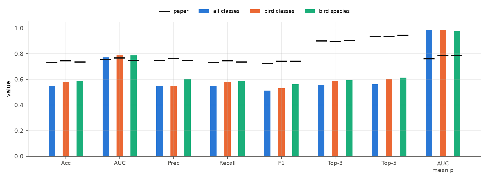

# Code review — SincNet on NIPS4Bplus (reproduction of Bravo Sanchez et al., Sci Rep 2021)

A deep review of the repository against [the Sci Rep paper](Bioacoustic%20classification%20of%20avian%20calls%20from%20raw%20sound%20waveforms.pdf), [the SincNet paper](sinceNet.pdf), [the supplement](supplimentarryInfo.pdf), and the project's own analyses ([DeepArchitectureAnalysis.md](DeepArchitectureAnalysis.md), [DataPipelineAnalysis.md](DataPipelineAnalysis.md), [DATASET_ANALYSIS.md](DATASET_ANALYSIS.md), [logs.md](logs.md), [output/](output/)).

**How this review was done.** Every code reference is a link to the line in this repository. Every number marked ⟨measured⟩ was produced by a script in [code_review/scripts/](code_review/scripts/) from the committed checkpoints, lists and audio (outputs in [code_review/data/](code_review/data/), figures in [code_review/figures/](code_review/figures/)); 13 of the findings are also pinned by executable tests in [code_review/tests/test_review_claims.py](code_review/tests/test_review_claims.py). **No pipeline file was modified** ([CLAUDE.md](CLAUDE.md)); the one place where the saved checkpoints are re-scored under other decision rules is a read-only diagnostic ([Part 5 §4](code_review/parts/05_inference_and_evaluation.md)).

Notes on the files you listed: `changelogs.md` does not exist (the change log is [logs.md](logs.md)); [ArchitectureAnalysis.md](ArchitectureAnalysis.md) is byte-identical to [DeepArchitectureAnalysis.md](DeepArchitectureAnalysis.md); `REPRODUCTION_REPORT.md`, referenced by CLAUDE.md, is not in the repo.

---

## Read it in this order

| Your requested topic | Where |
|---|---|
| **Problems being solved**, **system components**, **system flow**, **algorithm catalogue** | [Part 0 — problems, components, flow](code_review/parts/00_problems_components_flow.md) |
| **Code structure**, **libraries and dependencies**, line-by-line walkthrough of the preprocessing scripts | [Part 1 — repository & scripts](code_review/parts/01_repository_and_scripts.md) |
| Data pipeline: one real recording followed end to end, sampler statistics, leakage, evaluation ceiling | [Part 2 — data pipeline](code_review/parts/02_data_pipeline.md) |
| **Algorithms** — theory from DeepArchitectureAnalysis.md → code → numeric check, layer by layer | [Part 3 — model, theory to code](code_review/parts/03_model_theory_to_code.md) |
| **Tuning and optimisation**: loop, RMSprop, convergence, profiling, hyper-parameter search | [Part 4 — training & optimisation](code_review/parts/04_training_loop_and_optimisation.md) |
| Inference, aggregation rules, metrics, per-class analysis, the re-scoring diagnostic | [Part 5 — inference & evaluation](code_review/parts/05_inference_and_evaluation.md) |
| **Software-engineering practices**, **code review** (per file, with IDs and severities), testing, errata | [Part 6 — engineering review](code_review/parts/06_engineering_review.md) |
| Ranked hypotheses for the gap to the paper, open questions | [Part 7 — gap analysis](code_review/parts/07_gap_analysis_and_open_questions.md) |

Parts 3 and 5 follow your Rule 2: each mechanism is first described theoretically (section numbers refer to DeepArchitectureAnalysis.md), then the implementing code is shown, then what was measured on the trained models, then a verdict. The reconciliation table is at the end of [Part 3 §8](code_review/parts/03_model_theory_to_code.md).

---

## Executive summary

### Where we stand against Table 1 (SincNet rows)

| | accuracy ours (shipped rule) | tag-span diagnostic | paper | top-3 ours → mean-p whole file → paper |
|---|---|---|---|---|
| All classes (87) | 0.5514 | 0.678 | 0.7301 | 0.557 → 0.844 → 0.899 |
| Bird classes (77) | 0.5803 | 0.708 | 0.7447 | 0.588 → 0.858 → 0.897 |
| Bird species (51) | 0.5841 | 0.689 | 0.7356 | 0.592 → 0.856 → 0.902 |

95 % intervals (file-cluster bootstrap) are about ±4.5 points per cell, so the class-set ranking is not significant.

### Findings, most important first

| # | Finding | Evidence | Detail |
|---|---|---|---|
| **F1** | Test scoring pools **all frames of the whole 5 s file** with `softmax(Σ log p)`, but a label belongs to a tag that is **2 % of the file**; 48 % of test rows share a file with a *different* label (ceiling of a one-label-per-file predictor ≈ 82 %). Re-scoring the **same weights** over the tag span gives **+10.5 to +12.8 points** (paired CI excludes 0) | rules A–D, 3,000-resample bootstrap | [Part 5 §4](code_review/parts/05_inference_and_evaluation.md), [Part 2 §5](code_review/parts/02_data_pipeline.md) |
| **F2** | The reported scores are **one-hot** (max probability exactly 1.0 for 100 / 100 / 99.85 % of rows; median summed-log-prob margin ≈ 10,000 nats). Hence top-3/5 ≈ top-1 and "ROC AUC" = `(acc + 1 − FPR)/2`. Mean-probability scores give top-3 0.84–0.86, top-5 0.92 | measured on `predictions.npz` | [Part 5 §2.5, §3](code_review/parts/05_inference_and_evaluation.md), [evaluate_metrics.py:143-152](evaluate_metrics.py#L143-L152) |
| **F3** | `BatchNorm1d(N_filt, <length>, momentum)` passes the pooled length as **`eps`** (111 / 21 / 3). The enhanced CNN's BatchNorm outputs have std 0.22 / 0.32 / 0.57 instead of ≈ 1 | measured on the trained model | [Part 3 §4.2](code_review/parts/03_model_theory_to_code.md), [dnn_models.py:415](SincNet_src/dnn_models.py#L415) |
| **F4** | The Sinc cut-offs are **frozen** (median 0.3–0.6 Hz movement over 400 epochs, max 6 Hz): parameters are in Hz and RMSprop steps are ≤ `lr = 0.001`. The "learned filterbank" is the mel initialisation; the 440 sinc parameters are constants | drift budget: ≤ 32 Hz bound, 3.2 Hz systematic, 0.18 Hz random walk | [Part 3 §2.6](code_review/parts/03_model_theory_to_code.md) |
| **F5** | The 220-filter bank is far less rich than it looks: effective −3 dB bandwidth ≈ **390 Hz for every filter** (nominal 113 Hz), neighbouring low-frequency filters have cosine similarity 0.997, and the bank has **rank ≤ 76** (all filters are even-symmetric; 99 % of energy in 52 dimensions) | SVD + FFT of the trained bank | [Part 3 §2.5](code_review/parts/03_model_theory_to_code.md) |
| **F6** | The enhanced models drop the `abs()` after the Sinc layer (it exists only on the LayerNorm path): an undocumented structural difference between default and enhanced | cfg + code | [Part 3 §3](code_review/parts/03_model_theory_to_code.md) |
| **F7** | The split unit is the tag: 98.6–99.0 % of test rows sit in a recording that also supplies training tags; 16–20 % of test tags overlap *in time* a training tag; 17 % of training windows overlap a tag of another class | audit of lists | [Part 2 §4-5](code_review/parts/02_data_pipeline.md) |
| **F8** | `x / abs(max(x))` followed by a `PCM_16` write **hard-clips 187 of 687 files** (up to 23 % of one file's samples; overshoot up to 3.77×) | raw vs normalised comparison | [Part 1 §3.1](code_review/parts/01_repository_and_scripts.md) |
| **F9** | The checkpoint is from **epoch 392**; `logs.md` says `N_eval_epoch` was changed to 57 but all three cfgs still say 8; the tracked canonical split lists **cannot be regenerated** (they predate the seed argument) | `time.res`, cfgs, a regeneration test | [Part 4 §5](code_review/parts/04_training_loop_and_optimisation.md), [Part 6 P-7](code_review/parts/06_engineering_review.md) |
| **F10** | The model code the project depends on is **git-ignored** and present only as symlinks into an unpinned clone; `call_id.py` and `evaluate_metrics.py` are import-time scripts that duplicate ~70 lines of config/model construction; there are no tests, no pins, absolute paths in cfgs | repository audit | [Part 6](code_review/parts/06_engineering_review.md) |
| F11 | Single frames inside a tag are already ≈ 54–55 % correct; background frames are labelled with a species at ≈ 0.64–0.69 confidence (no "none" class); recall tracks class support (ρ 0.43–0.65); 11–25 classes have zero recall | frame-level and per-class analysis | [Part 5 §2.4, §5](code_review/parts/05_inference_and_evaluation.md) |
| F12 | Parameter count 2.49–2.59 M matches the paper, but ≈ 61 k of them (2.5 %) are dead (unused norm modules, bias before BN) | construction audit | [Part 3 §6.3](code_review/parts/03_model_theory_to_code.md) |

### Corrections to my own first draft of this review (retracted)

* *"Python batch assembly dominates the step time."* Retracted: it is **4 %** (0.97 ms of 22.4 ms) on this machine; forward + backward are 88 %. The 6.5× longer wall-clock of the recorded runs (11.6 s/epoch vs 1.8 s predicted) is unexplained because the runs' hardware was not recorded ([Part 4 §2.1](code_review/parts/04_training_loop_and_optimisation.md)).
* *"`÷ 2·band` equalises the peak gain of the filters."* Retracted: it equalises the **centre tap** only; the peak magnitude response varies 36–72 across the bank ([Part 3 §2.4](code_review/parts/03_model_theory_to_code.md)).

---

## Figure index (30 figures, [code_review/figures/](code_review/figures/))

| Folder | Figures |
|---|---|
| `architecture/` | [tensor_shapes](code_review/figures/architecture/tensor_shapes.png), [param_budget](code_review/figures/architecture/param_budget.png), [batchnorm_eps_effect](code_review/figures/architecture/batchnorm_eps_effect.png), [compute_and_activation_scale](code_review/figures/architecture/compute_and_activation_scale.png) |
| `filters/` | [sinc_forward_steps](code_review/figures/filters/sinc_forward_steps.png), [filter_responses](code_review/figures/filters/filter_responses.png), [passbands_init_vs_trained](code_review/figures/filters/passbands_init_vs_trained.png), [drift_budget](code_review/figures/filters/drift_budget.png), [bank_resolution_and_redundancy](code_review/figures/filters/bank_resolution_and_redundancy.png), [bank_coverage](code_review/figures/filters/bank_coverage.png) |
| `data/` | [worked_example_trainfile007](code_review/figures/data/worked_example_trainfile007.png), [sampler_class_share](code_review/figures/data/sampler_class_share.png), [normalisation_clipping](code_review/figures/data/normalisation_clipping.png), [multilabel_test_files](code_review/figures/data/multilabel_test_files.png), [event_fraction_of_scored_file](code_review/figures/data/event_fraction_of_scored_file.png) |
| `training/` | [training_curves](code_review/figures/training/training_curves.png), [generalisation_gap](code_review/figures/training/generalisation_gap.png), [step_profile](code_review/figures/training/step_profile.png) |
| `evaluation/` | [ours_vs_paper](code_review/figures/evaluation/ours_vs_paper.png), [scoring_rule_diagnostic](code_review/figures/evaluation/scoring_rule_diagnostic.png), [score_saturation_and_support](code_review/figures/evaluation/score_saturation_and_support.png), [roc_micro_saturated_vs_meanexp](code_review/figures/evaluation/roc_micro_saturated_vs_meanexp.png), [frame_level_summary](code_review/figures/evaluation/frame_level_summary.png), [frame_posterior_timelines](code_review/figures/evaluation/frame_posterior_timelines.png), confusion matrices for [all](code_review/figures/evaluation/confusion_all_classes.png) / [bird classes](code_review/figures/evaluation/confusion_bird_classes.png) / [bird species](code_review/figures/evaluation/confusion_bird_species.png), accuracy by group for [all](code_review/figures/evaluation/accuracy_by_group_all_classes.png) / [bird classes](code_review/figures/evaluation/accuracy_by_group_bird_classes.png) / [bird species](code_review/figures/evaluation/accuracy_by_group_bird_species.png) |

## Scripts, data and tests

| Script ([code_review/scripts/](code_review/scripts/)) | Produces |
|---|---|
| [01_model_audit](code_review/scripts/01_model_audit.py) | shapes, parameters, BN `eps`, dead parameters |
| [02_sinc_filters](code_review/scripts/02_sinc_filters.py), [12_sinc_gradient_scale](code_review/scripts/12_sinc_gradient_scale.py), [18_sinc_worked_example](code_review/scripts/18_sinc_worked_example.py), [19_filterbank_resolution](code_review/scripts/19_filterbank_resolution.py) | filter drift, gradient/RMSprop budget, one filter step by step, bank resolution/rank |
| [03_training_curves](code_review/scripts/03_training_curves.py), [11_profile](code_review/scripts/11_profile.py) | convergence, timing, step profile |
| [04_evaluation_analysis](code_review/scripts/04_evaluation_analysis.py), [14_class_tables](code_review/scripts/14_class_tables.py), [20_bootstrap_rules](code_review/scripts/20_bootstrap_rules.py) | metrics, saturation, per-class/group tables, bootstrap CIs |
| [05_data_audit](code_review/scripts/05_data_audit.py), [06_normalisation_clipping](code_review/scripts/06_normalisation_clipping.py), [15_sampler_and_example](code_review/scripts/15_sampler_and_example.py) | lists/leakage/ceiling, clipping, sampler statistics, worked example |
| [07_batchnorm_eps](code_review/scripts/07_batchnorm_eps.py), [13_layer_stats](code_review/scripts/13_layer_stats.py) | BN effect, receptive field, MACs, activation statistics |
| [08_scoring_diagnostics](code_review/scripts/08_scoring_diagnostics.py), [09_scoring_figure](code_review/scripts/09_scoring_figure.py), [10_frame_level](code_review/scripts/10_frame_level.py), [17_frame_level_figures](code_review/scripts/17_frame_level_figures.py) | **GPU diagnostics** (read-only re-scoring, frame-level behaviour) |

Everything is regenerated by [run_all.sh](code_review/scripts/run_all.sh). The shared helper [_common.py](code_review/scripts/_common.py) builds the authors' models from their own cfgs via `data_io.read_conf`.

## Limits of this review

One trained model per class set (no seed variance); the waveform+CNN and pre-trained baselines were not run (out of scope per [TODO.md](TODO.md)); the "tag span" rule is my reading of the paper's Methods, not the authors' code (not public); statements about what the authors did (model selection on the test list, how the parameter count and the Mean-Exp AUC were computed) are inferences, not observations; the committed runs' hardware is unknown. Hypotheses for the remaining 4–5-point gap are recorded, not tested, in [Part 7](code_review/parts/07_gap_analysis_and_open_questions.md).
