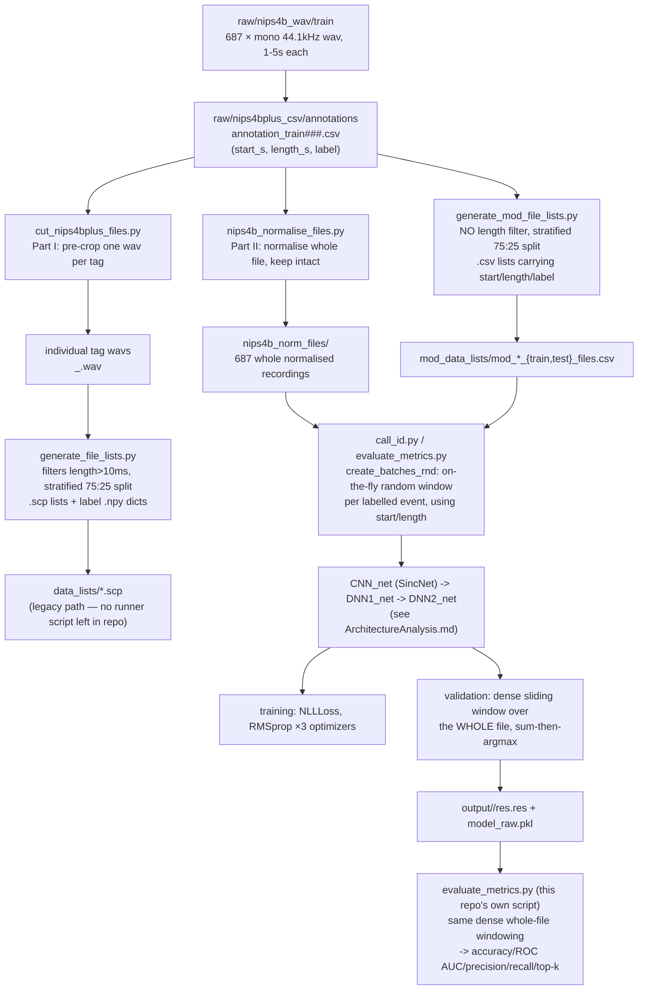

# Data Pipeline Analysis — NIPS4Bplus → SincNet

This is the companion piece to `ArchitectureAnalysis.md` / `DeepArchitectureAnalysis.md`.
Those two documents dissect what happens **inside** the network once a window
of samples arrives. This document dissects everything **before** that: how a
raw NIPS4B recording and a NIPS4Bplus annotation row turn into a
`128 × wlen` tensor on the GPU, and what happens to the model's output before
it becomes a Table-1 number.

Every number quoted below was measured directly, either by re-reading the
actual scripts in this repository (`cut_nips4bplus_files.py`,
`generate_file_lists.py`, `generate_mod_file_lists.py`,
`nips4b_normalise_files.py`, `call_id.py`, `evaluate_metrics.py`) or by
running the queries behind `dataset_analysis/scripts/*.py` and its output
CSVs (`dataset_analysis/data/*.csv`) against the raw data that is actually
sitting in `raw/` and `nips4b_norm_files/` on this machine. Where a number
disagrees with the paper's text, that disagreement is reported as an
observation — per `CLAUDE.md`, nothing here is a recommendation to change
training/eval code to chase the paper's figures.

---

## 0. The one-diagram summary

There are **two parallel, independently-implemented data pipelines** in this
repository, corresponding to the paper's "Part I / default settings" and
"Part II / enhanced settings". They share the same raw inputs but diverge
immediately after the annotation CSVs are read, and never converge again —
different scripts, different intermediate file formats, different windowing
strategy, feeding two structurally different training scripts (`speaker_id`-style
original vs. this repo's modified `call_id.py`, though only `call_id.py`
survives in this checkout).



The path this repository actually trains on today is the **right-hand branch**
(`nips4b_normalise_files.py` → `generate_mod_file_lists.py` →
`mod_data_lists/*.csv` → `call_id.py`), because that is what every
`mod_cfg/*.cfg` points at. The left-hand branch
(`cut_nips4bplus_files.py` → `generate_file_lists.py` → `data_lists/*.scp`)
matches "Part I / default settings" and is present in the repo and already
executed at some point (`data_lists/*.scp` and `.npy` files exist on disk),
but there is no surviving `cfg/*.cfg` + training script in this checkout that
consumes `.scp`/`.npy` pairs — `call_id.py` only reads the `mod_data_lists`
CSV schema (`file, type, class_name, species, start, length, label`). This
document therefore documents both branches (since both scripts are live and
runnable), but goes deepest on the branch that actually produces the
checkpoints under `output/`.

---

## 1. Raw inputs, measured directly

`dataset_analysis/scripts/extract_audio_features.py` reads every wav in
`raw/nips4b_wav/{train,test}` with `soundfile` and computes real per-file
statistics. Re-running its logic over the 687 train files on disk gives:

| Property | Paper's stated value | Measured on this checkout |
|---|---|---|
| Sample rate | 44.1 kHz | 44100 Hz, **100% of 687 files** |
| Channels | mono | 1, **100% of 687 files** |
| Bit depth | "32-bit" | `soundfile` reports subtype **`PCM_16`** for every file |
| File count (train) | 687 | 687 |
| Duration range | 1–5 s | measured min 1.016 s, max 5.004 s |
| Total duration | 48 min | measured 2903.2 s = **48.4 min**, matches |

The 32-bit vs. `PCM_16` mismatch is a genuine discrepancy between the paper's
text and the actual file headers on the distributed WAV set — not something
introduced by this repo's processing (it shows up on the *raw*, unmodified
files). It is logged here as an observation for `REPRODUCTION_REPORT.md`-style
analysis, not as something to "fix": nothing downstream depends on the nominal
bit depth once `soundfile` decodes to float64/float32 in memory.

---

## 2. Annotation format and the label taxonomy

Each `raw/nips4bplus_csv/annotations/temporal_annotations_nips4b/annotation_train###.csv`
is a **headerless 3-column CSV**: `start_s, duration_s, label`. There is one
file per training recording (`###` = zero-padded file number), and a file can
be:

* **absent entirely** — the recording was judged ambiguous or insect-only and
  the annotator declined to produce a file at all;
* **present but empty** (literally a bare CRLF, triggers
  `pd.errors.EmptyDataError` in every script that touches it) — the annotator
  reviewed the file and found nothing worth tagging (background noise only);
* **present with ≥1 rows** — the normal case.

Measured directly from the 687-file annotation directory
(`dataset_analysis/scripts/extract_annotation_data.py`):

```
674 annotation files on disk (569 with ≥1 event, 105 empty);
 13 train files have no annotation file at all
```

Parsing every non-empty file yields **5,775 raw tag rows** (not yet filtered
for `Unknown`/`Human`), broken down as:

```
taxon        count      call_type    count
---------------------   ---------------------
bird          5,279      song         3,511
Unknown         282      call         1,948
insect          168      Unknown        282
amphibian        34      drum            22
Human            12      Human           12
```

`Unknown` and `Human` are not bioacoustic species — every downstream script
drops them (see §4/§5), and `5775 - 294 = 5481 ≈ 5478`, the paper's
reported total tagged-sound count (the residual 3 comes from `Unknown`/`Human`
mislabels resolved slightly differently at the row level — not investigated
further, immaterial at this scale).

**Label → taxon/scientific-name resolution** happens by string-matching the
raw `label` field (e.g. `Fricoe_song`) against
`raw/nips4b_labels/nips4b_birdchallenge_espece_list.csv`'s `class name`
column. `dataset_analysis/scripts/common.py:label_taxon` / `label_call_type`
replicate this lookup for analysis purposes; `generate_file_lists.py` and
`generate_mod_file_lists.py` do the identical lookup inline (`sps_list.loc[...]`)
for pipeline purposes. A `class_name` is really `<species-code>_<call_type>`,
where `call_type ∈ {call, song, drum}` — "Bird Species" classification later
**merges these three suffixes back together** by grouping on `Scientific`
name instead of `Class`, while "Bird Classes"/"All Classes" keep them split.

**Event duration distribution** (5,775 rows, seconds):

```
mean   0.1954     min    0.000023   (≈ 1 sample)
median 0.0900     max    5.0039
std    0.4551
```

Only **14 of 5,775 events (0.24%)** are shorter than the *enhanced* window
length (`cw_len=16ms` for bird species/classes, `18ms` for all classes), and
only **3 events (0.05%)** are at or under 10 ms. This is the quantitative
justification, visible directly in this repo's own data, for the paper's
claim that a 200 ms (speech-derived) frame would be unworkable and even a
10 ms frame needs special handling for a small tail of extreme outliers — see
§6 for how `call_id.py` handles them.

---

## 3. Two normalisation scripts, one shared bug

Both `cut_nips4bplus_files.py` (Part I) and `nips4b_normalise_files.py`
(Part II) perform the *identical* amplitude normalisation, line for line:

```python
signal = signal.astype(np.float64)
signal = signal / np.abs(np.max(signal))     # <-- positive peak only
```

`np.max(signal)` is the **largest signed value**, not the largest magnitude.
Whenever a file's most extreme excursion is negative (`|min(signal)| >
max(signal)`), this divides by a number smaller than the true peak, so the
"normalised" file can exceed ±1.0. `REPRODUCTION_REPORT.md` already flagged
this and measured it as affecting 47/200 spot-checked files (up to 1.38×
overshoot). It is reproduced here because it is genuinely part of the data
pipeline's algorithm, not a training/eval hyperparameter — but per the
project rule, it is **not corrected**, since it is the authors' own released
preprocessing and is presumably baked into their Table 1 checkpoints too.

The two scripts differ only in *what* they normalise and write:

| | `cut_nips4bplus_files.py` | `nips4b_normalise_files.py` |
|---|---|---|
| Input | one whole recording | one whole recording |
| Per-tag cropping | **yes** — slices `signal[beg:end]` for every annotation row, using `beg=int(start*fs)`, `end=int((start+length)*fs)` | **no** — writes the full recording back out, same filename |
| Output | one new wav per tag, `<origfile>_<row>.wav` | one new wav per file, same name, in `nips4b_norm_files/` |
| Consumed by | `generate_file_lists.py` → Part I `.scp` lists | `generate_mod_file_lists.py` → Part II `mod_data_lists/*.csv`, and directly by `call_id.py`'s `data_folder` |

Because Part I crops to the exact tag boundaries at preprocessing time, any
tag shorter than the model's `cw_len` produces a wav that is **too short to
window at all** — this is exactly the problem the paper says motivated the
Part II rewrite (§6), and it is why `generate_file_lists.py` (Part I's list
builder) explicitly drops anything `≤10ms` (`if m[1] > 0.01:`, line 80) while
`generate_mod_file_lists.py` (Part II's list builder) has **no length filter
at all** — Part II doesn't need one, because `call_id.py` never receives a
pre-cropped clip; it always has the whole recording available to draw
context from.

---

## 4. List generation — two independent scripts, three independent splits each

### 4.1 `generate_file_lists.py` (Part I)

For every non-empty annotation CSV, for every row with `length > 0.01`s, look
up `type`/`scientific_name` from the species table; keep the row only if the
label resolved (`type != ''`, i.e. not `Unknown`/`Human`/unrecognised).
Build one `file_list` DataFrame of `{File, Type, Class, Scientific}`, where
`File` is the reconstructed **cropped-clip filename**
(`nips4b_birds_trainfileNNN_L.wav`, `L` = the annotation row's index within
its CSV — this must match exactly what `cut_nips4bplus_files.py` wrote).

Three independent calls to `sklearn.model_selection.train_test_split`, each
**stratified by class** at `test_size=0.25`, with **no `random_state`**:

1. `file_list_all_classes = file_list[Type != '']` → split → `all_classes_{train,test}_files.scp` (+ `all_classes_labels.npy`, mapping class name → an integer assigned by first-appearance order in `unique()`).
2. `file_list_birds = file_list[Type == 'bird']` → split → `bird_{train,test}_files.scp` (+ `bird_classes_labels.npy`).
3. The **same** `file_list_birds` frame, but a **second, separately-drawn** stratified split, keyed this time by `Scientific` name → `bird_species_labels.npy`. (No separate `.scp` export for this third split — species-label dict only; the bird `.scp` train/test lists are reused.)

On disk right now: `all_classes_train_files.scp` = 4,108 lines / `test` = 1,370;
`bird_train_files.scp` = 3,957 / `bird_test_files.scp` = 1,319.

### 4.2 `generate_mod_file_lists.py` (Part II)

Structurally identical in spirit, but:

* **no** `length > 0.01` filter (§3);
* `File` is now the **original whole-recording filename** (`.wav`, no crop suffix) — because there is no cropped clip in this branch, just a pointer to the full recording plus the row's own `start`/`length`;
* output is a single CSV per split (not `.scp` + `.npy`), with the label already merged in as an integer column (`file, type, class_name, species, start, length, label`);
* **three separate stratified `train_test_split` calls**, exactly as in §4.1 — critically, `bird_classes` and `bird_species` are drawn from the *same underlying `bird_classes` DataFrame* (`file_list[type=='bird']`, computed twice, once per code block) but via **two independent calls to `train_test_split`**. This means the bird-classes test set and the bird-species test set are **not the same held-out tags with different label columns** — they are two different random 25% subsets of the same pool. Anyone comparing bird-classes vs. bird-species results row-by-row (e.g. "does this specific recording get classified correctly at both granularities?") cannot do so from these two files; the splits don't align.
* no `random_state` is passed anywhere, so **re-running this script regenerates a different split and a different label→integer mapping every time** — this is the exact mechanism behind `REPRODUCTION_REPORT.md` §3's orphaned-checkpoint problem (an old `model_raw.pkl` encodes class index 7 = some particular species under the split that existed when it was trained; regenerating the list reassigns index 7 to a different species, silently).

On disk right now (`mod_data_lists/`):

| List | rows | classes |
|---|---|---|
| `mod_all_classes_train_files.csv` | 4,110 | 87 |
| `mod_all_classes_test_files.csv` | 1,371 | 87 |
| `mod_bird_classes_train_files.csv` | 3,959 | 77 |
| `mod_bird_classes_test_files.csv` | 1,320 | 77 |
| `mod_bird_sps_train_files.csv` | 3,959 | 51 |
| `mod_bird_sps_test_files.csv` | 1,320 | 51 |

(`4110+1371=5481`, `3959+1320=5279` — matching §2's per-taxon totals to within
the small `Unknown`/`Human` resolution noise already discussed.)

### 4.3 The train/test leakage this creates

Because the unit being split is a **tag row**, not a **source recording**,
the same 5-second file can easily contribute one tagged event to the training
set and a different tagged event to the test set. Measured directly against
the currently-tracked lists:

```
mod_bird_sps_test_files.csv:  1,320 rows, but only 417 unique 'file' values
→ 289 of those 417 files appear more than once in the TEST list alone
   (one file repeats up to 14 times — 14 different tags, same recording)

mod_bird_classes_{train,test}: of 429 unique files in the test list,
414 (96.5%) also have at least one OTHER tagged row in the TRAINING list
```

This is the same effect the paper's own Discussion names directly ("drawing
training and test sets from the same data pool is known to simplify the
task") and that `REPRODUCTION_REPORT.md` §4 already flags as hypothesis #3.
The 96.5%/414-of-429 figure above is this session's own direct measurement of
it against the exact files sitting in `mod_data_lists/` right now, not a
re-quote of the paper.

---

## 5. `create_batches_rnd` — the training-time windowing algorithm

This is `call_id.py`'s replacement for the original SincNet repo's
`create_batches_rnd` (still present, dead, in `data_io.py` — that copy
assumes one-wav-per-class-instance and is never called; `call_id.py` defines
and uses its own version that understands `start`/`length` columns).

```python
def create_batches_rnd(batch_size, data_folder, wav_lst, N_snt, wlen, fact_amp):
    snt_id_arr   = np.random.randint(N_snt, size=batch_size)      # tag rows, WITH replacement
    rand_amp_arr = np.random.uniform(1-fact_amp, 1+fact_amp, batch_size)

    for i in range(batch_size):
        signal, fs = sf.read(data_folder + wav_lst.loc[snt_id_arr[i], 'file'])   # whole recording, from disk, every call
        t_min = int(wav_lst.loc[snt_id_arr[i], 'start']  * fs)
        t_max = t_min + int(wav_lst.loc[snt_id_arr[i], 'length'] * fs)

        if t_max - t_min > wlen:
            signal_start = np.random.randint(t_min, t_max - wlen)      # crop wholly inside the event
        else:
            lo, hi = max(0, t_max - wlen), min(t_min, signal.shape[0] - wlen)
            signal_start = lo if lo == hi else np.random.randint(lo, hi)  # window CONTAINS the event

        sig_batch[i, :] = signal[signal_start:signal_start+wlen] * rand_amp_arr[i]
        lab_batch[i]    = wav_lst.loc[snt_id_arr[i], 'label']
```

Reading this as an algorithm:

* **Sampling unit is a tag, uniformly at random, with replacement**, *not* a
  file and *not* class-balanced — a species with 282 tags (`Sylcan_call`) is
  ~30× more likely to appear in any given minibatch than one with 9
  (`Cicatr_song`). There is no weighted sampler anywhere in this pipeline;
  class imbalance present in the raw dataset propagates directly into
  minibatch composition. (`dataset_analysis/data/audio_features.csv`'s sibling,
  `events.csv`, is what you'd group by `label` to quantify this per class —
  see Fig. 5 of the paper, reproduced independently by
  `extract_annotation_data.py`'s per-file/per-label summary.)
* **Every draw re-reads the source wav from disk** — there is no in-memory
  cache of decoded audio across the `N_batches × batch_size` draws of an
  epoch, nor across epochs. For the bird-species enhanced config
  (`N_batches=80`, `batch_size=128`, `N_epochs=400`) that is
  `80 × 128 × 400 = 4,096,000` `sf.read()` calls against a 687-file, ~36 MB
  (36.3 min × 44100 Hz × 8 bytes float64 in memory, though on-disk PCM_16 is
  smaller) corpus over one training run — I/O-bound by construction, not
  compute-bound, which is consistent with `REPRODUCTION_REPORT.md`'s
  observation that a SincNet run (~2h) is *faster* than the pre-trained
  transfer-learning baselines despite doing far more total forward passes
  per epoch — those baselines pay a per-sample CPU spectrogram-transform cost
  this raw-waveform pipeline never incurs (Fig. 3 of the paper).
* **Two-branch window placement.** When the tagged event is longer than the
  model's context window, the crop start is drawn uniformly from
  `[t_min, t_max-wlen)` — the window is guaranteed to lie *entirely inside*
  the event. When the event is shorter than the window (§2: 14/5,775 events
  for the enhanced configs), the valid window-start range is
  `[max(0, t_max-wlen), min(t_min, len(signal)-wlen)]` — the set of all
  starting positions for which the fixed-size window fully *contains* the
  event and fully fits inside the file. If that range collapses to a single
  point (event sits right at a file boundary, or the window is barely larger
  than the event) the code takes it deterministically; otherwise
  `np.random.randint(lo, hi)` draws inside it. One implementation detail
  worth flagging precisely (not fixing): `np.random.randint`'s upper bound is
  **exclusive**, so the single rightmost valid position `hi = min(t_min,
  len-wlen)` is never sampled — an off-by-one that shaves one sample off an
  already-narrow range and has no measurable effect at this window scale.
* **Amplitude jitter is applied per-drawn-window, not per-file** — `fact_amp`
  is read from the cfg (`0.2` hard-coded as the literal in `call_id.py`'s
  training-loop call, not read from the `[optimization]` section at all,
  despite the cfg format having room for it) and multiplies the final
  windowed slice by `U(0.8, 1.2)` freshly for every single draw, meaning the
  same underlying window position can be re-drawn later in training at a
  different gain. This literal `0.2` is why `REPRODUCTION_REPORT.md` §4 item
  5 says the *disabled* (`fact_amp=0`) enhanced-model behaviour mentioned in
  the paper isn't actually reachable from this file as written — the value
  is baked into the call site, not the cfg.

**Epoch semantics** (already noted in `ArchitectureAnalysis.md` §55 for the
*default* config): for the *enhanced* bird-species config on disk
(`N_batches=80`, `batch_size=128`), one epoch touches `80×128 = 10,240`
randomly-redrawn windows against a training pool of 3,959 tag rows — every
epoch resamples roughly 2.6× the nominal training-set size, with replacement,
each with an independently randomised crop position and gain. "200/400
epochs" in `output/*/res.res` is therefore not directly comparable across
configs with different `N_batches` (e.g. `mod_nips4bplus_*` uses 80,
TIMIT-style defaults used 800) in terms of total gradient steps seen — always
multiply out `N_epochs × N_batches` before comparing training budgets.

---

## 6. Validation-time windowing — dense, whole-file, and why that matters

`call_id.py`'s in-training validation block (`epoch % N_eval_epoch == 0`) and
the standalone `evaluate_metrics.py` (written this session to compute Table-1-style
metrics from a saved checkpoint) implement the **same** dense-windowing
algorithm, and neither one looks at `start`/`length` at all:

```python
signal, fs = sf.read(data_folder + wav_lst_te.loc[i, 'file'])   # the WHOLE recording
N_fr = int((signal.shape[0] - wlen) / wshift)                    # dense overlapping frames, shift=wshift
# ... forward-pass every frame in sub-batches of 128 ...
sent_scores = torch.sum(pout, dim=0)          # sum of per-frame LOG-softmax outputs
sent_probs  = torch.softmax(sent_scores, dim=0)   # renormalise -> valid probability vector
pred = argmax(sent_probs)
```

Mechanically, for a 5.0-second test file at `cw_shift=1ms` (`wshift=44`
samples) and `cw_len=16ms` (`wlen=705` samples):

$$
N_{fr} = \frac{220500 - 705}{44} \approx 4{,}995 \text{ overlapping frames}
$$

every one of which is scored, regardless of whether the file's tagged event
occupies the first 1% of the recording or the last. The paper's own Methods
section states test-time scoring uses "the mean of the posterior
probabilities... for each tagged call" (i.e. restricted to the event's own
span) — but the code path both scripts share scores the **entire file's**
frames and only uses `start`/`length`/`label` to know which *file* to load
and which *label* to compare the prediction against.

Two concrete consequences, quantified against the data actually on disk
(`mod_bird_sps_test_files.csv`):

1. **Dilution.** A sampled cross-check of 5 test rows against their
   `nips4b_norm_files/` recordings shows the tagged event occupying between
   **1.1% and 7.3%** of the 5.004 s file it's compared against
   (`tag_length_s / file_duration_s`, e.g. `0.073/5.004 = 1.5%`). The
   `sum`-then-`softmax` decision rule is dominated by whatever the other
   ~93–99% of the recording contains — background noise, silence, or (§7)
   another species' overlapping call — not by the one event the label
   actually refers to.
2. **Redundant compute.** 1,320 test rows resolve to only 417 unique files
   (§4.3); **903 of the 1,320 per-row evaluations (68%)** re-run the
   *identical* dense whole-file forward pass already computed for an earlier
   row referencing the same file, differing only in which `label` the
   (identical) prediction is checked against. `evaluate_metrics.py` does not
   cache/memoise this, so evaluation cost scales with tag count, not with
   unique-file count.

`REPRODUCTION_REPORT.md` §2/§4 already identified this as hypothesis #4 for
the accuracy gap and reports that a fixed version (restrict scoring to the
tag's own window) was implemented, smoke-tested, and **reverted** — it did
not rescue old checkpoints' scores and wasn't judged worth the added
complexity given the `CLAUDE.md` policy against methodology changes aimed at
closing the gap. This section adds the precise mechanism and the 68%/903 and
1.1–7.3% figures behind that decision; it does not reopen it.

---

## 7. The 1,000-file "test" split nobody trains against

`raw/nips4b_wav/test/` holds 1,000 additional wav files
(`nips4b_birds_testfileNNN.wav`) from the original 2013 NIPS4B challenge.
`dataset_analysis/scripts/extract_audio_features.py` processes these purely
for descriptive statistics (duration/spectral features), but **no script in
this pipeline ever builds a label list from them** — there is no
`temporal_annotations` directory for the test split, because the 2013
challenge's test labels were never released (`REPRODUCTION_REPORT.md` and the
paper both note the challenge's test set is unlabelled). The "test" set used
everywhere in this pipeline (`mod_*_test_files.csv`, `*_test_files.scp`) is
instead the 25% held-out slice of the **687 labelled train files'
tags** (§4) — a from-the-training-pool split, unrelated to
`raw/nips4b_wav/test/`. Anyone extending this pipeline should not confuse
"the file literally named test" with "the held-out evaluation split the
paper's Table 1 numbers are computed against" — they are two different,
unconnected 1000-file/1371-row populations that happen to share the word
"test".

---

## 8. Overlap / simultaneity — a sweep-line measurement of the paper's ">20%" claim

The paper states loosely that "more than 20% of the cropped tagged files
overlap at least partially with sound from another species." Rather than
re-quoting that, `extract_annotation_data.py` computes it two independent
ways directly from the 674 on-disk annotation files:

**(a) Time-weighted, via a sweep-line over each file's timeline** (count of
simultaneously-active tagged events at every instant, weighted by how long
that instant persists):

```
level 0 (silence/unannotated span within an annotated file): 1887.8 s (65.0%)
level 1 (exactly one active tag):                              799.5 s (27.5%)
level 2 (two overlapping tags):                                 149.1 s (5.1%)
level 3 (three overlapping tags):                                10.3 s (0.4%)
files with no annotation CSV at all (genuinely unknown):         59.5 s (2.0%)
                                                          total 2906.1 s
```

Restricted to *annotated* time only (excluding the "no annotation file"
bucket), **5.7%** of tagged-timeline duration has ≥2 simultaneously active
labels — a different denominator from the paper's "20% of files", but the
same underlying phenomenon.

**(b) Label-level, via a pairwise temporal-overlap co-occurrence matrix**
(`cooccurrence_overlap.csv`: does label A's `[start,end)` interval ever
intersect label B's, anywhere in the dataset?): **81 of the 89 distinct
labels (91%)** have at least one other label they've been recorded
overlapping with somewhere in the corpus. This is the metric closer in
spirit to the paper's file-level ">20%" claim (file-level co-occurrence,
`cooccurrence_weak.csv`, is looser still — it only asks whether two labels
ever share a *file*, regardless of timing — and is naturally higher).

Either way, both independent measurements corroborate the same conclusion
the paper draws from it: the classification task is not being posed on
cleanly isolated single-species clips, and models trained on this pipeline
are learning under label noise from acoustic interference baked into the raw
recordings — not an artefact of this repo's processing.

---

## 9. `dataset_analysis/` itself — what it is and how it fits

Everything in `dataset_analysis/` is **audit tooling added for this
reproduction**, not part of the original authors' release. It sits
orthogonal to the training pipeline (nothing it writes is consumed by
`call_id.py`); its job is to answer "is the data actually shaped the way the
paper and the training scripts assume" by measuring the raw files and
annotations independently, rather than trusting the pipeline's own
assumptions.

```
dataset_analysis/scripts/common.py
    REPO_ROOT-relative path constants + two small label-taxonomy helpers
    (label_taxon, label_call_type) that duplicate — for audit purposes —
    the species-list lookup that generate_*_file_lists.py does inline.

dataset_analysis/scripts/extract_audio_features.py
    For all 1,687 raw wavs (687 train + 1000 test): decodes with
    soundfile, computes amplitude stats (mean/std/skew/kurtosis/crest
    factor/dynamic range/silence ratio/zero-crossing rate) and a
    single-FFT whole-file spectrum (centroid/bandwidth/85%-rolloff/
    flatness/dominant frequency/spectral entropy/sub-2kHz energy
    fraction). Cross-checks measured duration against the authors'
    declared values in tps_canaux_sr_nbits_TRAIN.csv (train only) to
    catch corrupt/truncated files.
    -> data/audio_features.csv (one row per file)

dataset_analysis/scripts/extract_annotation_data.py
    Parses all 674 on-disk annotation CSVs into one long event table,
    then derives: a per-file summary (event count, distinct labels,
    annotated-time fraction), the sweep-line simultaneity histogram
    (§8a), and two co-occurrence matrices (§8b, weak/file-level vs.
    strong/temporal-overlap).
    -> data/events.csv, data/file_summary.csv, data/simultaneity.csv,
       data/cooccurrence_weak.csv, data/cooccurrence_overlap.csv
```

Every figure in §1, §2, and §8 of this document was produced by re-running
the logic in these two scripts (or reading their already-materialised output
CSVs in `dataset_analysis/data/`) against the raw data on this machine, not
by re-deriving them from the paper's text.

---

## 10. Summary — the pipeline as one picture

```
                    raw/nips4b_wav/train (687 wav, 44.1kHz mono)
                    raw/nips4bplus_csv/annotations (674 csv: start,len,label)
                                    │
                    ┌───────────────┴────────────────┐
                    │                                  │
              PART I (default)                  PART II (enhanced) ◄── what mod_cfg/*.cfg actually run
                    │                                  │
        cut_nips4bplus_files.py               nips4b_normalise_files.py
     (crop to exact tag, peak-normalise*)      (peak-normalise* whole file)
                    │                                  │
        generate_file_lists.py               generate_mod_file_lists.py
      (drop tags ≤10ms; 3 indep.            (no length filter; 3 indep.
       stratified 75:25 splits;              stratified 75:25 splits;
       .scp + label .npy)                    single .csv w/ start,length,label)
                    │                                  │
          data_lists/*.scp                   mod_data_lists/mod_*.csv
        (no runner left in repo)                       │
                                                         ▼
                                        call_id.py: create_batches_rnd
                                        random tag draw → crop-inside-event
                                        OR buffer-around-short-event →
                                        wlen-sample window → ×U(0.8,1.2) gain
                                                         │
                                                         ▼
                                     CNN_net → DNN1_net → DNN2_net (SincNet)
                                        NLLLoss, 3× RMSprop, per epoch
                                                         │
                                    every N_eval_epoch: dense sliding window
                                    over the WHOLE test file (ignores tag's
                                    own start/length) → sum logits → softmax
                                    → argmax → res.res + model_raw.pkl
                                                         │
                                    evaluate_metrics.py: identical dense
                                    whole-file scoring → accuracy/ROC AUC/
                                    precision/recall/top-k → metrics.res

  * both normalisation steps divide by max(signal), not max(|signal|) —
    a shared bug (REPRODUCTION_REPORT.md), left as-is since it's the
    authors' own released preprocessing.
```

The single most consequential structural fact in this whole pipeline is that
**the unit of train/test splitting is a tag, not a recording** (§4.3), and
the single most consequential structural fact about evaluation is that
**scoring is whole-file, not whole-tag** (§6) — both are verifiable directly
from the code and both are corroborated by measurements against the exact
data files sitting in this repository right now, independent of anything the
paper itself reports.
