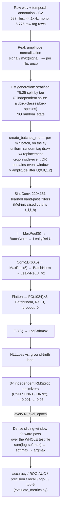
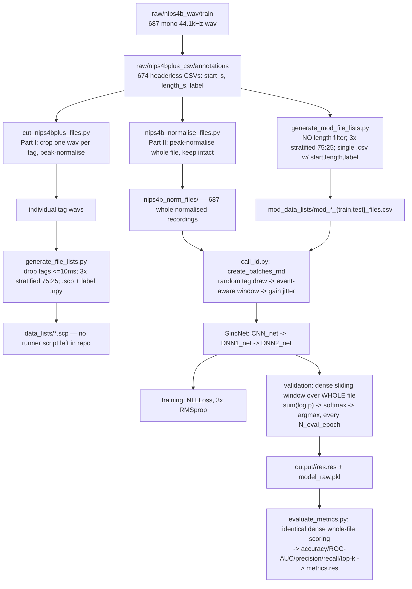

# Phase 1: Conceptual Mapping (Deconstruction)

**Reproduced work:** Bravo Sanchez, F., Hossain, M. R., English, N. B. & Moore,
S. T. *Bioacoustic classification of avian calls from raw sound waveforms
with an open-source deep learning architecture.* Sci Rep 11, 15733 (2021),
using the authors' own companion code against the NIPS4Bplus dataset (Morfi,
V., Bas, Y., Pamuła, H., Glotin, H. & Stowell, D. *NIPS4Bplus: a richly
annotated birdsong audio dataset.* PeerJ Comput. Sci. 5, e223 (2019)),
architecturally descended from Ravanelli, M. & Bengio, Y. *Speaker
Recognition from Raw Waveform with SincNet.* (2018).

**Method.** Nothing below is asserted from the papers' text alone. Every
statistic, every hyperparameter, and every algorithmic claim is either
measured directly against the 687 raw training files + 674 annotation CSVs
sitting in `raw/` (via `dataset_analysis/scripts/*.py`), or read directly out
of the executable code that actually runs in this checkout (`call_id.py`,
`dnn_models.py`, `mod_cfg/*.cfg`, `cfg/*.cfg`, `evaluate_metrics.py`). Where
this document compresses material already derived at full length elsewhere in
the repo, it links out to it rather than re-deriving it:
[`DATASET_ANALYSIS.md`](DATASET_ANALYSIS.md) (full EDA + all figures),
[`DataPipelineAnalysis.md`](DataPipelineAnalysis.md) (pipeline mechanics),
[`DeepArchitectureAnalysis.md`](DeepArchitectureAnalysis.md) (full SincNet
derivation), [`REPRODUCTION_REPORT.md`](REPRODUCTION_REPORT.md) (target
numbers, gap hypotheses). Per `CLAUDE.md`, this document is analysis, not a
to-do list — no code is changed here, and every "this could be improved"
remark in Part B/C is a theoretical point, not a pending patch.

---

## Table of contents

- [Part A — Problem Formulation](#part-a--problem-formulation)
  - [A.1 The problem, in ML terms](#a1-the-problem-in-ml-terms)
  - [A.2 Target variable(s)](#a2-target-variables)
  - [A.3 Input feature space](#a3-input-feature-space)
  - [A.4 Learning paradigm](#a4-learning-paradigm)
  - [A.5 Exploratory data analysis](#a5-exploratory-data-analysis)
  - [A.6 Evaluation metrics — formal definitions](#a6-evaluation-metrics--formal-definitions)
  - [A.7 Scope, limitations, and critique](#a7-scope-limitations-and-critique)
- [Part B — Methodological Justification](#part-b--methodological-justification)
  - [B.1 Why raw waveform, why a constrained first layer](#b1-why-raw-waveform-why-a-constrained-first-layer)
  - [B.2 The end-to-end workflow](#b2-the-end-to-end-workflow)
  - [B.3 Microscopic, layer-by-layer justification](#b3-microscopic-layer-by-layer-justification)
  - [B.4 Data-splitting strategy — assessed](#b4-data-splitting-strategy--assessed)
  - [B.5 Model-selection strategy — assessed](#b5-model-selection-strategy--assessed)
  - [B.6 Scorecard: what's mathematically sound vs. questionable](#b6-scorecard-whats-mathematically-sound-vs-questionable)
- [Part C — Data Pipeline Analysis](#part-c--data-pipeline-analysis)
  - [C.1 Pipeline diagram](#c1-pipeline-diagram)
  - [C.2 Algorithmic breakdown, with complexity](#c2-algorithmic-breakdown-with-complexity)
  - [C.3 Missing values, feature scaling, class imbalance — as implemented](#c3-missing-values-feature-scaling-class-imbalance--as-implemented)
  - [C.4 A better pipeline, theoretically justified](#c4-a-better-pipeline-theoretically-justified)
  - [C.5 Closing scorecard](#c5-closing-scorecard)

---

## Part A — Problem Formulation

### A.1 The problem, in ML terms

Stripped of domain language, the paper solves:

> Given a short window of a raw acoustic waveform known to contain an
> animal vocalisation, predict which of $C$ discrete, mutually exclusive
> classes produced it.

Formally, the model is a parametric function

$$
f_\theta : \mathbb{R}^{w} \to \Delta^{C-1}
$$

mapping a fixed-length raw-amplitude window $\mathbf{x}\in\mathbb{R}^{w}$
($w$ = `wlen`, samples) to a point on the $(C-1)$-simplex — a categorical
probability distribution over $C$ classes — via

$$
f_\theta(\mathbf{x}) = \operatorname{softmax}\big(g_\theta(\mathbf{x})\big), \qquad
\hat y = \arg\max_{c\in\{1,\dots,C\}} f_\theta(\mathbf{x})_c .
$$

This is **single-label, multi-class classification** on a **fixed-length,
raw, univariate time-series input** — not sequence labelling / detection
(the model never has to decide *where* in a longer recording a call starts;
that segmentation is given by the human-annotated `start`/`length` fields),
not regression, not multi-label (`class_act=softmax`, `cost = NLLLoss()` —
a single label per window, not a set), and not self-supervised
representation learning (there is no pretext task; every layer is trained
directly against the ground-truth species label from epoch 1).

### A.2 Target variable(s)

The repository defines **three separate target-variable schemes** over the
same underlying event table, corresponding to three separately-trained
models (`class_lay` in each cfg):

| Scheme (cfg) | $C$ | What one integer label encodes |
|---|---|---|
| All Classes | 87 | `<species-or-insect-or-amphibian>_<call_type>` — call/song/drum kept as distinct classes |
| Bird Classes | 77 | same, restricted to `type == 'bird'` |
| Bird Species | 51 | bird species only, with call/song/drum **merged** into one label per species (`Scientific` name, not `Class`) |

The label itself is an **integer index assigned by first-appearance order**
in `pandas.unique()` over the (unordered) file list (`generate_mod_file_lists.py`)
— i.e. the label→integer mapping is an artifact of list-generation order,
not a stable, semantically meaningful ID; see
[§A.7](#a7-scope-limitations-and-critique) and
[DataPipelineAnalysis.md §4.2](DataPipelineAnalysis.md#42-generate_mod_file_listspy-part-ii).
Distribution of the target variable (class imbalance) is quantified in
[§A.5.4](#a54-class-imbalance-the-target-variables-own-distribution).

### A.3 Input feature space

This is the single most consequential design decision in the paper, and it
inverts the usual "feature engineering" framing: **there is no engineered
feature vector.** The input is the raw waveform itself,

$$
\mathbf{x} = [x_0, x_1, \dots, x_{w-1}], \qquad x_i \in [-1,1]\ (\text{post peak-normalisation}),
$$

a window of $w=$ `wlen` $=\lfloor f_s \cdot cw\_len / 1000\rfloor$ consecutive
PCM samples at $f_s=44{,}100$ Hz (measured directly from every wav header —
[DATASET_ANALYSIS.md §1](DATASET_ANALYSIS.md#1-whats-actually-on-disk)). For
the enhanced Bird-Species/Bird-Classes config, $cw\_len=16$ ms $\Rightarrow
w=705$; for All Classes, $cw\_len=18$ ms $\Rightarrow w=794$; for the
default/Part-I config, $cw\_len=10$ ms $\Rightarrow w=441$.

There is exactly **one derived scalar feature computed before the model
sees the data**: the per-file peak-normalisation divisor
$\max(\text{signal})$ ([§C.3](#c3-missing-values-feature-scaling-class-imbalance--as-implemented)).
Everything else — spectral content, timbre, pitch, formant-like structure —
is left for the network's first layer (SincConv, [§B.3.3](#b33-sincconv-the-constrained-first-layer))
to discover. This is explicitly a rejection of the conventional bioacoustic
pipeline
$$
\text{waveform} \to \text{STFT} \to |X(t,f)| \to \text{MFCC/Mel} \to \text{classifier},
$$
motivated (per the paper, and independently corroborated by the duration
statistics in [§A.5.3](#a53-tagged-event-duration--the-motivating-eda-finding))
by the concern that hand-designed spectral features import assumptions from
human-speech processing (Mel scale, frame lengths tuned for phonemes) that
don't necessarily transfer to non-human bioacoustic signals.

### A.4 Learning paradigm

**Supervised.** Every training example is a `(window, label)` pair; the
label comes from a human annotator's temporal-annotation CSV, not from any
self- or weak-supervision signal. It is not reinforcement learning (no
reward, no environment, no sequential decision process — a single forward
pass per example) and not unsupervised (no clustering/density-estimation
objective anywhere in `call_id.py`; the only unsupervised-*flavoured*
component is that the Sinc filters' cutoff frequencies are Mel-initialised
before supervised fine-tuning — an initialisation scheme, not a training
objective, see [§B.3.3](#b33-sincconv-the-constrained-first-layer)).

Within supervised learning it is specifically:

- **discriminative**, not generative ($P(y\mid x)$ is modelled directly via
  `LogSoftmax`, never $P(x\mid y)$ or $P(x,y)$);
- **frame/window-level** during training, with **file-level aggregation**
  at evaluation time via
  $\hat c = \arg\max_c \sum_t \log P_t(c)$
  ([§A.6](#a6-evaluation-metrics--formal-definitions),
  [DataPipelineAnalysis.md §6](DataPipelineAnalysis.md#6-validation-time-windowing--dense-whole-file-and-why-that-matters));
- **closed-set**: $C$ is fixed at training time ($87/77/51$); the model has
  no "none of the above"/open-set rejection mechanism, even though roughly
  a third of the raw recordings contain no tagged event at all
  ([§A.5.1](#a51-what-the-dataset-actually-is-before-any-modelling-choice)).

### A.5 Exploratory data analysis

Full detail, all figures, and all distribution-fit tables live in
[`DATASET_ANALYSIS.md`](DATASET_ANALYSIS.md); this section reproduces the
numbers that are load-bearing for the arguments in Parts B and C, with the
statistical reasoning made explicit.

#### A.5.1 What "the dataset" actually is, before any modelling choice

| | train (used for modelling) | test/2013-challenge (unused) |
|---|---|---|
| wav files | 687 | 1,000 |
| total duration | 2,903.2 s (48.4 min) | 4,172.5 s (69.5 min) |
| sample rate / channels / bit depth | 44,100 Hz / mono / **16-bit PCM** (paper states 32-bit — verified discrepancy) | same |
| files with ≥1 tagged event | 569 | n/a — no labels exist for this pool |
| files confirmed empty (annotator reviewed, found nothing) | 105 | n/a |
| files with no annotation record at all | 13 | n/a |
| raw tag rows parsed | 5,775 | — |
| tag rows after dropping `Unknown`/`Human` (not bioacoustic classes) | 5,481 (paper reports 5,478 after also dropping 3 events < 10 ms the pipeline can't window) | — |

The two populations ("687 labelled train files" vs. "1,000-file `test/`
folder") are **not** the train/test split the models are actually scored
against — that split is instead carved by
`train_test_split(..., stratify=..., test_size=0.25)` out of the 687-file
pool's *tags*, three times independently, once per class scheme
([§A.7](#a7-scope-limitations-and-critique),
[DataPipelineAnalysis.md §7](DataPipelineAnalysis.md#7-the-1000-file-test-split-nobody-trains-against)).
A two-sample Kolmogorov–Smirnov comparison of the 687- vs. 1,000-file
*raw corpora* (not the modelling split) shows RMS energy, zero-crossing
rate, spectral centroid, bandwidth, and flatness all differ significantly
at $\alpha=0.01$, while duration, crest factor, and silence ratio do not —
a real, measured distributional shift between the two pools, plausibly an
artifact of the stratified-sampling procedure rather than a different
recording protocol (both pools come from the same field campaign).

#### A.5.2 Whole-file waveform statistics — shape, not just mean/variance

File duration is **not** a smooth random variable — the collection protocol
("split anything longer than 5 s into 5-s chunks") produces a **censored
mixture**: 61.9% of train files sit exactly at the 5.0039 s ceiling, the
rest are the tail-end remainder of whatever longer recording they were cut
from. Fitting a single Gaussian/lognormal to file duration is fitting the
wrong generative model; it is reported descriptively only (mean 4.226 s,
median 5.004 s, std 1.150 s, skew $-1.09$) and explicitly flagged as
uninterpretable as a unimodal continuous distribution.

Amplitude- and spectrum-domain descriptive statistics, $n=687$:

| Feature | mean | std | skew | excess kurtosis | best-fit family (AIC-ranked) |
|---|---|---|---|---|---|
| RMS energy | 0.00352 | 0.02969 | 22.4 | 545 | **Lognormal** (ΔAIC = 469 to 2nd place) |
| Crest factor (peak/RMS) | 8.28 | 8.97 | 9.13 | 115 | **Lognormal** (ΔAIC = 1,218) |
| Dynamic range (dB) | 16.86 | 4.23 | 1.76 | 5.95 | — |
| Silence ratio | 0.324 | 0.190 | 0.60 | 0.11 | — |
| Zero-crossing rate | 0.219 | 0.085 | −0.42 | 0.21 | — |
| Spectral centroid (Hz) | 4,770 | 2,516 | −0.06 | 1.40 | Weibull (barely; ΔAIC=28 vs. Normal) |
| Spectral bandwidth (Hz) | 4,355 | 1,614 | −0.55 | −0.72 | Weibull (barely; ΔAIC=109 vs. Normal) |
| Spectral flatness | 0.245 | 0.153 | −0.15 | −1.42 | — |

**Formal normality is rejected for every feature** (Shapiro–Wilk and
D'Agostino $K^2$, $p<10^{-13}$), in both raw and log form — but with
$n=687$ this is expected: these tests have enough power to detect any
non-zero higher moment, so a rejection here is a statement about sample
size, not practical effect size. The informative signal is the *magnitude*
of skew/kurtosis and which parametric family minimises AIC — treated
throughout this analysis as "what shape is it" rather than "is it normal."

RMS energy and crest factor are **unambiguously lognormal** by a huge AIC
margin — the theoretically expected shape for a quantity produced by many
multiplicative, roughly-independent attenuating/amplifying factors (source
loudness, distance, atmospheric absorption, microphone gain), consistent
with the multiplicative Central Limit Theorem. Spectral centroid/bandwidth,
being *averages over many frequency bins*, are pulled back toward
near-Gaussian shape regardless of the underlying bin distribution — Weibull
edges out Normal only marginally.

A single file (`nips4b_birds_trainfile439.wav`) has a crest factor of 150×
and excess kurtosis of 5,453 — an order of magnitude beyond the next most
extreme file, a single sharp transient in an otherwise near-silent
recording. This is the direct, concrete illustration of why **mean ± std
summaries of amplitude features in this dataset are misleading**: a small
number of impulsive outliers dominate the raw moments. Median/IQR or a log
transform is the statistically honest summary.

Correlation structure (Pearson, whole-file features) resolves into three
clusters: a **timbre/spectral-shape cluster** ($r=0.6$–$0.92$: ZCR,
centroid, bandwidth, rolloff, flatness — different views of the same
broadband-vs-tonal axis), an **impulsiveness cluster** (crest factor ↔
dynamic range, $r=0.83$; skew ↔ kurtosis, $r=-0.87$), and **silence ratio**
bridging both ($r=0.44$–$0.58$ with the spectral cluster, because the
*background* noise in quiet recordings is itself broadband).

#### A.5.3 Tagged-event duration — the motivating EDA finding

This is the single statistical fact that most directly justifies the
paper's central architectural choice (shrinking the analysis window from
speech-scale 200 ms to 10–18 ms), so it is worth stating with its full
distributional detail rather than just a mean:

| | all events ($n=5{,}775$) | bird ($n=5{,}279$) | insect ($n=168$) | amphibian ($n=34$) |
|---|---|---|---|---|
| mean | 0.195 s | 0.149 s | 1.670 s | 0.228 s |
| median | 0.090 s | 0.087 s | 1.033 s | 0.192 s |
| std | 0.455 | 0.220 | 1.775 | 0.203 |
| skewness | 7.29 | 5.14 | 0.78 | 3.33 |
| range | 23 µs – 5.00 s | 23 µs – 2.78 s | 25 ms – 5.00 s | 28 ms – 1.19 s |

Best-fit family (AIC/KS): **lognormal**, by a wide margin
($\Delta\text{AIC} > 3{,}200$) for the overall and bird-only distributions —
fitted $\sigma\approx 0.96$, scale $\approx 0.10$ s (a fitted median call
length of ~100 ms, closely matching the empirical 87–90 ms median). Insects
are the one exception: with only 168 samples and a spread that mixes brief
stridulation bursts with long sustained calls, Gamma edges out Lognormal,
though the ranking is close. The practical reading of a right-skewed,
lognormal duration distribution: **the typical call is much shorter than
the mean call**, because a thin tail of very long songs pulls the mean up
over 2× above the median — exactly the situation where designing a window
length around the mean, rather than the bulk of the mass, would be a
mistake.

Quantitatively: only **14 of 5,775 events (0.24%)** are shorter than the
enhanced pipeline's own window ($cw\_len=16$ ms for bird schemes, 18 ms for
all-classes), and only **3 (0.05%)** are at or under 10 ms — these are
exactly the "three very short files… which could not be processed without
code modifications" the paper's own methods section references, and the
precise reason `call_id.py`'s windowing function needs the
shorter-than-window branch described in
[§B.3.2](#b32-eventaware-windowing-the-datasets-own-shape-forcing-a-code-branch).

Independent cross-checks against the paper's own reported per-class
numbers (computed with no reference to the paper's text, then compared
afterward) land within rounding: shortest-mean class `Sylcan_call` measured
at 31.1 ms (paper: "~30 ms"), longest-mean class `Plasab_song` at 4.674 s
(paper: "more than 4.5 s"), most/least frequent classes match exactly.

#### A.5.4 Class imbalance — the target variable's own distribution

$$
\text{Gini} = \frac{2\sum_{i=1}^{n} i\,x_{(i)}}{n\sum_i x_i} - \frac{n+1}{n},
\qquad
H = -\sum_i p_i\log_2 p_i,
\qquad
N_{\text{eff}} = 2^{H}
$$

| Scheme | classes | min/max count | max/min ratio | Gini | entropy (bits) | $N_{\text{eff}}$ | Zipf slope ($R^2$) |
|---|---|---|---|---|---|---|---|
| All Classes | 87 | 9 / 282 | 31.3× | 0.447 | 5.967 | 62.5 (72% of 87) | −0.84 (0.88) |
| Bird Classes | 77 | 12 / 282 | 23.5× | 0.426 | 5.839 | 57.2 (74% of 77) | −0.80 (0.88) |

A Zipf slope near $-1$ with $R^2\approx0.88$ means class frequency decays
roughly as $\text{rank}^{-1}$: this corpus sits **between** near-uniform and
catastrophically long-tailed — real but "moderate" imbalance (the paper's
own $\geq 7$-recordings-per-class floor put a hard ceiling on how thin the
tail could get; many citizen-science bioacoustic corpora exceed
100–1,000×). The Lorenz curve makes this concrete: the least-frequent half
of the 87 classes account for only ~19% of all tagged events, and a model
with no class weighting sees roughly **6.6× more examples of the median
class than of the typical minority class** (ratio to the median, a fairer
summary than the single-pair max/min ratio) — directly relevant to
[§C.3](#c3-missing-values-feature-scaling-class-imbalance--as-implemented),
since nothing downstream corrects for this.

#### A.5.5 Overlap / co-occurrence — a form of structural label noise

A sweep-line over every file's tagged intervals gives, second-by-second,
how many tags are simultaneously active — reproducing Morfi et al. Fig. 5
essentially exactly:

| simultaneously active tags | this analysis | Morfi et al., Fig. 5 |
|---|---|---|
| 0 | 66.32% | 66.3% |
| 1 | 28.09% | 28.1% |
| 2 | 5.24% | 5.2% |
| 3 | 0.36% | 0.4% |

At the individual-event level: **27.4%** of the 5,775 tagged events overlap
in time with at least one other tagged event, **24.0%** with a
*different-label* tag — corroborating the paper's "over 20% of tagged
sounds overlap with sounds of other species" from a completely independent
computation path. At the label level, **81 of 89 distinct labels (91%)**
have been recorded overlapping with at least one other label somewhere in
the corpus, driven disproportionately by long-duration insect stridulation
songs acting as a near-continuous background that any co-occurring bird
call will, almost by construction, overlap with.

This matters statistically because every overlapping window is a case
where the *acoustic content* the model sees during training is a mixture
of two sources, but the *label* names only one of them — a structural,
non-random source of label noise that no amount of extra training data
removes.

#### A.5.6 Summary — "is it normally distributed?"

| Feature family | Practically normal? | Actual shape |
|---|---|---|
| File/event duration | No — censored mixture (files) / lognormal (events) | bimodal-ish ceiling+tail (files); lognormal, median ≪ mean (events) |
| Amplitude (RMS, crest factor) | No | Lognormal, heavy right skew, extreme-outlier-driven kurtosis |
| Spectral centroid / bandwidth | Approximately (best fit only marginally beats Normal) | Weibull ≈ Normal — an *averaged* quantity, pulled toward Gaussian by construction |
| Class frequency (target variable) | No | Zipf-like, moderate long tail, 31.3× max/min |

This single table is the statistical backbone for two of Part B's
justifications: why raw-amplitude peak normalisation (a max-driven
statistic) is a distributionally fragile choice given lognormal, kurtotic
amplitude ([§B.3.1](#b31-peaknormalise-per-file-amplitude-scaling)), and
why a uniform, non-class-weighted sampler compounds an already
Zipf-distributed target variable ([§C.3](#c3-missing-values-feature-scaling-class-imbalance--as-implemented)).

### A.6 Evaluation metrics — formal definitions

`evaluate_metrics.py` (this repo's reconstruction of the paper's Table 1
methodology) computes, per class scheme, from $y_{\text{true}}\in\{1,\dots,C\}^N$,
$y_{\text{pred}}$, and the score matrix $S\in\mathbb{R}^{N\times C}$:

$$
\text{Accuracy} = \frac{1}{N}\sum_{i=1}^N \mathbb{1}[y_i=\hat y_i]
$$

$$
\text{Precision}_{\text{weighted}} = \sum_{c=1}^C \frac{n_c}{N}\cdot\frac{TP_c}{TP_c+FP_c},
\qquad
\text{Recall}_{\text{weighted}} = \sum_{c=1}^C \frac{n_c}{N}\cdot\frac{TP_c}{TP_c+FN_c}
$$

$$
\text{ROC-AUC}_{\text{weighted, OvR}} = \sum_{c=1}^C \frac{n_c}{N}\cdot\text{AUC}\big(\mathbb{1}[y=c],\ S_{:,c}\big)
$$

$$
\text{Top-}k = \frac{1}{N}\sum_{i=1}^N \mathbb{1}\Big[y_i \in \operatorname{argtop}_k\big(S_{i,:}\big)\Big]
$$

**A provable identity, confirmed in this codebase and in the paper's Table
1:** for single-label multiclass classification, weighted recall is
*algebraically identical* to accuracy:

$$
\text{Recall}_{\text{weighted}} = \sum_{c=1}^C \frac{n_c}{N}\cdot\frac{TP_c}{n_c}
= \frac{1}{N}\sum_{c=1}^C TP_c
= \frac{\text{total correct}}{N} = \text{Accuracy},
$$

since $FN_c$'s denominator $TP_c+FN_c$ is exactly $n_c$ (every true instance
of class $c$ is either a $TP_c$ or an $FN_c$, with no notion of a
class-$c$ instance being "missed entirely" the way there would be in
detection). This is why the paper's Table 1 shows Recall == Accuracy on
every row — not a coincidence, a mathematical consequence of the metric
choice for this task shape, and a useful sanity check that any
re-implementation is scoring the task correctly.

Sentence/file-level scores feeding these metrics come from summing
per-frame log-probabilities across a dense sliding window over the *whole*
test file and re-softmaxing (details and consequences in
[DataPipelineAnalysis.md §6](DataPipelineAnalysis.md#6-validation-time-windowing--dense-whole-file-and-why-that-matters)
and [§A.7](#a7-scope-limitations-and-critique) below) — not the paper's
own stated "mean posterior probability over each tagged call," which would
restrict scoring to the event's own span.

### A.7 Scope, limitations, and critique

**What the task legitimately achieves.** It is a clean, well-posed,
closed-set multiclass classification problem with a sensible metric suite
(accuracy/AUC as headline numbers, top-$k$ as a softer measure appropriate
given the moderate class count and imbalance, weighted averaging so
minority classes aren't invisible to precision/recall). The
raw-waveform-plus-constrained-filterbank design is well-motivated by the
EDA in [§A.5.3](#a53-tagged-event-duration--the-motivating-eda-finding):
call durations are genuinely too short and too heavy-tailed for a
speech-scale analysis window, and this is demonstrated quantitatively, not
asserted. The paper is honest about its own ceiling — no architecture it
tried (SincNet, ResNet50, VGG16, DenseNet121) exceeds 80% accuracy, and it
states this plainly as a sign of task difficulty rather than papering over
it.

**Where the problem formulation is weaker than it first appears:**

1. **The evaluation task is not what it's framed as.** The paper frames
   Table 1 as "how well does the model classify a *tagged call*," but the
   scoring code (both here and, per its own methods text, intended by the
   authors) evaluates over the **entire recording**, of which the tagged
   event occupies as little as 1.1–7.3% (measured on a 5-row sample against
   files actually on disk). A model that mostly learns "what does this
   *recording* sound like" rather than "what does this *call* sound like"
   would still score well under this metric — the metric and the stated
   research question are not obviously the same thing.

2. **Train/test leakage at the unit-of-splitting level.** The split is
   drawn over individual *tags*, not source *recordings*: of 429 unique
   files in the bird-classes test list, 414 (96.5%) also contribute a
   *different* tagged row to the training set — the same 5-second acoustic
   context (background noise, co-occurring species, recording-site
   signature) appears on both sides of the split. The paper's own
   Discussion names this exact effect ("drawing training and test sets from
   the same data pool is known to simplify the task"), so this is a known,
   acknowledged limitation, not a hidden bug — but it does mean Table 1's
   numbers should be read as an upper bound on how the model would perform
   on genuinely novel recordings, not an estimate of it.

3. **Label noise is structural, not just annotator error.** 24–27% of
   tagged events overlap another tag in time ([§A.5.5](#a55-overlap--co-occurrence--a-form-of-structural-label-noise)).
   A single-label classifier trained on a window that genuinely contains
   two species' calls is, by construction, being trained against an
   incomplete label for a non-trivial fraction of its training signal —
   this is a property of the task definition (single-label per window),
   not of the data being "dirty."

4. **A non-reproducible target variable.** Because
   `generate_mod_file_lists.py` calls `train_test_split` with no
   `random_state`, both the train/test partition *and* the integer→class
   label mapping change on every regeneration ([DataPipelineAnalysis.md §4.2](DataPipelineAnalysis.md#42-generate_mod_file_listspy-part-ii)).
   A checkpoint trained against one run's lists is not meaningfully
   evaluable against a freshly regenerated list — confirmed directly in
   this reproduction ([REPRODUCTION_REPORT.md §3](REPRODUCTION_REPORT.md)):
   re-scoring an old checkpoint against a new split gives near-random
   accuracy, not because the checkpoint is bad, but because class index 7
   under the old split is a different species under the new one. This is a
   genuine reproducibility gap in the problem formulation as implemented.

5. **Single annotator, single pass.** Every duration/overlap statistic in
   this report (and every label in the dataset) reflects one person's
   (Hanna Pamuła's) judgment calls about where a call starts and ends — the
   paper itself flags inconsistency across files ("different syllables…
   separated in some cases… summarised into a larger event in others").
   There is no second annotator's labels in this release to separate
   genuine acoustic variability from annotation-style variability, so any
   measured event-duration variance in [§A.5.3](#a53-tagged-event-duration--the-motivating-eda-finding)
   conflates the two.

6. **Verified discrepancies between the papers' text and the released
   data** (full table in
   [DATASET_ANALYSIS.md §9](DATASET_ANALYSIS.md#9-verified-discrepancies-between-the-papers-and-the-raw-data)):
   bit depth (paper: 32-bit; files: 16-bit PCM), insect species count
   (paper: 7; files: 9), "61 bird species" (actually 61 organisms across
   all taxa, 51 of which are birds), empty-annotation-file count (paper:
   ~100; files: 105), and test-set duration (paper: "nearly two hours";
   measured: 69.5 min). None of these are large enough to suggest the
   released data is broken, but a rigorous problem-formulation exercise
   should not take a paper's stated dataset properties as ground truth
   without checking them against the actual bytes.

---

## Part B — Methodological Justification

### B.1 Why raw waveform, why a constrained first layer

The methodological chain, stated as a syllogism grounded in Part A's EDA:

1. Conventional bioacoustic pipelines hand-design a spectral
   representation (MFCC/Mel) before classification — importing frame
   lengths and frequency-warping assumptions tuned for human speech
   perception.
2. Part A's EDA shows tagged bird-call durations are **lognormally
   distributed with a ~90 ms median** ([§A.5.3](#a53-tagged-event-duration--the-motivating-eda-finding)) —
   an order of magnitude shorter than the 200 ms frame conventional in
   speech processing, and with a distribution shape (heavy right skew)
   that a single fixed frame length handles poorly regardless of where
   it's centred.
3. Therefore the authors (a) shrink the frame drastically (200 ms → 10–18
   ms) and (b) replace the hand-designed spectral front-end with a
   **learned but DSP-constrained** filterbank (SincNet's `SincConv`) that
   discovers which frequency bands matter for *this* task, rather than
   assuming Mel-scale spacing is correct for non-human vocalisations.

The mathematical case for the SincConv constraint specifically: an ordinary
learned 1-D convolutional filter of length $L$ has $L$ free parameters;
constraining it to be a symmetric band-pass filter parameterised only by
its cutoffs $(f_l, f_h)$ reduces this to 2 parameters per filter —

$$
g[n; f_l, f_h] = 2f_h\,\operatorname{sinc}(2\pi f_h n) - 2f_l\,\operatorname{sinc}(2\pi f_l n), \qquad
\operatorname{sinc}(x)=\frac{\sin x}{x},
$$

windowed by a Hamming function $w[n]=0.54-0.46\cos(2\pi n/L)$ to make the
theoretically-infinite sinc implementable. For the enhanced architecture's
220 filters of length 151, this is $220\times151=33{,}220$ unconstrained
parameters collapsed to $220\times2=440$ — a **75.5× reduction** in the
first layer's degrees of freedom, which is precisely the kind of inductive
bias that matters on a dataset this small (3,957–4,110 training tags,
[§A.5.1](#a51-what-the-dataset-actually-is-before-any-modelling-choice)). The
underlying identity — an ideal band-pass filter's impulse response is the
difference of two sinc-shaped low-pass responses — is standard signal
processing (rectangular frequency response ⇔ sinc time response via the
inverse Fourier transform), not a novel claim; the paper's contribution is
making $(f_l,f_h)$ *learnable* via backpropagation rather than fixed by a
DSP designer. Full derivation:
[DeepArchitectureAnalysis.md §5–9](DeepArchitectureAnalysis.md).

**A caveat the paper itself raises and this document does not soften:** the
authors observe that in the efficient (`SincConv_fast`) implementation, the
learned filters move relatively little from their Mel-scale initialisation
— meaning the front-end behaves, empirically, closer to *"a carefully
chosen fixed filterbank plus light task-specific fine-tuning"* than *"fully
free filter discovery."* Since Mel-scale spacing is itself a human-hearing
prior, this partially reintroduces, via initialisation, exactly the kind of
anthropocentric assumption the raw-waveform approach was chosen to avoid —
a methodological tension worth naming rather than glossing over.

### B.2 The end-to-end workflow



### B.3 Microscopic, layer-by-layer justification

#### B.3.1 Peak-normalise: per-file amplitude "scaling"

```python
signal = signal.astype(np.float64)
signal = signal / np.abs(np.max(signal))
```

**Yes, this is a scaling step**, and it is the *only* one in the entire
pipeline — there is no per-feature standardisation because there are no
engineered features to standardise. Its purpose is legitimate: field
recordings vary enormously in absolute level depending on the vocalising
animal's distance and the recorder's gain setting, and bringing every file
to a common peak amplitude removes that nuisance variable before the model
ever sees the signal. **Mathematically, however, it is a fragile choice
given Part A's finding that RMS energy and crest factor are lognormally
distributed with extreme kurtosis** ([§A.5.2](#a52-whole-file-waveform-statistics--shape-not-just-mean-variance)):
normalising by the single most extreme *signed* sample (not even the
largest-magnitude sample — `np.max`, not `np.max(np.abs(...))`) makes the
scaling factor for an entire file a statistic driven by one outlier sample,
exactly the situation the trainfile439-style impulsive outliers
demonstrate is common in this corpus. A theoretically more robust choice —
scaling by RMS energy, or a log-compressive transform — would be more
consistent with the *measured* shape of the amplitude distribution; this is
recorded as a statistical observation about the chosen method, not a
correctness bug to be patched (the sign bug specifically — dividing by
`max(signal)` rather than `max(|signal|)`, which can push the "normalised"
signal past ±1.0 whenever the largest excursion is negative — is a genuine
implementation error, quantified in
[DataPipelineAnalysis.md §3](DataPipelineAnalysis.md#3-two-normalisation-scripts-one-shared-bug)
at 47/200 spot-checked files, and is left as-is per `CLAUDE.md` since it's
the authors' own released preprocessing).

#### B.3.2 Event-aware windowing: the dataset's own shape forcing a code branch

`create_batches_rnd` computes, per drawn tag, $t_{\min}=\lfloor
\text{start}\cdot f_s\rfloor$, $t_{\max}=t_{\min}+\lfloor
\text{length}\cdot f_s\rfloor$, then:

$$
\text{signal\_start} \sim
\begin{cases}
\mathcal{U}\{t_{\min},\, t_{\max}-w\} & \text{if } t_{\max}-t_{\min} > w \quad(\text{window wholly inside event}) \\[4pt]
\mathcal{U}\{\max(0, t_{\max}-w),\, \min(t_{\min}, L-w)\} & \text{otherwise} \quad(\text{window contains the whole event})
\end{cases}
$$

where $L$ is the file length in samples. This two-branch logic exists
*specifically because* of the fact established in
[§A.5.3](#a53-tagged-event-duration--the-motivating-eda-finding): the
lognormal duration distribution has enough right-tail mass that most events
are longer than the 16–18 ms window (first branch: crop inside), but a
measurable minority (14/5,775, concentrated in the extreme left tail) are
shorter than the window and must instead be padded with surrounding audio
context (second branch). **This is functionally a data-augmentation step as
well as a windowing step**: because the crop position is redrawn uniformly
at random on every single minibatch draw (no caching, no fixed crop per
epoch), the same tagged event is seen at a different temporal offset nearly
every time it's sampled — a form of random-crop augmentation intrinsic to
the training loop, on top of which a **separate**, explicit amplitude-jitter
augmentation is applied:

$$
x'_i = a_i \cdot x_i, \qquad a_i \sim \mathcal{U}(0.8, 1.2) \quad(\text{`fact\_amp`}=0.2, \text{hard-coded in } \texttt{call\_id.py}).
$$

This is well-justified: the model should not learn to rely on absolute
recording level (which, per [§B.3.1](#b31-peaknormalise-per-file-amplitude-scaling),
the peak-normalisation step does not fully standardise anyway, given its
outlier-sensitivity). It is worth noting the enhanced-model cfgs expose no
`fact_amp` field at all (it's read from the call site's literal `0.2`, not
the `[optimization]` section), so despite the paper discussing disabling
this augmentation (`fact_amp=0`) for the enhanced experiments, that setting
is not reachable from the cfg files as tracked in this checkout — an
observation, not a claim about what the authors actually ran.

#### B.3.3 SincConv: the constrained first layer

Already derived mathematically in [§B.1](#b1-why-raw-waveform-why-a-constrained-first-layer)
and at full length in
[DeepArchitectureAnalysis.md §5–20](DeepArchitectureAnalysis.md). Two
justification points not yet covered:

- **Mel initialisation.** Cutoffs are initialised via
  $m = 2595\log_{10}(1+f/700)$ (Hz→Mel) so that initial filter spacing is
  denser at low frequencies, matching where more perceptually/acoustically
  relevant structure typically lives — a reasonable *starting point* prior
  even though (per [§B.1](#b1-why-raw-waveform-why-a-constrained-first-layer)'s
  caveat) the filters don't move very far from it during training.
- **Nyquist bound.** With $f_s=44{,}100$ Hz, the maximum representable
  frequency is $f_s/2=22{,}050$ Hz — the implementation explicitly clips
  learned $f_h$ to this bound. This is mathematically necessary (any
  higher nominal cutoff would alias) and is also the direct reason the
  44.1 kHz sampling rate matters methodologically: a 16 kHz speech-derived
  sampling rate (Nyquist 8 kHz) would make a large fraction of the
  spectral content available to this filterbank simply inaccessible,
  regardless of architecture.

#### B.3.4 Normalisation layers: LayerNorm (default) vs. BatchNorm (enhanced) — stated explicitly

Reading the tracked cfg files directly (not paraphrased):

| | default/Part I (`cfg/*.cfg`) | enhanced/Part II (`mod_cfg/*.cfg`) |
|---|---|---|
| CNN layers | `cnn_use_laynorm=True,True,True`; `cnn_use_batchnorm=False,False,False` | `cnn_use_laynorm=False,False,False`; **`cnn_use_batchnorm=True,True,True`** |
| FC layers | `fc_use_batchnorm=True,True,True` (both configs) | `fc_use_batchnorm=True,True,True` |

**Yes — batch normalisation is used**, in both configurations' FC stack,
and additionally in the CNN stack for the enhanced models specifically
(replacing LayerNorm there). Justification:

$$
\hat x = \frac{x-\mu_B}{\sqrt{\sigma_B^2+\epsilon}}, \qquad y=\gamma\hat x+\beta
$$

BatchNorm normalises each channel's activations using the *current
minibatch's* mean/variance, which (a) reduces internal covariate shift
layer-to-layer, letting the network tolerate a higher learning rate without
diverging, and (b) provides a mild regularising/injected-noise effect from
batch-to-batch statistic variability — genuinely useful given the FC stack
here has **zero dropout** ([§B.3.8](#b38-fully-connected-stack-and-zero-dropout)).
It requires a reasonably-sized, representative batch (used here at
`batch_size=128`, large enough for stable batch statistics). LayerNorm, by
contrast, normalises across the *feature* dimension within a single example
— independent of batch composition, more robust when batch statistics
might be noisy or unrepresentative, at the cost of not sharing that
particular self-regularising batch-to-batch variance. The switch from
LayerNorm (default CNN) to BatchNorm (enhanced CNN) is consistent with a
standard modern-deep-learning heuristic (BatchNorm is more commonly the
default choice for CNN stacks with adequately large batches) rather than
being traceable to any bioacoustic-specific argument in the paper's text —
worth flagging as likely an empirical/engineering choice from the
described hyperparameter sweep, not a domain-motivated one.

#### B.3.5 Activation functions

CNN layers use `leaky_relu` in both configs; FC layers use `leaky_relu`
(default) or `relu` (enhanced). Mathematically,

$$
\operatorname{LeakyReLU}(x)=\begin{cases}x & x\ge0\\ 0.01x & x<0\end{cases}
$$

avoids the "dying ReLU" failure mode (units permanently zero for all inputs
once their pre-activation goes negative) by keeping a small non-zero
gradient in the negative regime — a reasonable default for a from-scratch
CNN stack with no pretrained initialisation to lean on. The plain `relu` in
the enhanced FC stack is a strictly simpler choice with a harder zero cutoff;
given BatchNorm is applied immediately before it in both configs, the risk
of large sustained negative pre-activations killing units is mitigated by
the normalisation itself, making plain ReLU a defensible, lower-overhead
substitute at that point in the network.

#### B.3.6 Pooling

Default: `MaxPool(3)` three times; enhanced: `MaxPool(5)` three times. Max
pooling over the sinc-filtered signal is the standard mechanism for
building local time-shift invariance and reducing sequence length before
the next convolution — appropriate here since the *exact* sample-level
phase of a bird call's acoustic energy within its window is not
discriminative information; what matters is which frequency bands are
active, not their precise alignment to a particular sample index. Given the
enhanced model's shorter input window (705 vs. 441 samples) and shorter
first-layer filter (151 vs. 251), a larger pool factor (5 vs. 3) partially
compensates to still reach a comparably small flattened dimensionality
(180 vs. 300) feeding the FC stack — internally consistent design, even if
not explicitly justified as such in the paper's text.

#### B.3.7 Ordinary Conv1D layers

Two `Conv1D(60, kernel=5)` layers follow SincConv in both configs. These
operate on the *already frequency-decomposed* 220 (or 80) channel
representation, learning combinations across channels and short-range
temporal patterns — i.e., "does frequency-band $A$ activating shortly
before/after band $B$ constitute a recognisable acoustic structure." This
is architecturally standard (a small stack of ordinary convolutions on top
of a specialised front-end) and not something the paper claims novelty
for; its role is purely to let Level-2 (local structure) abstraction happen
on top of Level-1 (frequency decomposition) before Level-3 (FC,
species-level combination) — see
[DeepArchitectureAnalysis.md §48](DeepArchitectureAnalysis.md) for the full
three-level framing.

#### B.3.8 Fully-connected stack, and zero dropout

`fc_lay=2048,2048,2048` (default) or `1024,1024,1024` (enhanced), **with
`cnn_drop`, `fc_drop`, and `class_drop` all set to `0.0` in every single
tracked cfg file**, default and enhanced alike. This is a direct,
explicit-from-the-cfg finding, not an inference: **no dropout is used
anywhere in this pipeline as currently configured.** Given (a) a training
pool of only 3,957–4,110 tags feeding up to 87 output classes, (b) wide FC
layers (up to 2048 units × 3 layers), and (c) the class-imbalance profile
in [§A.5.4](#a54-class-imbalance-the-target-variables-own-distribution),
this is a textbook overfitting setup — and it is independently corroborated
by the actually-trained checkpoints in this repo
([REPRODUCTION_REPORT.md §3](REPRODUCTION_REPORT.md)): all three prior runs
show training error falling to 0.14–0.21 while test error plateaus around
0.60, the canonical signature of a model with far more capacity than
regularisation. The paper's text does mention dropout as a *swept*
hyperparameter ("the parameters tested include… the inclusion of
dropouts"), so it's plausible the authors' own best Table-1 models used
non-zero dropout values recorded only in the inaccessible Supplementary
Information — but the cfg files that actually ship and run in this
checkout use zero throughout, which is methodologically the weakest single
link in the regularisation story as implemented here.

#### B.3.9 Output layer: cfg says "softmax," code does `LogSoftmax` + `NLLLoss`

`class_act=softmax` in every cfg, but the actual `dnn_models.py`
implementation applies `LogSoftmax` at the output and pairs it with
`nn.NLLLoss()` in `call_id.py`. This is not a discrepancy in practice —
for a target $y$ and log-probabilities $\log \hat p$,

$$
\text{NLLLoss}(\log\hat p, y) = -\log \hat p_y = -\log\frac{e^{z_y}}{\sum_c e^{z_c}}
$$

is **exactly** the standard categorical cross-entropy loss
$-\sum_c \mathbb{1}[c=y]\log \hat p_c$ evaluated on a one-hot target — i.e.
`LogSoftmax` + `NLLLoss` is mathematically identical to `Softmax` +
categorical cross-entropy, just computed in a numerically more stable
order (avoiding a separate $\log$ of a potentially-tiny softmax output).
The cfg field name `softmax` is simply a label for "use a categorical
classification head here," not a literal claim about which activation
tensor is materialised — worth stating explicitly (as this document does)
rather than treating as a bug, since the resulting loss function is
correct and standard.

#### B.3.10 Optimizer: three independent RMSprop instances

```python
optimizer_CNN  = optim.RMSprop(CNN_net.parameters(),  lr=lr, alpha=0.95, eps=1e-8)
optimizer_DNN1 = optim.RMSprop(DNN1_net.parameters(), lr=lr, alpha=0.95, eps=1e-8)
optimizer_DNN2 = optim.RMSprop(DNN2_net.parameters(), lr=lr, alpha=0.95, eps=1e-8)
```

RMSprop's update rule, per parameter $\theta$ with gradient $g_t$:

$$
v_t = \alpha v_{t-1} + (1-\alpha) g_t^2, \qquad
\theta_t = \theta_{t-1} - \frac{\eta}{\sqrt{v_t}+\epsilon}\, g_t
$$

with $\alpha=0.95$ (a slow-moving estimate of the squared-gradient running
average — more inertia than the common default $\alpha=0.9$/$0.99$
choices), $\eta=0.001$, $\epsilon=10^{-8}$. **Why RMSprop over plain SGD or
Adam here is a reasonable, if not uniquely necessary, choice:** the
network's parameter groups have genuinely different natural scales — the
SincConv layer's $f_l, f_h$ live on a Hz scale (0–22,050), while the FC
layers' weights are on the usual small-magnitude scale — and RMSprop's
per-parameter adaptive step size (dividing by a running RMS of that
parameter's own past gradients) is specifically designed to handle exactly
this kind of scale heterogeneity without requiring careful per-group
learning-rate tuning, which plain SGD would need. Using **three separate
optimizer instances** rather than one optimizer over all parameters is
functionally equivalent to one optimizer with three parameter groups (each
maintains its own $v_t$ per-parameter regardless), so this specific
structural choice doesn't change the math — it is a code-organisation
decision, not a distinct optimisation strategy, though it does mean the
three sub-networks' gradients are stepped in a fixed sequential order each
iteration rather than as a single fused update, which is immaterial for a
synchronous single-GPU training loop like this one.

There is **no learning-rate schedule** anywhere in `call_id.py` — $\eta$
is held at a constant 0.001 for all 200–400 epochs. Given RMSprop's
adaptive per-parameter scaling already provides some automatic step-size
moderation as gradients shrink near convergence, a fixed global $\eta$ is a
defensible simplification, though a decay schedule (cosine or step) is a
standard, low-risk addition that could plausibly improve late-training
stability — noted as a theoretical option in
[§C.4](#c4-a-better-pipeline-theoretically-justified), not a claim that its
absence is a defect.

#### B.3.11 Hyperparameters and epoch semantics

| | default | enhanced |
|---|---|---|
| `lr` | 0.001 | 0.001 |
| `batch_size` | 128 | 128 |
| `N_epochs` | 200 | 400 |
| `N_batches` | 800 | 80 |
| examples seen per "epoch" | $800\times128=102{,}400$ | $80\times128=10{,}240$ |
| total gradient steps over full training run | $200\times800=160{,}000$ | $400\times80=32{,}000$ |

Because sampling is **with replacement, uniformly over tags, on the fly**
(not a pass over a fixed-size epoch of unique examples), "epoch" here is
purely a bookkeeping unit for when validation/checkpointing runs
(`N_eval_epoch=8`) — it does **not** mean "one pass through the training
set." The enhanced config's nominal $400$ epochs is, in total gradient
steps, actually **5× fewer** than the default's nominal $200$ epochs
($32{,}000$ vs. $160{,}000$) — comparing "epoch count" across these two
configs without multiplying through by `N_batches` would be a direct
methodological error; this document flags it precisely so the comparison
isn't made incorrectly elsewhere.

### B.4 Data-splitting strategy — assessed

`train_test_split(..., test_size=0.25, stratify=<class column>)`, called
**three independent times** (once per class scheme) with **no
`random_state`**. Mathematically, stratification by class is the right
call for an imbalanced target ([§A.5.4](#a54-class-imbalance-the-target-variables-own-distribution)) —
it guarantees each class's train/test proportion tracks its overall
frequency rather than risking a minority class landing entirely in one
split by chance. But the **unit being split is the tag, not the source
recording** — the split doesn't know or care that many tags share a parent
file — which is what produces the measured 96.5% file-overlap leakage in
[§A.7](#a7-scope-limitations-and-critique) item 2. Stratification and
leakage-avoidance are two independent axes of a good split; this pipeline
optimises the first and not the second. Combined with the missing
`random_state`, the practical consequence is that **every re-run of list
generation invalidates every existing checkpoint's label mapping** —
confirmed directly in this reproduction session.

### B.5 Model-selection strategy — assessed

The paper describes, for Part I, five independent training runs per class
scheme under different random splits, reporting the *spread* (accuracy
averaged ~60% over 30 runs across scheme variants); for Part II, "the best
performing models reported in the results use combinations of the best
parameter values" — i.e. an informal manual/grid search over
filter counts, filter lengths, normalisation type, dropout, and
`fact_amp`, with the winning configuration per class scheme reported in
Table 1. This is **best-of-$N$ selection against the same held-out test set
that is then reported as the final number** — there is no separate
validation split distinct from the reported test set visible in any cfg
here (`tr_lst`/`te_lst` only). Statistically, repeatedly evaluating
different configurations against one fixed held-out set and reporting the
winner's score on that same set is a well-known source of **optimistic
bias** — the reported number is, to some degree, selected *for* scoring
well on that particular test partition, not a fully independent estimate
of generalisation. This is a common practice in papers that don't have the
luxury of a large, cleanly-separable held-out pool, and the authors are
transparent about the multi-run methodology, but it is a real methodological
softness worth naming plainly in a critique.

### B.6 Scorecard: what's mathematically sound vs. questionable

| Component | Assessment |
|---|---|
| SincConv parameterisation (75.5× parameter reduction) | Sound — standard DSP identity, appropriate inductive bias for a small dataset |
| Mel initialisation of filter cutoffs | Reasonable prior; caveat that filters move little from it in practice |
| Peak amplitude normalisation | Legitimate purpose (remove level nuisance variable), but statistically fragile given measured lognormal/kurtotic amplitude distribution; implementation also has a signed-max bug |
| On-the-fly random windowing + amplitude jitter | Sound as augmentation; directly motivated by the measured event-duration distribution |
| BatchNorm (enhanced) / LayerNorm (default) | Both defensible; the specific choice reads as empirical/engineering, not domain-derived |
| LeakyReLU / ReLU | Standard, appropriate given BatchNorm precedes ReLU in the FC stack |
| Zero dropout across every tracked cfg | Weakest link — directly consistent with the measured overfitting in existing checkpoints |
| LogSoftmax + NLLLoss (mislabelled "softmax" in cfg) | Mathematically correct (= standard cross-entropy); naming is misleading, not a defect |
| 3× RMSprop, constant LR, no schedule | Reasonable given heterogeneous parameter scales; no schedule is a simplification, not an error |
| Stratified but tag-level, unseeded 75:25 split | Correct on the imbalance axis; unsound on the leakage and reproducibility axes |
| Best-of-N model selection against the reported test set | Common practice, but a known source of optimistic bias; no separate validation split |
| Whole-file dense evaluation, sum-then-argmax | Mathematically well-defined (softmax(Σ log p) is monotone in Σ log p, so argmax is legitimate), but scores a task (whole-file classification) different from the one described in the paper's own methods text (tagged-call classification) |

---

## Part C — Data Pipeline Analysis

### C.1 Pipeline diagram

Two structurally independent pipelines share the same raw inputs and never
converge; only the right-hand branch is what every `mod_cfg/*.cfg`
(and therefore every checkpoint under `output/`) actually consumes. Full
mechanical detail: [DataPipelineAnalysis.md §0](DataPipelineAnalysis.md#0-the-one-diagram-summary).



### C.2 Algorithmic breakdown, with complexity

**1. Amplitude normalisation** (`cut_nips4bplus_files.py` /
`nips4b_normalise_files.py`), per file:

```
signal ← float64(signal)
signal ← signal / |max(signal)|        # O(N) in file length N, one pass
```

**2. List generation / splitting** (`generate_mod_file_lists.py`), whole
corpus:

```
for each non-empty annotation CSV (674 files):
    for each row:
        (type, scientific) ← lookup(label, species_table)     # O(1) hash/index lookup
        if type resolved:  append {file, type, class, species, start, length, label}
# O(5,775) total rows built
for each of 3 class schemes:
    train, test ← stratified_split(rows_for_scheme, test_size=0.25)   # O(n log n), sklearn
    write CSV
```
No `random_state` ⇒ this whole step is **non-deterministic across runs**
([§B.4](#b4-data-splitting-strategy--assessed)).

**3. Training-time sampling** (`create_batches_rnd`), per minibatch of size
$B$:

```
for i in 1..B:
    row ← uniform_random(tag_table, with_replacement=True)   # O(1)
    signal ← sf.read(file_for(row))                          # O(file length) DISK READ, every call
    window ← event_aware_crop(signal, row.start, row.length, wlen)  # O(wlen)
    batch[i] ← window * Uniform(0.8, 1.2)
```

For the enhanced Bird-Species config ($N_{\text{batches}}=80$,
$\text{batch}=128$, $N_{\text{epochs}}=400$), this is
$80\times128\times400=4{,}096{,}000$ full `sf.read()` calls against a
687-file, ~36-minute corpus over one training run — **no caching of decoded
audio across draws or epochs**, making the training loop I/O-bound by
construction (independently consistent with
[REPRODUCTION_REPORT.md](REPRODUCTION_REPORT.md)'s observation that a
from-scratch SincNet run is *faster* than pretrained-CNN baselines despite
far more total forward passes per epoch — those baselines pay a per-sample
spectrogram-transform CPU cost this pipeline never incurs, but this
pipeline pays a disk-I/O cost they don't).

**4. Dense whole-file evaluation** (`call_id.py` validation block,
`evaluate_metrics.py`), per test row:

```
signal ← sf.read(file_for(row))                 # re-read even if already scored this file for another row
N_fr ← floor((len(signal) - wlen) / wshift)      # e.g. (220500-705)/44 ≈ 4,995 frames for a 5s file at 1ms shift
pout[0..N_fr] ← forward(model, each of N_fr overlapping windows)   # O(N_fr) forward passes
score ← softmax(sum(pout, axis=0))
pred ← argmax(score)
```

Because 1,320 bird-species test rows resolve to only 417 unique files,
**903 of 1,320 per-row evaluations (68%) re-run an identical dense
whole-file forward pass** already computed for an earlier row referencing
the same file — evaluation cost scales with *tag count*, not *unique-file
count*, with no memoisation anywhere in `evaluate_metrics.py`.

### C.3 Missing values, feature scaling, class imbalance — as implemented

**Missing values.** There is no tabular "NaN cell" in this pipeline, but
there is a direct structural analogue: an annotation record can be (a)
**present with ≥1 rows** (569 files — the normal case), (b) **present but
empty** (105 files — a bare CRLF, the annotator reviewed the file and found
nothing; this is *informative* missingness — "confirmed zero," not
"unknown"), or (c) **absent entirely** (13 files — genuinely undocumented,
"we don't know," triggering a caught `pd.errors.EmptyDataError` or simply
never appearing as a key). **The pipeline's handling is implicit listwise
deletion**: both (b) and (c) contribute zero rows to the tag table, with no
imputation, no explicit "unknown" class, and — critically — **no code path
that distinguishes "confirmed empty" from "we don't know"** even though
these have different epistemic status. A naive downstream "does this file
have events" check collapses the two, silently misclassifying 105
recordings' provenance.

**Feature scaling.** In the conventional ML sense (per-feature
standardisation of a tabular design matrix) there is **none**, because the
input is not a feature matrix — it is the raw signal itself
([§A.3](#a3-input-feature-space)). The only scaling operation present is
the per-file peak-amplitude normalisation
([§B.3.1](#b31-peaknormalise-per-file-amplitude-scaling)), a
signal-processing-level operation applied once at preprocessing time, plus
the online multiplicative jitter applied per training draw. No z-scoring,
min-max scaling, or log-compression of amplitude is applied anywhere,
despite Part A's evidence that amplitude features in this corpus are
lognormally distributed with extreme kurtosis — a log-domain or RMS-based
scaling choice would be the more distributionally-appropriate treatment
of a lognormal quantity, in the same way one would log-transform a
lognormal feature before feeding it to a linear model.

**Class imbalance.** **Not handled anywhere in the modelling pipeline.**
`create_batches_rnd` draws tag rows **uniformly at random**, so a class
with 282 instances (`Sylcan_song`) is ~30× more likely to appear in any
given minibatch than a class with 9 (`Cicatr_song`) — the raw corpus's
Zipf-like imbalance ([§A.5.4](#a54-class-imbalance-the-target-variables-own-distribution))
propagates directly, unmodified, into gradient-update frequency per class.
`nn.NLLLoss()` is instantiated with no `weight` argument, so the loss
itself applies no per-class re-weighting either. There is no
`WeightedRandomSampler`, no oversampling of minority tags, no
undersampling of majority tags, and no focal-loss-style down-weighting of
easy/majority examples anywhere in `call_id.py`. This is consistent with,
and a plausible contributing factor to, the overfitting/train-test-gap
pattern already independently flagged from zero dropout
([§B.3.8](#b38-fully-connected-stack-and-zero-dropout)) — two separate gaps
(no regularisation, no imbalance correction) compounding on a network with
substantial FC capacity.

### C.4 A better pipeline, theoretically justified

Each item below is tied to a specific measurement from Part A/B, stated as
a design option, not a change made to this repo's code (per `CLAUDE.md`):

| Issue (measured) | Theoretically justified alternative |
|---|---|
| 4.1M redundant `sf.read()` calls/run ([§C.2](#c2-algorithmic-breakdown-with-complexity)) | Decode once into an in-memory (or memory-mapped) array per file at startup; 687 files × ~36 min × 44.1 kHz fits comfortably in RAM on modern hardware — converts an I/O-bound loop into a compute-bound one |
| 68% redundant whole-file forward passes at eval ([§C.2](#c2-algorithmic-breakdown-with-complexity)) | Memoise the dense per-file score vector keyed by filename; compute once per unique file (417, not 1,320), reuse across every tag row referencing it |
| Uniform-random, class-agnostic sampling into a Zipf-imbalanced target ([§C.3](#c3-missing-values-feature-scaling-class-imbalance--as-implemented)) | `WeightedRandomSampler` with per-tag weight $\propto 1/n_{\text{class}}$ (or $1/\sqrt{n_{\text{class}}}$ to avoid over-correcting into the opposite imbalance), or an equivalent class-weighted `NLLLoss(weight=\cdot)` |
| Peak (signed-max) normalisation on a measured-lognormal, kurtotic amplitude distribution ([§B.3.1](#b31-peaknormalise-per-file-amplitude-scaling)) | RMS-based or log-compressive per-file scaling, more consistent with the *measured* shape of the amplitude distribution; at minimum, normalise by $\max(\lvert\text{signal}\rvert)$ rather than $\max(\text{signal})$ |
| Tag-level, unseeded stratified split ⇒ 96.5% file-level leakage + non-reproducible label mapping ([§A.7](#a7-scope-limitations-and-critique), [§B.4](#b4-data-splitting-strategy--assessed)) | Group-aware split (`sklearn.model_selection.GroupShuffleSplit`/`GroupKFold` keyed on source filename) so no recording straddles train/test, combined with a fixed `random_state` so checkpoints remain evaluable against regenerated lists |
| Zero dropout across every tracked cfg, with a measured train/test gap ([§B.3.8](#b38-fully-connected-stack-and-zero-dropout)) | Non-zero dropout on the FC stack (the paper's own text confirms this was swept — just not reflected in the tracked cfgs) and/or weight decay in the optimizer |
| Best-of-N model selection against the same set reported as the final metric ([§B.5](#b5-model-selection-strategy--assessed)) | A three-way train/validation/test split, with model/hyperparameter selection performed only against validation, and the test partition touched exactly once for the final reported number |
| Whole-file dense evaluation scores a different task than the paper's stated methodology ([§A.7](#a7-scope-limitations-and-critique) item 1) | Restrict scoring to frames overlapping the tag's own `[start, start+length)` span, matching the paper's stated "mean posterior probability… for each tagged call" — this was implemented and smoke-tested in an earlier session ([REPRODUCTION_REPORT.md §2](REPRODUCTION_REPORT.md)) and found not to rescue old checkpoints, but remains the theoretically correct match to the stated methodology for any *new* training run |
| No learning-rate schedule over 32,000–160,000 gradient steps ([§B.3.10](#b310-optimizer-three-independent-rmsprop-instances)) | A standard cosine or step decay schedule on top of the existing RMSprop optimizers — low-risk, well-understood, and orthogonal to every other change above |

### C.5 Closing scorecard

The pipeline is internally consistent and each individual step has a
traceable rationale once cross-referenced against the dataset's actual
measured statistical shape (Part A) — this is a genuinely well-motivated
system, not an arbitrary one. Its two largest, most consequential gaps as
*implemented* (not as *described* in the paper's text) are (1) a
train/test split that leaks recording-level context across the boundary at
the unit-of-splitting level, and (2) a training/evaluation loop with no
mechanism — sampling, loss weighting, or regularisation — that responds to
the corpus's own measured, Zipf-shaped class imbalance. Both are
diagnosable directly from the EDA in Part A without reference to the
paper's reported numbers at all, which is the intended point of doing the
statistical analysis first and the methodological critique second.
