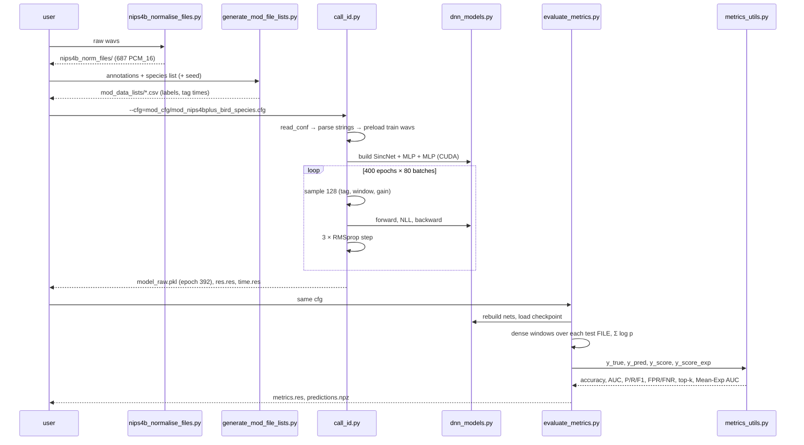

# Part 0 — The problems, the components, the end-to-end flow, and the algorithm catalogue

> Part of the [deep code review](../../CODE_REVIEW.md). Next: [Part 1](01_repository_and_scripts.md).
> This part is the map. The detail behind each box is in Parts 1–6; every claim is tied to code with a link.

---

## 1. The problems the system is built to solve

The repository reproduces *Bravo Sanchez et al., 2021*: classify bird (and some insect/amphibian) sounds in field recordings **directly from the waveform** with SincNet. Behind that sentence are eight distinct engineering problems; each has a specific solution in the code and a specific residual weakness.

| # | Problem | Why it is hard | How the code solves it | Residual weakness |
|---|---|---|---|---|
| P1 | **High-dimensional input, little data.** 44,100 samples/s; 5,478 labelled events | a free first conv layer has `F·K` weights on noisy samples | SincNet: parametrised band-pass filters ([dnn_models.py:28-158](../../SincNet_src/dnn_models.py#L28-L158)) | the 440 parameters do not move at `lr=1e-3` ([Part 3 §2.6](03_model_theory_to_code.md)) |
| P2 | **Events are shorter than the speech window.** median tag 90 ms, 5 % < 26 ms, 3 events < 10 ms | SincNet was built for 200 ms windows | `cw_len` 200 → 10/16/18 ms; `cw_shift` 10 → 1 ms ([mod_cfg](../../mod_cfg/mod_nips4bplus_bird_species.cfg#L11-L12)) | windows (16 ms) are shorter than many *syllable repeats*; temporal context beyond 16 ms is absent |
| P3 | **Events shorter than the window.** 6–24 training rows | a crop is shorter than the network input | keep the whole file; choose a window that **contains** the event ([call_id.py:90-96](../../call_id.py#L90-L96)) | affects ≤ 0.6 % of draws; the window is mostly background |
| P4 | **Variable-length recordings / fixed-input net** | the classifier sees only `wlen` samples | training: random windows from tags; testing: dense sliding window + pooling ([call_id.py:63-120](../../call_id.py#L63-L120), [evaluate_metrics.py:123-145](../../evaluate_metrics.py#L123-L145)) | test pooling is over the whole file, not the tag ([Part 5](05_inference_and_evaluation.md)) |
| P5 | **Three label granularities** (87 / 77 / 51) | different class definitions and test sets | three CSV pairs, one cfg per set ([generate_mod_file_lists.py:88-138](../../generate_mod_file_lists.py#L88-L138)) | three independent splits; labels not comparable |
| P6 | **Class imbalance (30×) and overlapping tags (17 % of windows)** | bias towards frequent classes; label noise | *not addressed*: uniform sampling, plain NLL ([call_id.py:69,208](../../call_id.py#L69)) | 11–25 classes never recalled |
| P7 | **Reproducibility of a stochastic pipeline** | random split, random windows, GPU | `split_seed`, `sorted(glob)`, seeds ([generate_mod_file_lists.py:43,50](../../generate_mod_file_lists.py#L43), [call_id.py:204-205](../../call_id.py#L204-L205)) | tracked split predates seeding; model code untracked; no env pin |
| P8 | **Faithful metrics** (Table 1, S7) | the paper's score aggregation is described loosely | [metrics_utils.py](../../metrics_utils.py) + dense evaluation | score saturation, whole-file rule ([Part 5](05_inference_and_evaluation.md)) |

---

## 2. System components and their responsibilities

| Component | Type | Inputs | Outputs | Depends on |
|---|---|---|---|---|
| [nips4b_normalise_files.py](../../nips4b_normalise_files.py) | batch script | `raw/nips4b_wav/train/*.wav` | `nips4b_norm_files/*.wav` (PCM_16, peak-normalised, clipped) | soundfile, numpy |
| [generate_mod_file_lists.py](../../generate_mod_file_lists.py) | batch script | annotation CSVs, species table | `mod_data_lists/*.csv` (3 × train/test) | pandas, sklearn |
| [data_io.py](../../SincNet_src/data_io.py) `read_conf` | library | `.cfg` | `options` object of strings | configparser, optparse |
| [dnn_models.py](../../SincNet_src/dnn_models.py) | library | architecture dicts | `SincNet`, `MLP` modules | torch |
| [call_id.py](../../call_id.py) | training script | cfg, lists, wavs | `model_raw.pkl`, `res.res`, `time.res`, stdout log | all of the above |
| [evaluate_metrics.py](../../evaluate_metrics.py) | evaluation script | cfg, lists, wavs, `model_raw.pkl` | `metrics.res`, `predictions.npz` | + `metrics_utils` |
| [metrics_utils.py](../../metrics_utils.py) | library | arrays | metric dict | sklearn, numpy |
| [dataset_analysis/](../../dataset_analysis/) | EDA | raw data | CSV tables + PDF figures | scipy, matplotlib, librosa |
| [code_review/](../scripts/) | review tooling | everything above (read-only) | figures, JSON, tests | torch, sklearn, matplotlib |

**Interaction pattern.** Components communicate *only through files on disk*: cfg → lists → wavs → checkpoint → predictions. There is no shared Python object between training and evaluation; the cfg is the contract. That is a strength (any stage can be re-run) and a weakness (the contract is untyped strings and silently duplicated parsing, [Part 6 §2.1](06_engineering_review.md)).

---

## 3. End-to-end flow (what happens when you reproduce one row of Table 1)



### 3.1 Data lineage with sizes (bird-species run, ⟨measured⟩)

```
raw/nips4b_wav/train                     687 files   ≈ 2,903 s    PCM_16
   │ normalise (clips 187 files)
nips4b_norm_files                        687 files   246 MB
   │ annotations (5,775 rows)  ─ drop Human/Unknown ─▶ 5,481 ─ keep birds ─▶ 5,279 rows, 51 species
   │ stratified 75:25 on rows
mod_bird_sps_train_files.csv             3,959 rows  (528 distinct files)
mod_bird_sps_test_files.csv              1,320 rows  (417 distinct files)
   │ 128 × 80 × 400 = 4,096,000 random windows of 705 samples  (≈ 1,035 per tag)
model_raw.pkl                            10.0 MB, 2,486,271 parameters, epoch 392
   │ 417 files × ≈ 4,395 frames = 1.83 M frames   (≈ 100 s on GTX 1650)
predictions.npz                          y_true, y_pred, y_score(1320×51), y_score_exp
   │ compute_metrics
metrics.res                              accuracy 0.5841, AUC 0.7872, …, params 2,486,271
```

### 3.2 Information flow inside one forward pass (training window)

`705 float64 → float32` → `[128,1,705]` → Sinc `[128,220,555]` → pool `[128,220,111]` → BN/leaky → conv `[128,60,107]` → pool `[128,60,21]` → BN/leaky → conv `[128,60,17]` → pool `[128,60,3]` → BN/leaky → flatten `[128,180]` → 3 × (FC1024+BN+ReLU) → FC51 → LogSoftmax `[128,51]` → NLL scalar. Memory at batch 128: 850 MB peak on the GPU ⟨measured⟩.

### 3.3 Information flow inside one test prediction

`file (≈220 k samples)` → `5,000 frames [5000,705]` → network → `[5000,51]` log-probs → **Σ over frames** → `[51]` → softmax (saturated) → argmax → compared with *each* of the file's ≈ 3.2 labels ([Part 5 §1](05_inference_and_evaluation.md)).

---

## 4. Algorithm catalogue

| # | Algorithm | Where | Complexity | One-line description | Detail |
|---|---|---|---|---|---|
| A1 | Windowed-sinc band-pass construction | [dnn_models.py:134-150](../../SincNet_src/dnn_models.py#L134-L150) | `O(F·K)` per forward | `(sin(2πf_h t) − sin(2πf_l t))/(πt) · w`, mirrored, centre-normalised | [Part 3 §2](03_model_theory_to_code.md) |
| A2 | Mel-scale initialisation | [dnn_models.py:50-56,89-103](../../SincNet_src/dnn_models.py#L50-L103) | `O(F)` | `F+1` equally spaced mel points → Hz | [Part 3 §2.2](03_model_theory_to_code.md) |
| A3 | 1-D valid convolution + max-pool | [dnn_models.py:422,448-456](../../SincNet_src/dnn_models.py#L422) | `O(C_out·C_in·K·T)` | cross-correlation then stride-pool | [Part 3 §5](03_model_theory_to_code.md) |
| A4 | Batch / layer normalisation | [dnn_models.py:247-258,311,415](../../SincNet_src/dnn_models.py#L247-L258) | `O(N)` | per-channel standardisation; BN with `eps` = pooled length | [Part 3 §4](03_model_theory_to_code.md) |
| A5 | Cross-entropy via LogSoftmax + NLL | [call_id.py:208,304](../../call_id.py#L208) | `O(B·C)` | `−mean log p(y|x)` | [Part 3 §7](03_model_theory_to_code.md) |
| A6 | RMSprop | [call_id.py:278-280](../../call_id.py#L278-L280) | `O(P)` | `θ ← θ − lr·g/(√v+ε)`, `v` EMA of `g²` | [Part 4 §1.2](04_training_loop_and_optimisation.md) |
| A7 | Stratified train/test split | [generate_mod_file_lists.py:98](../../generate_mod_file_lists.py#L98) | `O(N log N)` | per-class 75:25 | [Part 1 §3.3](01_repository_and_scripts.md) |
| A8 | Training-window sampler (two branches) | [call_id.py:63-120](../../call_id.py#L63-L120) | `O(B·wlen)` | uniform tag, random start inside/around the event | [Part 2 §2.3-2.4](02_data_pipeline.md) |
| A9 | Dense sliding-window inference | [evaluate_metrics.py:123-133](../../evaluate_metrics.py#L123-L133) | `O(F)` network evals, `F≈5,000` | `unfold` with hop 44 | [Part 5 §1](05_inference_and_evaluation.md) |
| A10 | Frame → file aggregation (product rule) | [evaluate_metrics.py:143-148](../../evaluate_metrics.py#L143-L148) | `O(F·C)` | `softmax(Σ log p)` | [Part 5 §2](05_inference_and_evaluation.md) |
| A11 | Weighted OvR ROC AUC, top-k, FPR/FNR | [metrics_utils.py:15-47](../../metrics_utils.py#L15-L47) | `O(N·C log N)` | scikit-learn | [Part 5 §3](05_inference_and_evaluation.md) |
| A12 | Peak normalisation | [nips4b_normalise_files.py:35](../../nips4b_normalise_files.py#L35) | `O(n)` | `x/abs(max x)` (+ clipping) | [Part 1 §3.1](01_repository_and_scripts.md) |
| A13 | (review) file-cluster bootstrap | [20_bootstrap_rules.py](../scripts/20_bootstrap_rules.py) | `O(R·N)` | resample files with replacement | [Part 5 §4](05_inference_and_evaluation.md) |
| A14 | (review) sweep-line overlap counting | [extract_annotation_data.py](../../dataset_analysis/scripts/extract_annotation_data.py) | `O(N log N)` | active-tag count over time | [DATASET_ANALYSIS.md §6](../../DATASET_ANALYSIS.md) |

---

## 5. What the system does *well*

* A **clean cfg-driven architecture**: one script covers default and enhanced models, and three class sets differ by a few lines ([Part 1 §4.1](01_repository_and_scripts.md)).
* The **short-event window logic** is correct, bounded, and never crashes on the real lists (0 invalid ranges over 3 × 4 k rows).
* The **speed work** of the reproduction (preload, `unfold`, per-file memoisation, GPU accumulation) is sound and documented with measurements ([logs.md](../../logs.md)).
* **Careful change control**: every behavioural change is logged with its reason and source ([logs.md](../../logs.md), [CLAUDE.md](../../CLAUDE.md)).
* **Artefacts are kept** (`res.res`, `time.res`, `predictions.npz`), which made the evaluation analysis in Part 5 possible without retraining.

## 6. What the system does *not* do (scope boundaries)

No detection (tags are given), no sound-event localisation, no multi-label output (one label per file at test time), no uncertainty/calibration, no background/"no-bird" class, no domain adaptation, no data augmentation in the enhanced models, no hyper-parameter search driver, no baseline models (waveform+CNN, DenseNet/ResNet/VGG), no unlabelled-test-set submission.

→ continue with [Part 1: repository anatomy](01_repository_and_scripts.md).
