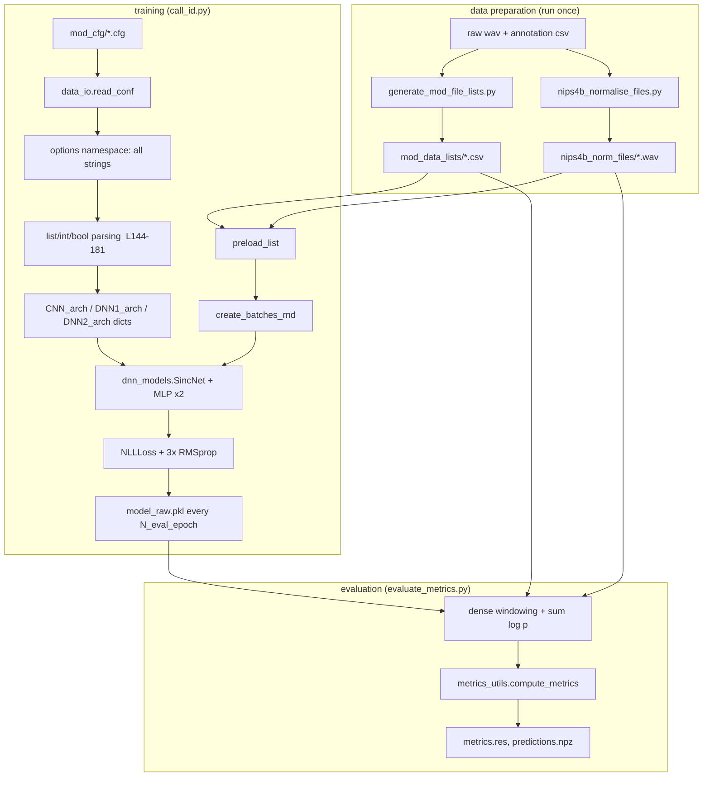
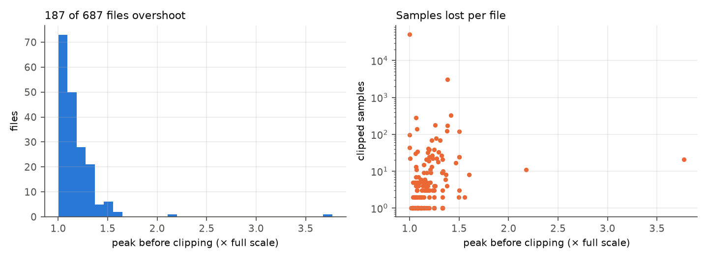

# Part 1 — Repository anatomy, dependencies, and the data-preparation scripts line by line

> Part of the [deep code review](../../CODE_REVIEW.md). All links point at the code in this repository.
> Numbers marked ⟨measured⟩ come from scripts in [code_review/scripts/](../scripts/); raw outputs are in [code_review/data/](../data/).

---

## 1. What the repository actually is

The repository is **three things layered on top of each other**:

| Layer | What it is | Files | Who wrote it |
|---|---|---|---|
| L0 | The upstream SincNet research code (speaker-ID on TIMIT/LibriSpeech) | [SincNet_src/](../../SincNet_src/) (nested git clone at `d741648`, ⟨measured⟩) | Ravanelli & Bengio |
| L1 | The paper authors' adaptation to NIPS4Bplus: crop/normalise/list scripts, `call_id.py`, cfgs | [cut_nips4bplus_files.py](../../cut_nips4bplus_files.py), [nips4b_normalise_files.py](../../nips4b_normalise_files.py), [generate_file_lists.py](../../generate_file_lists.py), [generate_mod_file_lists.py](../../generate_mod_file_lists.py), [call_id.py](../../call_id.py), [cfg/](../../cfg/), [mod_cfg/](../../mod_cfg/) | Bravo Sanchez et al. (2021) |
| L2 | This reproduction's additions: seeds, timing, metrics, EDA, docs, trained outputs | [evaluate_metrics.py](../../evaluate_metrics.py), [metrics_utils.py](../../metrics_utils.py), [dataset_analysis/](../../dataset_analysis/), [output/](../../output/), the `*.md` analyses, [logs.md](../../logs.md) | the reproduction |

Why this layering matters for a review: **every defect has an owner**. A bug in L0 (the BatchNorm `eps` problem, §3 of [Part 3](03_model_theory_to_code.md)) is not the reproduction's fault, but it is a fidelity constraint: [CLAUDE.md](../../CLAUDE.md) says to stay faithful to the authors' code, so L0/L1 behaviours are *documented, not repaired*. Defects in L2 are the reproduction's own responsibility and are the ones a maintainer can change.

### 1.1 Tracked vs untracked: the repo cannot be rebuilt from git alone

`git ls-files` (⟨measured⟩) contains no `dnn_models.py`, no `data_io.py`, no `SincNet_src/`. [.gitignore:7-9](../../.gitignore#L7-L9):

```
# Upstream SincNet clone (separate git repo, not part of this project)
SincNet_src/
dnn_models.py
data_io.py
```

and the two root files are **symlinks**:

```
data_io.py    -> SincNet_src/data_io.py
dnn_models.py -> SincNet_src/dnn_models.py
```

So a fresh `git clone` of this project has [call_id.py](../../call_id.py) importing modules that do not exist ([call_id.py:36-38](../../call_id.py#L36-L38)). The README tells the reader to copy them in ([README.md:58](../../README.md#L58)), but nothing pins *which* upstream commit. This review used `d741648`; `git -C SincNet_src log` ⟨measured⟩ shows five recent upstream commits, two of them edits to `dnn_models.py` ("Update dnn_models.py", `788fc3c`, `70326fd`). A different commit could silently change `SincConv_fast`.

### 1.2 Directory map with sizes and roles

```
NIPS4Bplus/
├─ call_id.py                 training (423 lines, 1 helper + 1 helper + top-level script)
├─ evaluate_metrics.py        evaluation (166 lines, pure script)
├─ metrics_utils.py           metric functions (47 lines, importable)
├─ generate_file_lists.py     Part I list builder (152 lines)
├─ generate_mod_file_lists.py Part II list builder (140 lines)
├─ cut_nips4bplus_files.py    Part I cropper (72 lines)
├─ nips4b_normalise_files.py  Part II normaliser (37 lines)
├─ cfg/ (3)                   default hyper-parameters, one per class set
├─ mod_cfg/ (3)               enhanced hyper-parameters (absolute /home/suchitra paths!)
├─ data_lists/                Part I .scp lists + .npy label dictionaries (committed)
├─ mod_data_lists/            Part II .csv lists (committed = the canonical split)
├─ output/                    3 × {model_raw.pkl 10 MB, predictions.npz, metrics.res, res.res, time.res} + 3 .log
├─ dataset_analysis/          EDA scripts (5) + CSV tables + 16 PDF figures
├─ code_review/               this review (scripts, data, figures, parts)
├─ overleaf_package/, overleaf_v2/, *.zip   LaTeX write-ups (figure copies, 18 MB)
└─ raw/ (610 MB), nips4b_norm_files/ (246 MB)   data, git-ignored
```

⟨measured⟩ `output/` is **tracked** (≈34 MB including three 10 MB pickles) although [logs.md](../../logs.md) says it is "gitignored" (the rule is commented out: [.gitignore:21](../../.gitignore#L21)). The `overleaf_*` folders and zips duplicate the 16 EDA PDFs three times.

---

## 2. Libraries and how they connect

| Library | Role | Concrete use (link) | Compatibility note |
|---|---|---|---|
| **PyTorch 2.14 (CUDA 13)** | tensors, autograd, `nn.Module`, RMSprop | [dnn_models.py](../../SincNet_src/dnn_models.py), [call_id.py:278-280](../../call_id.py#L278-L280) | Written for PyTorch ≤1.x; still runs. `Variable` is a deprecated no-op ([call_id.py:117](../../call_id.py#L117)); `torch.load` now defaults to `weights_only=True` which is fine for state-dicts ([evaluate_metrics.py:91](../../evaluate_metrics.py#L91)). |
| **soundfile** (libsndfile) | WAV decode to `float64` | [call_id.py:53](../../call_id.py#L53), [evaluate_metrics.py:120](../../evaluate_metrics.py#L120) | `sf.write` chooses **PCM_16** for `.wav` unless told otherwise → the clipping in [§4 of Part 2](02_data_pipeline.md) |
| **NumPy** | batch buffers, RNG for window/amplitude sampling | [call_id.py:65-71](../../call_id.py#L65-L71) | The *training RNG is NumPy's global state*; torch's seed does not control it ([call_id.py:204-205](../../call_id.py#L204-L205) seeds both) |
| **pandas** | CSV lists, annotation parsing | [call_id.py:186,192](../../call_id.py#L186) | slow `.iterrows()` + per-row `.loc` in the generators; irrelevant at 5 k rows |
| **scikit-learn** | `train_test_split`; `accuracy/roc_auc/precision/recall/f1/top_k/confusion_matrix` | [generate_mod_file_lists.py:26](../../generate_mod_file_lists.py#L26), [metrics_utils.py:10-12](../../metrics_utils.py#L10-L12) | `top_k_accuracy_score` tie behaviour matters (see [Part 5](05_inference_and_evaluation.md)) |
| `configparser` | read `.cfg` | [data_io.py:1,23-24](../../SincNet_src/data_io.py#L1) | everything comes back as **strings** (parsed later) |
| `optparse` | one flag `--cfg` | [data_io.py:19-22](../../SincNet_src/data_io.py#L19-L22) | `optparse` is "deprecated" but works |
| `glob`, `os`, `sys` | file discovery, positional argv | generators | no `argparse`, no `--help`, no validation |
| **matplotlib / scipy / librosa / seaborn / statsmodels** | EDA only | [dataset_analysis/scripts/](../../dataset_analysis/scripts/) | not needed to train; installed in `.venv` |

⟨measured⟩ environment: Python 3.14.7, numpy 2.5.3, pandas 3.0.6, scikit-learn 1.9.1, soundfile 0.14.0, torch 2.14.0+cu130, GPU: GTX 1650 4 GB. None are pinned in the repo.

### 2.1 How the pieces are wired together



The **only shared interface** between training and evaluation is the cfg file and the checkpoint dictionary keys `CNN_model_par`, `DNN1_model_par`, `DNN2_model_par` ([call_id.py:414-417](../../call_id.py#L414-L417), [evaluate_metrics.py:92-94](../../evaluate_metrics.py#L92-L94)). There is no shared code: evaluation re-implements model construction (see [Part 6](06_engineering_review.md)).

---

## 3. Line-by-line: the Part II preprocessing scripts

### 3.1 [nips4b_normalise_files.py](../../nips4b_normalise_files.py) (37 lines)

| Line | Code | What it does | Review note |
|---|---|---|---|
| [22-24](../../nips4b_normalise_files.py#L22-L24) | `wav_path=sys.argv[1]`, `output_path=sys.argv[2]` | positional CLI | no argument check → `IndexError` with no message |
| [26-27](../../nips4b_normalise_files.py#L26-L27) | `os.makedirs` | create output dir | fine |
| [30](../../nips4b_normalise_files.py#L30) | `glob(wav_path + '*.wav')` | **unsorted** file iteration | order irrelevant here (independent files) |
| [32-33](../../nips4b_normalise_files.py#L32-L33) | `sf.read` → `astype(np.float64)` | decode PCM_16 → float64 in [−1,1) | `sf.read` already returns float64 |
| [35](../../nips4b_normalise_files.py#L35) | `signal = signal/np.abs(np.max(signal))` | **intended** peak normalisation | uses `abs(max(x))`, i.e. *largest signed value*, not `max(abs(x))` |
| [36](../../nips4b_normalise_files.py#L36) | `sf.write(out, signal, fs)` | write **PCM_16** | values > 1 are clipped; values are re-quantised to 16 bit |

**Worked numerical consequence (⟨measured⟩, [06_normalisation_clipping.py](../scripts/06_normalisation_clipping.py)).**

For a file with positive peak `P = max(x)` and negative peak `N = min(x)`:

* the divisor is `|P|`; the result has positive peak exactly 1 and negative peak `N/P`;
* if `|N| > P` the negative peak is `|N|/P > 1` and is clipped to −1 on write.

Across all 687 train files: **187 files (27.2 %)** have `|N|/P > 1`; maximum `|N|/P = 3.77`; the worst file loses **23.3 %** of its samples to flat-topping (51,454 samples); the median affected file loses 2 samples (0.0012 % of the file). After the pass, `max|x| = 1.0` for every file (⟨measured⟩), so *looking at the written files cannot reveal the problem*; one has to compare against the raw files.



The same expression appears in [cut_nips4bplus_files.py:62](../../cut_nips4bplus_files.py#L62). A silent file (all samples ≤ 0) would divide by `0` or by a negative number; none occurs in this corpus (⟨measured⟩ no file has `max ≤ 0`).

### 3.2 [cut_nips4bplus_files.py](../../cut_nips4bplus_files.py) (72 lines, Part I only)

| Line | Code | Note |
|---|---|---|
| [41](../../cut_nips4bplus_files.py#L41) | `glob(csv_path + '*.csv')` | **not sorted**, unlike the Part II list builder; the *row index in the file name* (`_<l>`) comes from the CSV row order so it is still deterministic per file |
| [43](../../cut_nips4bplus_files.py#L43) | `'nips4b_birds_trainfile' + csv.str[-7:-4]` | derives the wav id from the last 7–4 characters of the csv path (`…annotation_train007.csv` → `007`) |
| [49-54](../../cut_nips4bplus_files.py#L49-L54) | `try: pd.read_csv(...) except EmptyDataError` | the 105 empty annotation files are skipped here |
| [58-62](../../cut_nips4bplus_files.py#L58-L62) | read, float64, normalise | same normalisation as above, but **applied to the whole file before cropping** |
| [66-68](../../cut_nips4bplus_files.py#L66-L68) | `beg=int(start*fs)`, `end=int((start+length)*fs)` | truncating `int()`; a 2.3 µs tag becomes 0 or 1 samples |
| [71-72](../../cut_nips4bplus_files.py#L71-L72) | `sf.write(…_<l>.wav)` | writes **every** row, including `Human` and `Unknown`; filtering happens in the list builder |

Because `Human`/`Unknown` rows are also cropped, the number of cropped files exceeds the number of rows in the lists (the list builder drops them). Part I **has no runner** in this repo besides the upstream [speaker_id.py](../../SincNet_src/speaker_id.py) in the ignored clone.

### 3.3 [generate_mod_file_lists.py](../../generate_mod_file_lists.py) (140 lines)

This script defines the *experiment*: which tags exist, what their integer labels are, and which are held out.

| Lines | Code | What it does |
|---|---|---|
| [36-43](../../generate_mod_file_lists.py#L36-L43) | argv parsing + `split_seed` | the 4th argument was added by the reproduction (`random_state`), default **1234** |
| [50](../../generate_mod_file_lists.py#L50) | `sorted(glob(...))` | added by the reproduction so integer labels do not depend on file-system order |
| [52](../../generate_mod_file_lists.py#L52) | `wav = 'nips4b_birds_trainfile' + csv.str[-7:-4]` | the wav name |
| [60-82](../../generate_mod_file_lists.py#L60-L82) | loops over CSV files and rows | builds `file_list` with columns `file,type,class_name,species,start,length` |
| [73-79](../../generate_mod_file_lists.py#L73-L79) | `sps_list.loc[class name == m[2]].type.values[0]` inside `try/except:` | **bare except** → `type=''`, `species=''` for any lookup failure |
| [88](../../generate_mod_file_lists.py#L88) | `file_list[type != '']` | "All classes": everything that resolved, i.e. birds + insects + amphibian (drops `Human`, `Unknown`) |
| [91-94](../../generate_mod_file_lists.py#L91-L94) | `unique()` + `reset_index` + `merge` | integer label = **order of first appearance** of the class name |
| [98](../../generate_mod_file_lists.py#L98) | `train_test_split(all_classes, stratify=label, test_size=0.25, random_state=seed)` | **row-level stratified split** |
| [101-102](../../generate_mod_file_lists.py#L101-L102) | `to_csv` | writes `mod_all_classes_{train,test}_files.csv` |
| [107-135](../../generate_mod_file_lists.py#L107-L135) | repeat for birds (class label) and birds (species label) | **three independent splits** |

**What this means concretely (⟨measured⟩, [05_data_audit.py](../scripts/05_data_audit.py)).**

* Three *different* random 25 % test subsets are created. `mod_bird_classes_test_files.csv` and `mod_bird_sps_test_files.csv` have the same size (1,320) but are not the same rows.
* Label integers are **not comparable across sets**. For `trainfile007` the Gargla_call row has label **11** in All classes, **9** in Bird classes and **8** in Bird species ([data/example_trainfile007_rows.csv](../data/example_trainfile007_rows.csv)).
* The label↔name mapping is never saved as a dictionary; it lives implicitly in the `label` and `class_name`/`species` columns. [`class_names()`](../scripts/_common.py) in the review scripts reconstructs it, and the confusion matrices rely on it.
* Per-class test share is 21–27 % (stratification works at the class level), minimum 2 / 3 / 4 test rows per class for All / Bird classes / Bird species.
* Sizes 4110/1371, 3959/1320, 3959/1320 match Supplementary S4–S6 (train sizes 4110/3959/3959).

### 3.4 [generate_file_lists.py](../../generate_file_lists.py) (Part I, 152 lines)

Same idea with three differences: (i) it filters `length > 0.01` ([L82](../../generate_file_lists.py#L82)) because it later *crops* to the tag and a ≤10 ms crop cannot fill a 10 ms window; (ii) its `File` field is the **cropped-clip file name** `…_<row>.wav` ([L83](../../generate_file_lists.py#L83)); (iii) output is `.scp` (a file column) plus a pickled-dict `.npy` mapping `File → label` ([L116-118](../../generate_file_lists.py#L116-L118)). Note `class_dict = dict(zip(merge_class.File, merge_class.Value))` builds the dictionary from the *whole* pool (train + test), which is what the upstream `speaker_id.py` expects (`lab_dict[wav_name]`). The 4th-argument seed was added by the reproduction ([L50](../../generate_file_lists.py#L50)).

### 3.5 Cross-script consistency checks (⟨measured⟩)

| Invariant | Holds? |
|---|---|
| Wav ids parsed identically in all four scripts (`str[-7:-4]`) | yes |
| Every list row's file exists in `nips4b_norm_files/` | yes (687/687 present; all list files resolve) |
| No `(file,start,length)` appears in both train and test of the same set | yes (0 duplicates) |
| `start+length ≤ file duration` for every training row | yes (0 events end past EOF) |
| Labels contiguous `0…C−1` in each CSV pair | yes (87 / 77 / 51) |
| Part I and Part II lists describe the same tag population | **no**: Part I drops ≤10 ms tags (3 rows) and uses a different split |

---

## 4. Configuration files as a design element

The authors encode the **entire architecture in strings** inside `.cfg` files ([mod_cfg/mod_nips4bplus_bird_species.cfg](../../mod_cfg/mod_nips4bplus_bird_species.cfg)):

```ini
[cnn]
cnn_N_filt=220,60,60            # comma-separated per layer
cnn_len_filt=151,5,5
cnn_use_batchnorm=True,True,True
cnn_act=leaky_relu,leaky_relu,leaky_relu
```

* `read_conf` ([data_io.py:17-78](../../SincNet_src/data_io.py#L17-L78)) copies each key into an attribute as a **string** (60 near-identical `Config.get` lines; `read_conf_inp` at [L121-181](../../SincNet_src/data_io.py#L121-L181) is a verbatim duplicate for a different entry point).
* [call_id.py:144-181](../../call_id.py#L144-L181) then converts with `split(',')`, `map(int/float/str_to_bool)`.
* [`str_to_bool`](../../SincNet_src/data_io.py#L81-L87) accepts **only** the exact strings `'True'`/`'False'`; anything else raises a bare `ValueError` with no message (`true`, `1`, trailing spaces all fail).
* The cfg **cannot express inconsistency checks**: lists of different lengths (`cnn_N_filt` 3 values vs `cnn_act` 2 values) fail late with `IndexError` inside the model constructor.

**Positives.** The architecture is data-driven; one script covers default and enhanced models; changing `class_lay` is the only difference needed between the three class sets (plus `cw_len` for all-classes). **Negatives.** Absolute paths ([mod_cfg/…:2-5](../../mod_cfg/mod_nips4bplus_bird_species.cfg#L2-L5)) make the files non-portable; `logs.md` records `sed` rewriting them for Colab. `fact_amp` is *not* in the upstream parser: the reproduction added it with a second `ConfigParser` pass ([call_id.py:139-142](../../call_id.py#L139-L142)) rather than extending `read_conf`.

### 4.1 Diff of default vs enhanced cfg (⟨measured⟩ with `diff`)

| Key | `cfg/` default | `mod_cfg/` enhanced | Where it bites |
|---|---|---|---|
| `fs` | 44100 | 44100 | same |
| `cw_len` | 10 | 16 (bird), 18 (all) | `wlen` 441 → 705 / 793 |
| `cw_shift` | 1 | 1 | evaluation hop = 44 samples |
| `fact_amp` | absent → 0.2 | 0 | amplitude jitter off |
| `cnn_N_filt` | 80,60,60 | 220,60,60 | Sinc filters |
| `cnn_len_filt` | 251,5,5 | 151,5,5 | Sinc taps |
| `cnn_max_pool_len` | 3,3,3 | 5,5,5 | |
| `cnn_use_laynorm_inp` | True | False | input normalisation |
| `cnn_use_laynorm` / `cnn_use_batchnorm` | T,T,T / F,F,F | F,F,F / T,T,T | **also removes `abs()` and triggers the eps bug** |
| `fc_lay` | 2048×3 | 1024×3 | |
| `fc_use_laynorm_inp` | True | False | |
| `fc_act` | leaky_relu | relu | |
| `N_epochs` / `N_batches` | 200 / 800 | 400 / 80 | 160 k vs 32 k optimiser steps |
| rest (`lr`, `batch_size`, `seed`, dropouts, `N_eval_epoch`) | same | same | |

---

## 5. Honest inventory of what is dead code

| Code | Location | Status |
|---|---|---|
| `ReadList` | [data_io.py:7-14](../../SincNet_src/data_io.py#L7-L14) | imported by [call_id.py:38](../../call_id.py#L38), never called (the CSV path replaced it) |
| `create_batches_rnd` (upstream version) | [data_io.py:90-117](../../SincNet_src/data_io.py#L90-L117) | never called; would `NameError` (`scipy` import is commented out at [L4](../../SincNet_src/data_io.py#L4)) |
| `read_conf_inp` | [data_io.py:121-181](../../SincNet_src/data_io.py#L121-L181) | never called |
| `flip`, `sinc`, `sinc_conv` | [dnn_models.py:9-25,163-220](../../SincNet_src/dnn_models.py#L9-L25) | legacy Sinc implementation; `SincNet` uses `SincConv_fast` ([L419](../../SincNet_src/dnn_models.py#L419)); `sinc_conv` also hard-codes `.cuda()` |
| `flip` import | [call_id.py:36](../../call_id.py#L36) | imported, unused |
| `import torch.nn.functional as F`, `Variable` | [call_id.py:30,32](../../call_id.py#L30) | `F` unused; `Variable` is a no-op wrapper |
| `lab_dict` option, `class_dict_file` | [call_id.py:131,236-237](../../call_id.py#L131) | commented out; `read_conf` still *requires* `lab_dict` to exist in the cfg (that is why mod cfgs carry an empty `lab_dict=`) |
| `pt_file` branch | [call_id.py:270-274](../../call_id.py#L270-L274) | functional (resume/finetune weights only; no optimizer state) |
| `snt_te`, `wav_lst_te` when `run_validation=False` | [call_id.py:190-193](../../call_id.py#L190-L193) | test list is loaded and counted but unused |
| `Batch_dev=128` | [call_id.py:216](../../call_id.py#L216) | only used inside the disabled validation |
| `err_tot`, `loss_tot` printing under `run_validation` | [call_id.py:399](../../call_id.py#L399) | unreachable with the default flag |
| `ArchitectureAnalysis.md` | repo root | byte-identical copy of `DeepArchitectureAnalysis.md` |

Dead code is concentrated in the upstream helper modules (`data_io.py`, the legacy half of `dnn_models.py`); `call_id.py` itself is almost entirely live.

---

## 6. Take-aways for Part 1

1. The repository is reproducible **only together with an unpinned, untracked upstream clone**.
2. The data-preparation scripts are short and correct *except* the normalisation (`abs(max)` + PCM_16 clipping) and the bare `except:` in the list builders.
3. The experiment is defined by `generate_mod_file_lists.py`: three independent **tag-level** stratified splits whose labels are not comparable between sets.
4. Everything architectural is a string in a cfg; the code that interprets those strings is duplicated in two places.

→ continue with [Part 2: the data pipeline in depth](02_data_pipeline.md).
