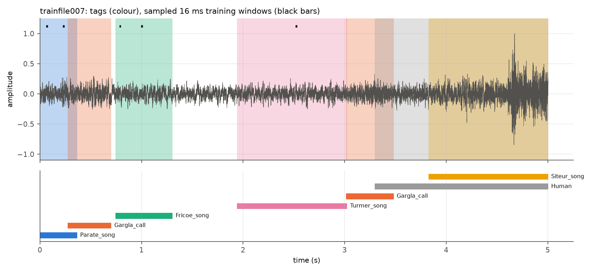
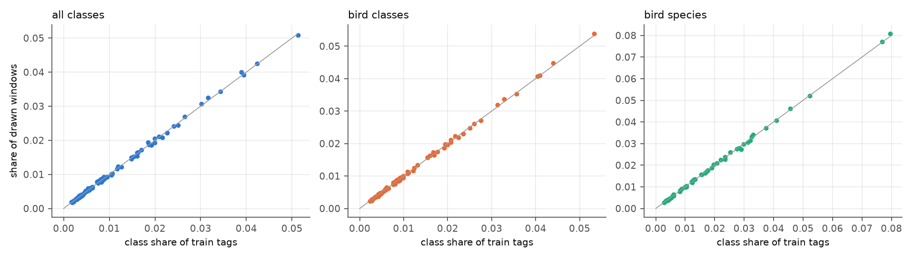
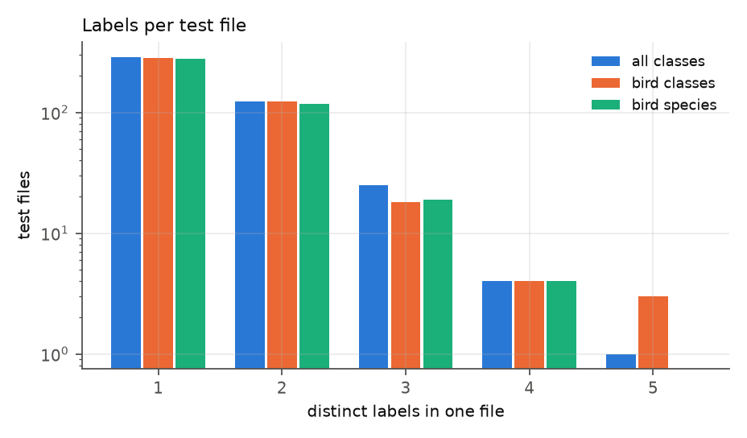
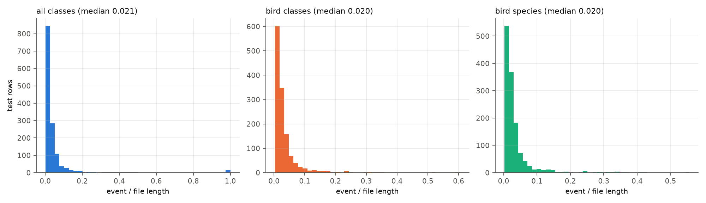

# Part 2 — The data pipeline in depth: from a 5-second recording to a `128 × 705` tensor

> Part of the [deep code review](../../CODE_REVIEW.md). Previous: [Part 1](01_repository_and_scripts.md). Next: [Part 3](03_model_theory_to_code.md).
> Companion documents: [DataPipelineAnalysis.md](../../DataPipelineAnalysis.md), [DATASET_ANALYSIS.md](../../DATASET_ANALYSIS.md). Where this review disagrees with them, §9 says so.

The goal of this part is to follow **one real recording** through every transformation, with the exact numbers, then step back and quantify what the pipeline does to the *training distribution* (class imbalance, label noise, leakage) and to the *evaluation protocol* (what a "test sample" actually is).

---

## 1. Raw inputs (what the pipeline is fed)

| Item | Value | Source |
|---|---|---|
| training recordings | 687 mono WAVs, 44,100 Hz, **PCM_16** (the paper says 32-bit) | [DATASET_ANALYSIS.md §1](../../DATASET_ANALYSIS.md) ⟨verified again here with `sf.info`⟩ |
| duration | 1.016–5.004 s, 61.9 % are exactly 5.0039 s (220,672 samples) | [dataset_analysis/data/audio_features.csv](../../dataset_analysis/data/audio_features.csv) |
| annotations | 674 headerless CSVs of `start_s, length_s, label`; 105 empty, 13 recordings have no file | [DataPipelineAnalysis.md §2](../../DataPipelineAnalysis.md) |
| tag rows | 5,775 raw → 5,481 after dropping `Human`/`Unknown` | same |
| class table | `nips4b_birdchallenge_espece_list.csv`: `class number, class name, English_name, Scientific_name, type` | [raw/nips4b_labels/](../../raw/nips4b_labels/) |

A class name is `<6-letter species code>_<call|song|drum>`, e.g. `Turmer_song` = *Turdus merula* song. "Bird species" merges the three suffixes by grouping on `Scientific_name` ([generate_mod_file_lists.py:128-132](../../generate_mod_file_lists.py#L128-L132)).

---

## 2. A single recording, followed end to end: `trainfile007`

I use [nips4b_birds_trainfile007.wav](../../nips4b_norm_files/nips4b_birds_trainfile007.wav) because it is the multi-tag example the EDA already plots ([DATASET_ANALYSIS.md §6.2](../../DATASET_ANALYSIS.md)).



### 2.1 Step 0 — what the annotator wrote ([data/example_trainfile007_annotation.csv](../data/example_trainfile007_annotation.csv))

| row | start (s) | length (s) | label | kept by list builder? |
|---|---|---|---|---|
| 0 | 0.000000 | 0.365714 | Parate_song | yes |
| 1 | 0.272834 | 0.429569 | Gargla_call | yes |
| 2 | 0.743039 | 0.563084 | Fricoe_song | yes |
| 3 | 1.938866 | 1.085533 | Turmer_song | yes |
| 4 | 3.012789 | 0.470204 | Gargla_call | yes |
| 5 | 3.297234 | 1.706667 | **Human** | **no** (`type == ''`, [generate_mod_file_lists.py:88](../../generate_mod_file_lists.py#L88)) |
| 6 | 3.825488 | 1.178413 | Siteur_song | yes |

Seven tags, four overlap in time with another (rows 0/1, 4/5/6). The recording is 220,672 samples (5.0039 s), peak 0.99997, RMS 0.0895 ⟨measured⟩.

### 2.2 Step 1 — split assignment (⟨measured⟩, [data/example_trainfile007_rows.csv](../data/example_trainfile007_rows.csv))

The *same recording* lands on both sides of the split in every one of the three class sets:

| class set | rows in **train** | rows in **test** |
|---|---|---|
| all classes | Parate_song(10), Gargla_call(11) ×2, Fricoe_song(12), Turmer_song(13) | Siteur_song(14) |
| bird classes | Parate_song(8), Fricoe_song(10), Gargla_call(9), Turmer_song(11) | Gargla_call(9), Siteur_song(12) |
| bird species | Parate(2), Fricoe(9), Gargla(8), Turmer(6) | Gargla(8), Siteur(10) |

(integers in parentheses are the *labels*; note `Gargla_call` is 11, 9 and 8 in the three sets.)

So whatever the model learns from this file's first 3 seconds is used to judge it on the last 2 seconds — and, as shown below, the *whole-file* decision at test time looks at all 5 seconds.

### 2.3 Step 2 — one training draw ([call_id.py:63-120](../../call_id.py#L63-L120))

Take the **Turmer_song** training row. With the enhanced bird configuration `wlen = int(44100·16/1000) = 705`:

```
t_min = int(1.938866213 · 44100) = 85 503
t_max = t_min + int(1.08553288 · 44100) = 85 503 + 47 872 = 133 375
t_max − t_min = 47 872  >  wlen = 705     → "event longer than window" branch  (call_id.py:87)
signal_start ∈ randint(85 503, 133 375 − 705 = 132 670)    → 47 167 equally likely starts (L88-89)
window = signal[signal_start : signal_start + 705]          → always entirely inside the song
```

The probability that a given *draw* picks this row is `1/3959` (uniform over rows, [call_id.py:69](../../call_id.py#L69)); the probability that the model sees one *specific* 16 ms window of the song in one draw is `1/3959 · 1/47167 ≈ 5.4×10⁻⁹`. Over a whole run (4.1 M draws) it sees this song ≈ 1,035 times, each time a different 16 ms slice, i.e. ≈ 1,035 of 47,167 possible slices (2.2 %).

The amplitude multiplier is `U(1−f, 1+f)` with `f = fact_amp`; for the enhanced config `f = 0` so the window is passed **unscaled** ([call_id.py:113](../../call_id.py#L113)).

### 2.4 Step 3 — the short-event branch, on the shortest realistic example

The `Sylmel_call` row in `trainfile614` (start 4.623673 s, length **8.7 ms**) has `t_min=203 903`, `t_max=204 287` (384 samples), file length 220,672:

```
t_max − t_min = 384 ≤ 705           → "buffer" branch (call_id.py:90)
lo = max(0, t_max − wlen) = 203 582       # window must end no earlier than the event end
hi = min(t_min, len − wlen) = 203 903     # window must start no later than the event start
lo ≠ hi → signal_start = randint(203 582, 203 903)    (321 equally likely, 203 903 excluded)
```

so the 384-sample event sits at offset 0–320 samples inside a 705-sample window; the window is **45 % background** on average. For the extreme row `Poepal_call` (length 0.000023 s = **1 sample**) the window is 99.9 % background but still labelled `Poepal_call`.

⟨measured⟩ across the *entire* bird-species training list only **6 rows (0.15 %)** take this branch; their lengths are 0.02, 2.9, 8.7, 11.4, 13.4, 16.0 ms. For all-classes (wlen 793) it is 24 rows (0.58 %); for bird-classes 12 rows (0.30 %).

**Review conclusion.** The authors' headline modification ("process calls shorter than `cw_len`") affects **well under 1 % of training windows**. It is a correct and carefully written edge-case handler, not a major source of the accuracy.

### 2.5 Step 4 — what the model is shown at test time

For the test row `Gargla_call` (3.013–3.483 s) of the same file the evaluator does **not** use the tag: [evaluate_metrics.py:119-145](../../evaluate_metrics.py#L119-L145) reads the whole file and scores every frame:

```
len = 220 672, wlen = 705, wshift = 44
n_frames = ceil((220 672 − 705)/44) = ceil(4 999.3) = 5 000 frames   (⟨measured⟩ matches)
frame k covers samples [44k, 44k + 705)
```

The tagged event (0.470 s) corresponds to **471 of the 5,000 frames (9.4 %)** (frames whose centre lies in the tag), the *Siteur_song* row (1.178 s) to 1,173 frames (23.5 %).

⟨measured⟩ predictions for this file, bird-species model (labels: Gargla=8, Siteur=10, Turmer=6):

| row | true | A: whole file Σ log p | B: whole file mean p | C: tag span Σ log p | D: tag span mean p |
|---|---|---|---|---|---|
| Gargla_call | 8 | **6** (*Turdus merula*) | 6 | **8** ✔ | **8** ✔ (p=0.53) |
| Siteur_song | 10 | 6 | 6 | 15 | 28 (p_true=0.007) |

The whole-file rule answers `Turmer_song` (label 6) **for both rows**, because the 1.09 s Turmer song is the longest, loudest-to-the-network event in the file. One prediction cannot be right for two different labels; whatever the model is, the protocol makes it wrong on one of them. Restricting to the tag span fixes `Gargla_call` and leaves `Siteur_song` wrong (the tag-span mean-p rule answers *Luscinia megarhynchos*, label 28, with p = 0.39 while the true class gets 0.007).

---

## 3. Annotation timing semantics: what is a "tag"?

* The annotator tagged **syllables or phrases**, so the same species and call type often has many short tags in a row (`Gargla_call` appears twice in 007).
* Overlap is common: a sweep-line over the annotated recordings finds 33.7 % of annotated time covered by ≥1 tag and 5.6 % by ≥2 simultaneous tags ([DATASET_ANALYSIS.md §6.1](../../DATASET_ANALYSIS.md)); 27.4 % of tags overlap another tag of any label.
* Event length is log-normal: median 90 ms, mean 195 ms, 5 % / 95 % quantiles **26 ms / 462 ms** for birds (⟨measured⟩ from the bird-species training list), with a 2.78 s maximum.
* Overlapping insect songs act as a near-continuous background.

---

## 4. The training sampler as a statistical object

[create_batches_rnd](../../call_id.py#L63-L120) defines the training distribution. ⟨measured⟩ by simulating 100,000 draws per class set ([15_sampler_and_example.py](../scripts/15_sampler_and_example.py)):



### 4.1 Class prior

* Draw probability = class share of training *tags* (max absolute deviation between simulated and exact share 0.001–0.002).
* Class share ratios: max/min **30.1× / 23.4× / 28.6×** (All / Bird classes / Bird species).
* Expected draws **per epoch** (`128×80 = 10,240` draws): the rarest class gets **17 / 23 / 28** windows, the commonest **526 / 546 / 815**.
* Per batch of 128, the number of distinct classes is **54.7 of 87 / 52.2 of 77 / 39.3 of 51** on average (minimum 45 / 44 / 33): a typical batch misses a third of the classes, and batch normalisation statistics are computed on this skewed composition.
* Nothing re-weights the loss ([call_id.py:208](../../call_id.py#L208) is plain `NLLLoss`) or the sampler.

### 4.2 Label noise created by overlapping tags

A window is cut from inside one tagged event but **other tags may cover the same time span**. ⟨measured⟩ (5,000 simulated draws per set):

| set | windows overlapped in time by *any* other tag | …by a tag of a **different class** |
|---|---|---|
| All classes | 17.6 % | **16.4 %** |
| Bird classes | 17.7 % | **16.9 %** |
| Bird species | 17.6 % | **16.6 %** |

(For the buffered short-event branch the start is the deterministic lower bound, so these are slight lower bounds.) So **about one training window in six is labelled with one species while a different tagged species is audible in the same 16 ms**. The network cannot be penalised for "wrong" answers on those windows by anything other than the label noise itself — a ceiling-lowering effect that applies to the paper's code as well.

### 4.3 Epoch semantics

An "epoch" is `N_batches × batch_size` draws *with replacement*, not a pass over the data:

| | default | enhanced |
|---|---|---|
| draws per epoch | 102,400 | 10,240 |
| epochs | 200 | 400 |
| draws per run | 20.5 M | 4.1 M |
| optimiser steps | 160,000 | 32,000 |
| draws per training tag per run | ≈ 5,000 | ≈ 1,000 (all 3 sets: 997–1,035) |

Comparing "epochs" across configurations is meaningless; compare steps or draws ([Part 4](04_training_loop_and_optimisation.md)).

### 4.4 RNG and reproducibility of the stream

Randomness consumed per batch: one `randint(N, size=128)` (ids), one `uniform(…, 128)` (gains, even when `f=0`), then up to 128 calls of `randint` (window starts). All from **NumPy's global RNG**, seeded once ([call_id.py:204-205](../../call_id.py#L204-L205)). Because the same stream is used for the data, results are reproducible only if `np.random` is not touched elsewhere; there is no `torch.backends.cudnn.deterministic`, so GPU kernels (conv1d backward) may still differ run to run. I did **not** re-run training to test bit-reproducibility (76 min per run; see [Part 7](07_gap_analysis_and_open_questions.md)).

---

## 5. Train/test relationship (what "held-out" means here)

### 5.1 Leakage numbers (⟨measured⟩, [05_data_audit.py](../scripts/05_data_audit.py))

| | test rows | unique test files | test files that also contain **train** rows | test rows in such files | test rows whose time span overlaps a train tag of the same file |
|---|---|---|---|---|---|
| All classes | 1,371 | 442 | 428 (96.8 %) | **98.6 %** | 276 (**20.1 %**) |
| Bird classes | 1,320 | 429 | 414 (96.5 %) | **98.6 %** | 214 (**16.2 %**) |
| Bird species | 1,320 | 417 | 406 (97.4 %) | **99.0 %** | 221 (**16.7 %**) |

Interpretation:

1. Nearly every test file is seen (via other tags) during training — the model can use **recording-specific cues** (background noise, microphone, site) that identify the file and correlate with its species. This favours the reported accuracy; it is the effect the paper concedes ("drawing training and test sets from the same data pool … simplifies the task").
2. In ≈ 1 of 6 test tags the *same audio samples* are inside a training annotation of another species.

### 5.2 The ceiling of a one-label-per-file classifier

⟨measured⟩: 48 % of test rows are in files whose rows carry ≥ 2 distinct labels (154 / 149 / 140 files). Because the evaluator makes **one prediction per file** ([evaluate_metrics.py:119-153](../../evaluate_metrics.py#L119-L153)), the best possible accuracy is `Σ_files max_label_count / rows`:

| set | ceiling |
|---|---|
| All classes | **82.2 %** |
| Bird classes | **81.6 %** |
| Bird species | **82.7 %** |



Accuracy declines monotonically with the number of distinct labels in the file ⟨measured⟩ (bird species: 71.6 % with 1 label, 50.6 % with 2, 19.3 % with ≥3; [data/group_breakdowns.json](../data/group_breakdowns.json)). A conservative reading: roughly **18 points of the accuracy scale are unreachable by construction** under the shipped rule, whatever the network learns.

### 5.3 Event size vs file size

The scored unit is the whole file, the labelled unit is a tag:



Median event/file duration ratio **2.0 %** (all 3 sets), 90th percentile 6.6–7.5 %, only 0.08–1.1 % of rows are more than half of the file (those are mostly insect songs).

---

## 6. Normalisation and what the network sees

Peak-normalised files have a residual **loudness spread**: the 5th/95th percentile RMS is **0.064 / 0.260** (ratio 4.1×, median 0.166, ⟨measured⟩). Reasons: peak (not RMS) normalisation means files with a single loud transient (e.g. `trainfile439`, crest factor 150, [DATASET_ANALYSIS.md §3.2](../../DATASET_ANALYSIS.md)) have a tiny background after scaling; files without transients are scaled up.

Combined with two configuration choices in the enhanced models:

* `fact_amp = 0` — no random gain during training ([logs.md](../../logs.md) change of 2026-10-07), and
* `cnn_use_laynorm_inp = False`, `cnn_use_batchnorm_inp = False` — no input normalisation ([mod_cfg:19-20](../../mod_cfg/mod_nips4bplus_bird_species.cfg#L19-L20)),

the first Sinc layer receives raw amplitudes whose scale is a *per-recording property*. A model that has seen other tags of a recording can use amplitude/noise-floor as a recording identifier. ⟨measured⟩ activation scale at the input is std 0.19 with **21 % of input samples exactly zero** (quiet 16-bit segments; [data/layer_stats.json](../data/layer_stats.json)). I did not measure how much accuracy this contributes (it would need an ablation, which per [CLAUDE.md](../../CLAUDE.md) is out of scope).

---

## 7. Evaluation protocol as a data transformation

```
test row i  (file f_i, start s_i, length l_i, label y_i)
   │
   ├── read f_i  (the WHOLE file; s_i, l_i are never used)             evaluate_metrics.py:119-121
   ├── frames  k = 0 … F−1  with  F = ceil((len − wlen)/wshift)           :123-129
   ├── pout[k, :] = log-softmax(model(frame k))        (F × C)            :131-133
   ├── score_i = Σ_k pout[k, :]      (cached per FILE)                    :143
   └── y_pred_i = argmax softmax(score_i);  compare with y_i              :147-151
```

⟨measured⟩ cost: the 417 unique test files of the bird-species list contain **1.83 M frames**; a pass takes ≈100 s on the GTX 1650 (≈ 18 k frames/s, [11_profile.py](../scripts/11_profile.py)); the `call_id.py` validation path (disabled) would redo this for every row (3.2 rows/file → 3.2× the work), which is why the evaluator memoises per file.

---

## 8. Data-pipeline findings, ranked

| # | Finding | Evidence | Effect on results |
|---|---|---|---|
| D1 | Whole-file scoring vs tag labels; ceiling ≈ 82 % | §5.2 | very large (+10-13 pts when scored on the tag span, [Part 5](05_inference_and_evaluation.md)) |
| D2 | Tag-level split ⇒ 98.6–99.0 % of test rows share a recording with training rows | §5.1 | inflates accuracy relative to a recording-level split |
| D3 | 16.4–16.9 % of training windows overlap a tag of another class | §4.2 | label noise lowers the achievable train accuracy |
| D4 | No class balancing; 23–30× prior ratio; zero-recall classes | §4.1, [Part 5](05_inference_and_evaluation.md) | 11–25 classes never recalled |
| D5 | Normalisation clips 27 % of files (up to 23 % of samples) | [Part 1 §3.1](01_repository_and_scripts.md) | data-quality; same in the authors' data |
| D6 | Short-event branch affects ≤0.6 % of training windows | §2.4 | negligible |
| D7 | No input normalisation / no gain jitter in enhanced models | §6 | recording identity cues available |
| D8 | Three independent splits, labels not comparable across sets | [Part 1 §3.3](01_repository_and_scripts.md) | cross-set comparisons are comparisons of different test samples |

---

## 9. Corrections to the existing data-pipeline documents

| Statement | Document | Status |
|---|---|---|
| "every draw re-reads the wav from disk" | [DataPipelineAnalysis.md §5](../../DataPipelineAnalysis.md) | outdated: [preload_list](../../call_id.py#L48-L59) reads each file once |
| "`fact_amp` hard-coded 0.2, not reachable from cfg" | same | outdated: [call_id.py:139-142](../../call_id.py#L139-L142), enhanced cfgs set 0 |
| "no `random_state` is passed anywhere" | same §4.2 | outdated: `split_seed` ([generate_mod_file_lists.py:43](../../generate_mod_file_lists.py#L43)) |
| "evaluate_metrics does not cache/memoise" | same §6 | outdated: [evaluate_metrics.py:111-147](../../evaluate_metrics.py#L111-L147) |
| normalised file "can exceed ±1.0" (47/200, ≤1.38×) | same §3 | the PCM_16 write clips instead; **187/687, ≤3.77×**, ≤23 % samples |
| "no surviving runner for Part I" | same §0 | the upstream `speaker_id.py` exists (git-ignored clone) |
| "1.1–7.3 % of file" for five sampled rows | same §6 | consistent with the full-list median 2.0 % / p90 6.6–7.5 % |
| the per-batch I/O claim "4,096,000 sf.read calls" | same §5 | no longer true; with preloading, assembling a batch takes **0.97 ms** ⟨measured⟩ |

→ continue with [Part 3: the model, theory to code](03_model_theory_to_code.md).
