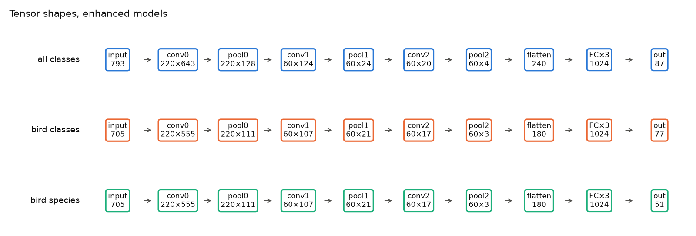
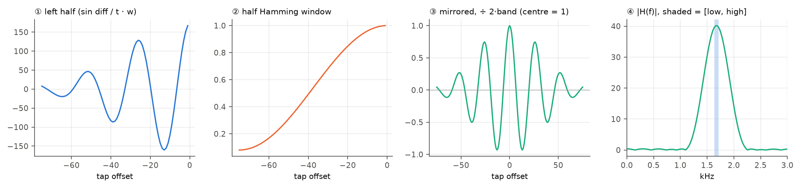
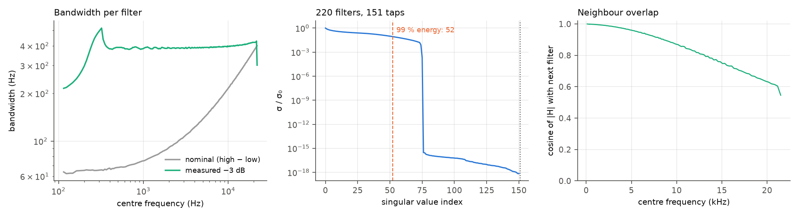
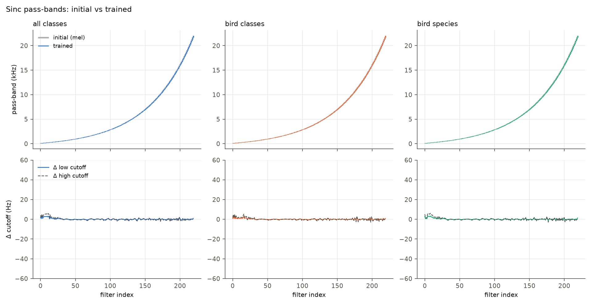
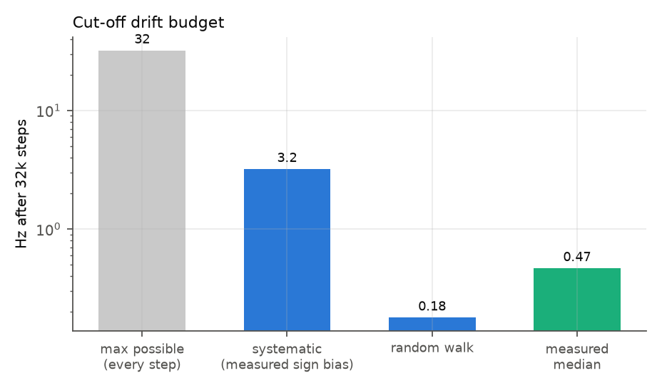
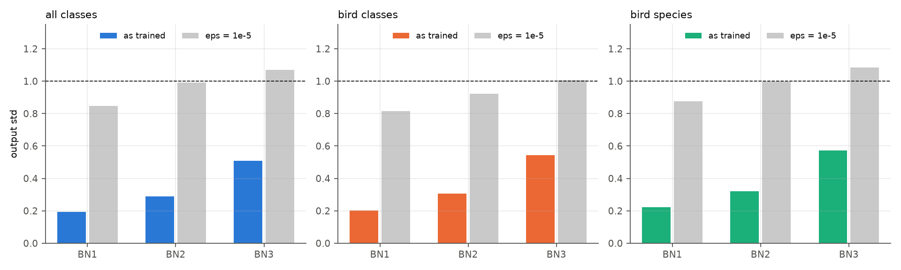
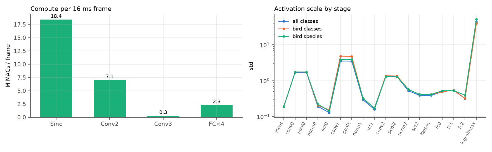
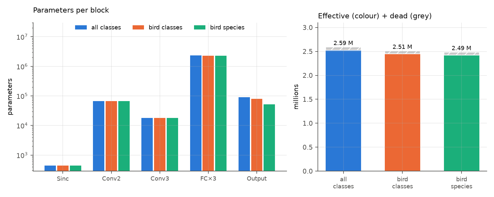

# Part 3 — The model: theory first, then the code, then what I measured

> Part of the [deep code review](../../CODE_REVIEW.md). Previous: [Part 2](02_data_pipeline.md). Next: [Part 4](04_training_loop_and_optimisation.md).
> Theory source: [DeepArchitectureAnalysis.md](../../DeepArchitectureAnalysis.md) (section numbers "§n" below refer to it), the [SincNet paper](../../sinceNet.pdf) and the [Sci Rep paper](../../Bioacoustic%20classification%20of%20avian%20calls%20from%20raw%20sound%20waveforms.pdf).
> Code under review: [SincNet_src/dnn_models.py](../../SincNet_src/dnn_models.py) (symlinked as `dnn_models.py`), constructed by [call_id.py:220-267](../../call_id.py#L220-L267).

Every section has the same shape: **(a) the mechanism**, **(b) the implementation**, **(c) a numeric check on the trained model**, **(d) verdict**.
The running example is the **enhanced bird-species network** (`wlen = 705`, 220 Sinc filters × 151 taps, pool 5, 3 × 1024 FC, 51 outputs); differences for the other models are noted.

---

## 0. The whole network in one line, with real shapes

```
x ∈ ℝ^705
 → SincConv(220×151)        220 × 555          (valid conv)         ← the only layer whose weights are *constructed*
 → maxpool 5                220 × 111
 → BatchNorm(eps=111) → LeakyReLU(0.2)
 → Conv1d(220→60, k=5)       60 × 107
 → maxpool 5                 60 × 21
 → BatchNorm(eps=21)  → LeakyReLU
 → Conv1d(60→60, k=5)        60 × 17
 → maxpool 5                 60 × 3
 → BatchNorm(eps=3)   → LeakyReLU
 → flatten                   180
 → [Linear → BatchNorm → ReLU] × 3     1024
 → Linear                    51
 → LogSoftmax                51 log-probabilities
```



⟨measured⟩ numbers for the three enhanced models and the default model (instantiated from the cfgs, [01_model_audit.py](../scripts/01_model_audit.py)):

| model | `wlen` | after Sinc | after pool 1 | after conv 2 | pool 2 | conv 3 | pool 3 | flatten | total params |
|---|---|---|---|---|---|---|---|---|---|
| default (all 3) | 441 | 80×191 | 80×63 | 60×59 | 60×19 | 60×15 | 60×5 | **300** | 9.20–9.27 M |
| enhanced, bird classes / species | 705 | 220×555 | 220×111 | 60×107 | 60×21 | 60×17 | 60×3 | **180** | 2.51 M / 2.49 M |
| enhanced, all classes | 793 | 220×643 | 220×128 | 60×124 | 60×24 | 60×20 | 60×4 | **240** | 2.59 M |

**Arithmetic as the code does it** ([dnn_models.py:413,424,427](../../SincNet_src/dnn_models.py#L413)): `T_out = int((T_in − K + 1)/pool)`; `out_dim = T_out_last × N_filt_last`. Two consequences worth stating:

* **Integer truncation discards samples.** `107/5 = 21.4` → 21, so the last two samples of the conv-2 output never reach the classifier; `17/5 = 3.4` → 3 drops 2 more.
* **The default model has 4× the parameters of the enhanced** (9.2 M vs 2.5 M) — DeepArchitectureAnalysis §18 says the default FC layers are 2048 wide; `300·2048 + 2048² · 2 + …≈ 9.0 M` of the 9.2 M sit in the FC stack. The paper's "2.5 M parameters" in Table 1 refers to the *enhanced* model.

---

## 1. Input framing — `x ∈ ℝ^{wlen}`  (§2, §11, §23–§24)

**(a) Mechanism.** A window of `cw_len` ms at `fs` Hz is `wlen = ⌊fs·cw_len/1000⌋` samples. The classifier is a function of one fixed-length window; longer recordings are covered by sliding the window with hop `cw_shift`.

**(b) Code.** [call_id.py:212-213](../../call_id.py#L212-L213):

```python
wlen   = int(fs*cw_len/1000.00)      # 44100·16/1000 = 705.6 → 705
wshift = int(fs*cw_shift/1000.00)    # 44100·1/1000  =  44.1 → 44
```

and [SincNet.forward](../../SincNet_src/dnn_models.py#L431-L441) reshapes `[B, wlen] → [B, 1, wlen]`.

**(c) Check.** 705 / 793 / 441 samples for 16 / 18 / 10 ms. The hop is `44` samples = 0.9977 ms (truncated from 44.1), so over 5 s the hop error accumulates to ≈ 11 ms of drift; irrelevant for scoring.

**(d) Verdict.** Correct; DeepArchitectureAnalysis §30 ("≈ 705 depending on the integer conversion") is exactly 705 by truncation.

---

## 2. The sinc band-pass layer  (§3–§8, §37–§46)

### 2.1 (a) Mechanism, from first principles

*Problem.* A standard first conv layer on a raw waveform has `K` free taps per filter. With `F = 220` filters and `K = 151` that is 33,220 weights acting directly on very noisy, high-dimensional input.

*SincNet's constraint.* Each filter should be a **band-pass filter** characterised by two numbers, a low and a high cut-off.

1. An ideal **low-pass** filter with cut-off `f_c` has frequency response `rect(f/2f_c)` and impulse response (inverse Fourier transform) `h_LP[n] = 2f_c·sinc(2π f_c n)` with `sinc(x)=sin x / x` and `n` in seconds.
2. A **band-pass** is the difference of two low-passes: `g[n] = 2f_h sinc(2π f_h n) − 2f_l sinc(2π f_l n)` (SincNet Eq. 4).
3. An ideal filter is infinite; truncation to `K` taps causes spectral ripple (Gibbs). Multiply by a **window** `w[n] = 0.54 − 0.46 cos(2πn/K)` (Eq. 8) to trade ripple for transition width.
4. To keep `0 ≤ f_l ≤ f_h`, learn `f_l^{abs}=|f_l|`, `f_h^{abs}= f_l+|f_h−f_l|` (Eq. 5-6).
5. The filter is real and symmetric (even), so only half the taps need to be computed.

*Resolution limit* (not discussed in DeepArchitectureAnalysis). A `K`-tap windowed filter cannot resolve frequencies finer than `≈ fs/K` (rectangular) or `≈ 3.3·fs/K` (Hamming transition width). For `K = 151, fs = 44,100`:

```
fs / K            = 292 Hz     (best case)
3.3 · fs / K      = 964 Hz     (Hamming transition width)
```

so a nominal pass-band narrower than ~300–1000 Hz **cannot be realised** by this layer. I measure the consequence in §2.5.

### 2.2 (b) Implementation — [SincConv_fast](../../SincNet_src/dnn_models.py#L28-L158)

Construction ([L58-113](../../SincNet_src/dnn_models.py#L58-L113)):

| Line | Code | Mathematical meaning |
|---|---|---|
| [73-74](../../SincNet_src/dnn_models.py#L73-L74) | `if kernel_size%2==0: kernel_size += 1` | force odd `K` for exact symmetry |
| [90-91](../../SincNet_src/dnn_models.py#L90-L91) | `low_hz = 30`; `high_hz = fs/2 − (50+50)` | mel range 30 Hz … 21 950 Hz |
| [93-96](../../SincNet_src/dnn_models.py#L93-L96) | `mel = linspace(to_mel(30), to_mel(21950), F+1); hz = to_hz(mel)` | `F+1` edge frequencies equally spaced in mel |
| [100](../../SincNet_src/dnn_models.py#L100) | `low_hz_ = Parameter(hz[:-1])` | initial lower edges (Hz, **not** normalised) |
| [103](../../SincNet_src/dnn_models.py#L103) | `band_hz_ = Parameter(diff(hz))` | initial widths (Hz) |
| [107-108](../../SincNet_src/dnn_models.py#L107-L108) | `n_lin = linspace(0, K/2−1, int(K/2)); window_ = 0.54 − 0.46 cos(2π n_lin/K)` | **left half** of a Hamming window |
| [112-113](../../SincNet_src/dnn_models.py#L112-L113) | `n_ = 2π · arange(−75, 0)/fs` | time axis (rad) for the left half |

Forward ([L118-158](../../SincNet_src/dnn_models.py#L118-L158)):

```python
low  = 50 + |low_hz_|                                   # L134  f_l^abs  (min_low_hz=50)
high = clamp(low + 50 + |band_hz_|, 50, fs/2)           # L136  f_h^abs  (min_band_hz=50)
band = (high - low)[:, 0]
f_times_t_low  = low  @ n_                              # L139  2π f_l t   (outer product F×75)
f_times_t_high = high @ n_                              # L140
left   = (sin(f_times_t_high) - sin(f_times_t_low)) / (n_/2) * window_      # L142 Eq.4 simplified, windowed
centre = 2*band                                          # L143 limit of Eq.4 at t=0
right  = flip(left)                                      # L144 symmetry
filt   = cat([left, centre, right]) / (2*band[:,None])   # L147,150 gain normalisation
out    = conv1d(x, filt.view(F,1,K), padding=0)          # L153-156
```

Equivalence of L142 with Eq. 4: with `t = n/fs`,
`2f_h sinc(2π f_h t) = 2f_h·sin(2π f_h t)/(2π f_h t) = sin(2π f_h t)/(π t)`,
so `g(t) = [sin(2π f_h t) − sin(2π f_l t)]/(π t)`, which is exactly L142 (`n_/2 = π t`). At `t = 0` the limit is `2(f_h − f_l) = 2·band`, which is L143. The final division by `2·band` rescales every filter so its **centre tap is 1** ([L150](../../SincNet_src/dnn_models.py#L150)).

### 2.3 (c) One filter, every number (filter #73 of the trained bird-species model)

From [18_sinc_worked_example.py](../scripts/18_sinc_worked_example.py) ([data/sinc_worked_example.json](../data/sinc_worked_example.json)):

| Quantity | Value |
|---|---|
| raw parameters `low_hz_`, `band_hz_` | 1582.235 Hz, 36.009 Hz |
| `low = 50 + |1582.235|` | **1632.235 Hz** |
| `high = low + 50 + 36.009` | **1718.244 Hz** |
| `band = high − low` | 86.009 Hz |
| `n_` first/last entries | −0.010686 … −0.000142 rad (i.e. 2π·(−75…−1)/44100) |
| window first/last | 0.08000 … 0.99960 (Hamming ends at 0.08, centre ≈ 1) |
| `left[0:3]` | 7.74, 5.00, 1.96 |
| `left[−3:]` | 129.3, 152.5, 167.1 (approaching the centre value) |
| `centre = 2·band` | **172.02** (= `left[−1]` ≈ 167 → smooth continuation ✔) |
| after `÷ 2·band` : centre tap | **1.000** |
| `‖filter‖₂`, `Σ|taps|` | 5.44, 51.2 |
| DC gain `Σ taps` | −0.383 (band-pass: ≈ 0 ✔) |
| peak `|H(f)|` (FFT 8192) | **40.16** at **1674.2 Hz** (band centre 1675.2 Hz ✔) |



*(Left → right: ① the left half before mirroring, ② the half window, ③ the symmetric filter with centre = 1, ④ its magnitude response with the nominal [low, high] band shaded — the shaded band is a sliver of the real pass-band.)*

**Check against the paper's equation** (all 220 filters of an untrained layer, `K=151`): maximum deviation from `normalise(Eq.4 · symmetric Hamming(N=K−1))` is 2.8×10⁻⁵ (float32 noise) — [02_sinc_filters.py](../scripts/02_sinc_filters.py). The window quirk of using `K` instead of `K−1` in the denominator with `linspace(0, K/2−1, int(K/2))` (step 1.0068 instead of 1) produces a maximum window error of 7.5×10⁻⁵.

### 2.4 Gain normalisation is *not* what the comments suggest

`÷ 2·band` equalises the **centre tap** (=1), not the pass-band gain. ⟨measured⟩ over the 220 filters of the trained bank the peak response ranges from **36.0 to 71.5** (factor 1.99). So in this implementation:

* a narrow filter and a wide filter have the same centre tap but different integrated response;
* the first-layer outputs are amplified ≈ 9× relative to the input (⟨measured⟩ input std 0.19 → `conv0` std 1.74), and different bands are amplified up to 2× differently before any normalisation layer can undo it.

This was not described in the paper. It does not need fixing for reproduction.

### 2.5 The bank is far less rich than "220 filters" suggests (new finding)

Three measurements on the trained bank ([19_filterbank_resolution.py](../scripts/19_filterbank_resolution.py)):



1. **Effective bandwidth ≠ nominal bandwidth.** The measured −3 dB bandwidth is ≈ **390 Hz for essentially every filter** (median 390 Hz) while the nominal `high − low` ranges from 63 Hz (low end) to 400 Hz (22 kHz end), median 113 Hz. **99.5 %** of filters are wider than nominal and **74.5 %** are more than twice as wide; below 2 kHz (82 filters) the median ratio is **5.1×**. The window, not `low_hz_/band_hz_`, sets the resolution.
2. **Adjacent filters are almost the same filter at low frequency.** Cosine similarity of neighbouring magnitude responses: **0.997** below 2 kHz, **0.98** overall (median), **0.76** above 10 kHz. 82 of 220 filters sit below 2 kHz, 90 between 2 and 10 kHz, 48 above 10 kHz.
3. **The bank has rank ≤ 76.** All filters are even-symmetric, so each lives in the 76-dimensional subspace of even sequences (75 free left taps + centre). The singular-value spectrum drops by 12 orders of magnitude at index **76**; 99 % of the energy needs **52** dimensions (99.9 %: 66). `220` output channels are therefore at most 76 independent linear measurements of the 151-sample neighbourhood.

**Verdict on theory.** DeepArchitectureAnalysis §59 says going from 80 → 220 filters "gives more learned frequency channels / more capacity". For this implementation, more filters give *finer sampling of the same 52–76-dimensional space*, not more independent bands. The change helps by providing a denser, smoother frequency sampling for the next layer; it does not add resolution.

### 2.6 The "learned" cut-offs stay at their mel initial values (§41–42, §64)

⟨measured⟩ |trained − initial| over the 220 filters: median **0.28 Hz (low), 0.61 Hz (high)**, maximum **5.8 Hz** (all classes) — against a 113 Hz median nominal band and a 390 Hz effective band. **0 / 220** filters moved by more than 5 % of their centre frequency.



*Mechanism (derived and checked).* PyTorch's RMSprop update is `θ ← θ − lr·g/(√v + ε)` with `v ← αv + (1−α)g²` ([call_id.py:278-280](../../call_id.py#L278-L280)). In steady state `g/√v` is `O(1)` regardless of the gradient's size, so every step changes a parameter by at most ≈ `lr = 0.001` **in the parameter's own units — which for `SincConv_fast` are Hz**. The first update is `lr/√(1−α) = 0.0045 Hz`. Over `400 × 80 = 32,000` steps:

```
upper bound (every step in the same direction) : 32.0 Hz
systematic part, measured sign-bias c̃ = 0.10    : 3.2 Hz   (= 32,000 · 0.001 · c̃)
random-walk part                                : 0.18 Hz  (= 0.001·√32,000)
measured median movement                        : 0.47 Hz,  max 6.1 Hz
```

where `c̃ = |mean g|/rms(g)` is the per-parameter gradient sign consistency measured over 120 real minibatches on the trained model (median 0.10 for `low_hz_`, 0.12 for `band_hz_`; [12_sinc_gradient_scale.py](../scripts/12_sinc_gradient_scale.py)). The measured movement sits between the random-walk and systematic estimates, as expected.



The legacy `sinc_conv` class stored `f/fs` ([L179-180](../../SincNet_src/dnn_models.py#L179-L180)), so the same `lr` moved cut-offs by up to `0.001·44,100 = 44 Hz` per step — 44,100× more. The paper's observation that "the newer, more efficient SincNet" leaves filters near initialisation (and its speculation about initialisation) is explained by **parameter units × learning rate**, not by the data. It also means that on the paper's own architecture the 440 sinc parameters are constants: the "SincNet vs waveform+CNN" comparison is a comparison of *a fixed, mel-spaced band-pass front-end* against *a free convolution*.

**Verdict.** Mechanism and equation: correct. "Learned filterbank": **not learned** in the released implementation at these settings.

---

## 3. Order of operations in each CNN layer  (§14)

**(a) Mechanism (doc).** "SincConv → |·| → max-pool → normalisation → activation → dropout".

**(b) Code.** [SincNet.forward](../../SincNet_src/dnn_models.py#L431-L461) has three mutually exclusive branches per layer:

```python
if cnn_use_laynorm[i]:                         # L446
    x = drop(act(ln( maxpool( abs(conv(x)) if i==0 else conv(x) ))))   # L447-450   abs only i==0
if cnn_use_batchnorm[i]:                       # L452
    x = drop(act(bn( maxpool( conv(x) ))))                              # L453       NO abs
if not (batchnorm or laynorm):                 # L455
    x = drop(act( maxpool( conv(x) )))                                  # L456       NO abs, NO norm
```

**(c) Check.** ⟨measured⟩ from the cfgs: default → LayerNorm branch → **abs applied** to the Sinc output; all three enhanced cfgs → BatchNorm branch → **no abs**.

**Why it matters.** Without `|·|`, `maxpool` after a band-pass filter keeps the largest *positive* excursion in each 5-sample window. A band-pass output oscillates at the band's centre frequency (e.g. 1.67 kHz → period 26 samples), so pooling over 5 samples samples the positive half-cycle's crest and discards the negative half-cycle — a half-wave, phase-dependent "envelope". With `abs`, pooling approximates a full-wave envelope. The two model families therefore differ in a **structural** way that the paper's Supplementary Table S2 does not list.

**(d) Verdict.** DeepArchitectureAnalysis §14 is correct for the default network only. This is a real undocumented difference between the default and enhanced models (the cfg switch `cnn_use_batchnorm` changes three things at once: the normaliser, the presence of `abs`, and — see §4 — the effective `eps`).

---

## 4. Normalisation layers

### 4.1 LayerNorm ([dnn_models.py:247-258](../../SincNet_src/dnn_models.py#L247-L258)) — default models only

```python
mean = x.mean(-1, keepdim=True); std = x.std(-1, keepdim=True)     # unbiased std
return gamma * (x - mean) / (std + eps) + beta                      # eps added to the STD
```

Differences from `nn.LayerNorm`: statistics over the **last axis only** (time, per channel), unbiased (`n−1`) variance, `eps = 1e-6` added to the standard deviation instead of the variance, and `γ, β` have the *shape of the normalised axes* (`[N_filt, T]` for CNN layers — [L413](../../SincNet_src/dnn_models.py#L413)): position-specific scale and shift. This is consistent with SincNet's description ("layer norm for the input samples and for all convolutional layers").

### 4.2 BatchNorm — the `eps` bug in the enhanced CNN (F3)

**(b) Code** ([dnn_models.py:415](../../SincNet_src/dnn_models.py#L415)):

```python
self.bn.append(nn.BatchNorm1d(N_filt, int((current_input-self.cnn_len_filt[i]+1)/self.cnn_max_pool_len[i]), momentum=0.05))
```

`nn.BatchNorm1d(num_features, eps, momentum, affine, track_running_stats)`: the **second positional argument is `eps`**. The author evidently meant to pass a `[N_filt, T]` shape as in the LayerNorm line above ([L413](../../SincNet_src/dnn_models.py#L413)) but BatchNorm takes only the channel count. The MLP version is correct ([L311](../../SincNet_src/dnn_models.py#L311): `BatchNorm1d(self.fc_lay[i], momentum=0.05)`).

**(a) Mechanism.** BatchNorm computes `y = γ (x − μ_B)/√(σ²_B + ε) + β`; with `ε ≪ σ²` it standardises each channel to zero mean and unit variance.

**(c) Check (⟨measured⟩, [07_batchnorm_eps.py](../scripts/07_batchnorm_eps.py)).** `eps` values are `111, 21, 3` (bird models), `128, 24, 4` (all-classes), `63, 19, 5` (default, unused). Running variances of the trained bird-species model on 1,024 real windows:

| CNN BN layer | `eps` | median running var | `eps / var` | output std as trained | output std if `eps = 1e-5` | learned γ (mean, min…max) |
|---|---|---|---|---|---|---|
| 1 (after Sinc) | **111** | 1.50 | **74×** | **0.22** | 0.88 | 0.75 (−0.01 … 2.05) |
| 2 | **21** | 2.04 | 10× | **0.32** | 1.00 | 0.97 (0.77 … 1.21) |
| 3 | **3** | 0.88 | 3.4× | **0.57** | 1.08 | 1.04 (0.77 … 1.37) |



So the first "BatchNorm" subtracts the channel mean and **divides by ≈ √(111+1.5) ≈ 10.6 instead of 1.2**; the layer is effectively *a mean-subtraction plus a fixed 9× attenuation*, with γ (init 1) compensating partially (mean 0.75). At eval time `running_var` is used the same way, so train and eval are consistent.

**(d) Verdict / consequences.** (i) The enhanced models' CNN part is closer to "unnormalised with centring" than to batch-normalised. (ii) The hyper-parameters in Table S2 were found *with* this behaviour. (iii) The bug is upstream and does not by itself explain the accuracy gap (the authors ran the same line), but any independent re-implementation that "fixes" it will not reproduce their configuration.

### 4.3 BatchNorm in the MLP and the batch-composition issue

[MLP.forward](../../SincNet_src/dnn_models.py#L327-L359) applies `Linear → BN → act → dropout` for each FC layer ([L344](../../SincNet_src/dnn_models.py#L344)). Training statistics come from minibatches that contain on average **39 of 51 classes** (⟨measured⟩, [Part 2 §4.1](02_data_pipeline.md)) and are exponentially averaged with `momentum = 0.05` (≈ 20-batch memory). Since 80 batches make an epoch, the running statistics at epoch 392 reflect ≈ the last 20 batches. That is standard, but it means `model_raw.pkl` stores statistics from a particular random stream and the test accuracy is *very slightly* seed-dependent through BN alone.

---

## 5. Convolutional layers 2 and 3 and the receptive field  (§15–§17, §33–§34)

**(a) Mechanism.** `nn.Conv1d(C_in, C_out, K)` computes the cross-correlation `y[c,t] = b_c + Σ_{c'} Σ_{k} w[c,c',k] x[c', t+k]` (valid, stride 1). Parameters `C_out·C_in·K + C_out`. Cost `C_out·C_in·K·T_out` MACs.

**(b) Code.** [L422](../../SincNet_src/dnn_models.py#L422): `nn.Conv1d(cnn_N_filt[i-1], cnn_N_filt[i], cnn_len_filt[i])` with PyTorch's default Kaiming-uniform initialisation (the SincNet paper says "Glorot").

**(c) Check.**

| Layer | parameters | MACs / frame | init std → trained std |
|---|---|---|---|
| Sinc (220×151) | 440 | **18.44 M** | n/a |
| Conv 2 (220→60, k5) | 66,060 | 7.06 M | 0.0174 → **0.183** (×10.5) |
| Conv 3 (60→60, k5) | 18,060 | 0.31 M | 0.0334 → **0.178** (×5.3) |
| FC 180→1024→1024→1024→51 | ≈ 2.35 M | 2.33 M | see §6 |
| **total** | 2.49 M | **28.14 M** (all-classes 32.34 M) | |



**Receptive field** (⟨measured⟩; each layer: `RF += (K−1)·jump`, pool multiplies `jump` by its size):

```
Sinc k=151         RF 151   jump 1
pool 5             RF 155   jump 5
Conv2 k=5          RF 175   jump 5
pool 5             RF 195   jump 25
Conv3 k=5          RF 295   jump 25
pool 5             RF 395   jump 125
```

so each of the 180 features sees at most **395 samples = 8.96 ms = 56 % of the 705-sample window**; the 3 time positions per channel are *3 overlapping 9 ms patches* (hop 125 samples = 2.8 ms) covering the window. DeepArchitectureAnalysis §9 states "the first layer examines a 5.69 ms receptive field"; that is true for layer 1 only (3.42 ms = 151 taps in the enhanced model).

**(d) Verdict.** Correct. The Sinc layer is **65 % of all compute** (18.4 of 28.1 M MACs) and, given §2.5 (rank ≤ 76 of 220 channels), a large share of it produces strongly correlated channels — an architectural property, not a bug.

---

## 6. Fully-connected stack, initialisation and dead units  (§18–§20)

### 6.1 Structure

[MLP](../../SincNet_src/dnn_models.py#L261-L359) is instantiated twice ([call_id.py:251,266](../../call_id.py#L251)): `DNN1` (3 layers, BN + ReLU, input 180) and `DNN2` (one layer, no BN, activation `softmax` → `nn.LogSoftmax(dim=1)`, [L240-241](../../SincNet_src/dnn_models.py#L240-L241)). For each layer `i`: `Linear(in, out, bias=…)`, **both** `LayerNorm(out)` and `BatchNorm1d(out)` are constructed ([L310-311](../../SincNet_src/dnn_models.py#L310-L311)), only the selected one is used in `forward`.

### 6.2 Initialisation analysis

[L321-322](../../SincNet_src/dnn_models.py#L321-L322):

```python
self.wx[i].weight = Parameter(Tensor(out, in).uniform_(-√(0.01/(in+out)), +√(0.01/(in+out))))
self.wx[i].bias   = Parameter(zeros(out))          # re-created even if bias=False was requested
```

Glorot/Xavier-uniform uses limit `√(6/(in+out))`; this code uses `√(0.01/(in+out))`, **0.041× the Xavier limit**. ⟨measured⟩:

| layer | init limit | Xavier limit | init std | trained std | growth |
|---|---|---|---|---|---|
| FC1 (180→1024) | 0.00288 | 0.0706 | 0.00166 | 0.1815 | ×109 |
| FC2 (1024→1024) | 0.00221 | 0.0541 | 0.00128 | 0.1707 | ×134 |
| FC3 (1024→1024) | 0.00221 | 0.0541 | 0.00128 | 0.1957 | ×153 |

The tiny init is irrelevant after training (weights grew two orders of magnitude, which is also what a tiny init plus BatchNorm — which is scale-invariant — permits). It also means the first updates are dominated by BN scale, not by the weights' scale.

### 6.3 Dead parameters

* `bias=False` is requested when a norm layer follows ([L307, 313-318](../../SincNet_src/dnn_models.py#L307)) but `.bias` is then overwritten with a zero `Parameter` ([L322](../../SincNet_src/dnn_models.py#L322)) → a trainable bias exists **in front of BatchNorm, which cancels it** (gradient ≈ 0): 3,072 dead parameters per DNN1.
* Un-selected `LayerNorm`/`BatchNorm` modules are built for every layer and counted by `parameters()`.

⟨measured⟩ bird-species model: counted **2,486,271** → effective **2,425,131** (−61,140, −2.5 %). [evaluate_metrics.py:96-98](../../evaluate_metrics.py#L96-L98) counts the first number, which equals `metrics.res`.



### 6.4 Activation statistics through the trained network (⟨measured⟩, 1,024 real training windows, eval mode)

| stage | mean | std | exactly-zero / ≤0 fraction |
|---|---|---|---|
| input | −0.0001 | 0.1905 | 0.214 (exact zeros) |
| conv0 (Sinc) | −0.0001 | 1.7437 | 0 |
| pool0 | +0.4960 | 1.7457 | 0 |
| norm0 (BN eps 111) | +0.0446 | 0.2215 | 0 |
| act0 (leaky 0.2) | +0.0884 | 0.1432 | 0.301 ≤ 0 |
| conv1 | −1.6859 | 3.8954 | 0 |
| pool1 | −1.3169 | 3.8594 | 0 |
| norm1 (eps 21) | +0.0086 | 0.3210 | 0 |
| act1 | +0.0959 | 0.1728 | 0.394 ≤ 0 |
| conv2 | −0.3400 | 1.3001 | 0 |
| pool2 | +0.0096 | 1.2746 | 0 |
| norm2 (eps 3) | +0.1857 | 0.5677 | 0 |
| act2 | +0.2925 | 0.4150 | 0.321 ≤ 0 |
| flatten | +0.2925 | 0.4150 | 0 |
| fc0 (ReLU) | +0.3166 | 0.5233 | **0.544 zeros** |
| fc1 (ReLU) | +0.2735 | 0.5273 | **0.629 zeros** |
| fc2 (ReLU) | +0.1689 | 0.3933 | **0.719 zeros** |
| log-softmax | −43.88 | 51.51 | |

Read this table as follows:

* The Sinc output has a **positive-biased pool** (`pool0` mean +0.50 from a zero-mean `conv0`): the missing `abs()` (§3) shows up directly as max-pooling a zero-mean signal.
* After the three eps-inflated BN layers the per-stage std is 0.22 → 0.32 → 0.57; the FC stack then operates at std ≈ 0.4–0.5.
* **54–72 % of the FC units are exactly zero** for a typical window (ReLU), increasing with depth: 28 % of the width (≈ 290 of 1024 units) is active in the last hidden layer.
* The mean log-probability of the 50 wrong classes is **−43.9** with std 51.5: the network is extremely confident (mean per-frame max probability 0.868 on in-event training windows, mean entropy 0.369 nats). This over-confidence is what, summed over ~5,000 frames, produces the saturated scores analysed in [Part 5](05_inference_and_evaluation.md).

---

## 7. Output, loss and the "softmax" that is not a softmax  (§20)

**(a) Mechanism.** For logits `z`, `log p_c = z_c − log Σ_j e^{z_j}`; the cross-entropy `−log p_y` is the `NLLLoss` of the log-probabilities.

**(b) Code.** `class_act=softmax` is mapped by [act_fun](../../SincNet_src/dnn_models.py#L240-L241) to `nn.LogSoftmax(dim=1)`; the loss is `nn.NLLLoss()` ([call_id.py:208](../../call_id.py#L208)); prediction is `argmax` over the log-probabilities ([call_id.py:303](../../call_id.py#L303)).

**(c) Check.** Log-softmax output has `exp(·)` summing to 1 (verified numerically in the `evaluate_metrics` path, [L145](../../evaluate_metrics.py#L145)).

**(d) Verdict.** Mathematically exact and numerically stable (log-sum-exp). Note the *`"linear"` activation is `LeakyReLU(1)`* ([L243-244](../../SincNet_src/dnn_models.py#L243-L244)), commented "not used in forward"; in `MLP.forward` the `'linear'` case skips the activation, so it is correct but obscure. `act_fun` has no `else`: an unknown name returns `None` and fails later with a confusing error.

---

## 8. Theory ↔ code reconciliation table

| DeepArchitectureAnalysis claim | Section | In the code | Verdict |
|---|---|---|---|
| first layer replaces `F·L` weights by `2F` | §3, §37, §44 | [L100-103](../../SincNet_src/dnn_models.py#L100-L103): `low_hz_`, `band_hz_` | ✔ (440 vs 33,220) |
| band-pass = difference of two sinc low-passes | §5–6 | [L139-147](../../SincNet_src/dnn_models.py#L139-L147) | ✔ ≤ 2.8×10⁻⁵ |
| Hamming window | §8 | [L107-108](../../SincNet_src/dnn_models.py#L107-L108) | ✔ (7.5×10⁻⁵ quirk) |
| 5.69 ms / 3.42 ms receptive field | §9, §32 | first layer only | ✔ but total RF is 8.96 ms (395 samples) |
| `441 → 80×191 → 80×63 → … → 300` | §10–§17 | [L413,424,427](../../SincNet_src/dnn_models.py#L413) | ✔ |
| `705 → 220×555 → … → 180` | §30–§36 | same | ✔; all-classes `793 → … → 240` not covered |
| `abs()` after Sinc | §14 | [L448](../../SincNet_src/dnn_models.py#L448) | ✘ only for LayerNorm configs |
| LayerNorm/BatchNorm as in cfg | §18, §58 | [L413-415](../../SincNet_src/dnn_models.py#L413-L415) | ✔ with the BN `eps` bug (F3) |
| "learned" Sinc cut-offs, Nyquist-limited, 50 Hz minima | §38 | [L134-136](../../SincNet_src/dnn_models.py#L134-L136) | ✔ equations; cut-offs do not move (F4) |
| mel initialisation | §40–42 | [L50-56,89-103](../../SincNet_src/dnn_models.py#L50-L103) | ✔ |
| more filters ⇒ more capacity | §59 | n/a | partly ✘: rank ≤ 76; effective width ≈ 390 Hz |
| FC 2048 / 1024, ReLU or leaky ReLU | §18, §28 | cfgs | ✔ |
| LogSoftmax output | §20 | [L240-241](../../SincNet_src/dnn_models.py#L240-L241) | ✔ |
| average frame **probabilities** | §21 | [evaluate_metrics.py:143](../../evaluate_metrics.py#L143) | ✘ sums **log**-probabilities |
| 2.5 M parameters | Table 1 | [evaluate_metrics.py:96-98](../../evaluate_metrics.py#L96-L98) | ✔ 2.49–2.59 M; includes ≈ 61 k dead parameters |
| amplitude jitter `U(0.8,1.2)` | §56 | [call_id.py:71](../../call_id.py#L71) | ✔ (0 for enhanced) |
| "SincNet = learnable DSP filterbank + CNN" | §70 | — | **not learnable** at these settings (F4) |

→ continue with [Part 4: the training loop and optimisation](04_training_loop_and_optimisation.md).
