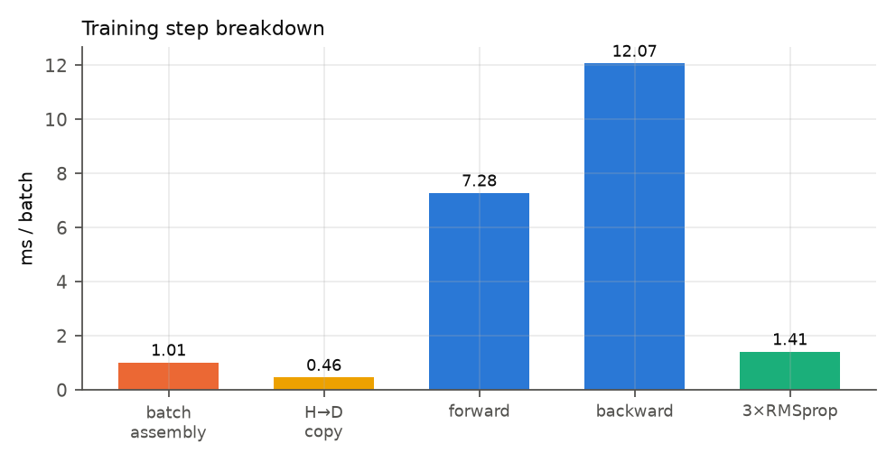
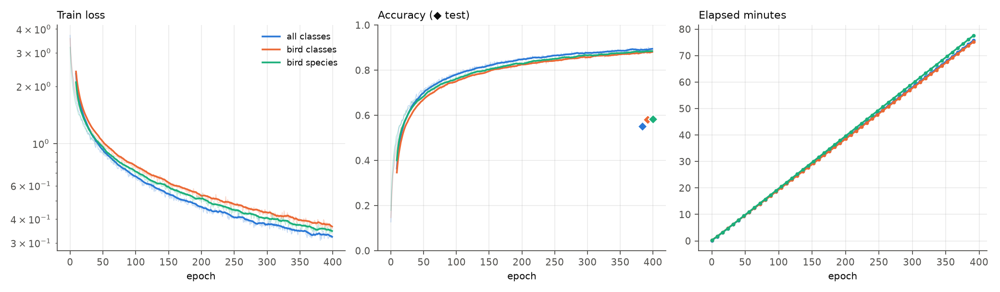
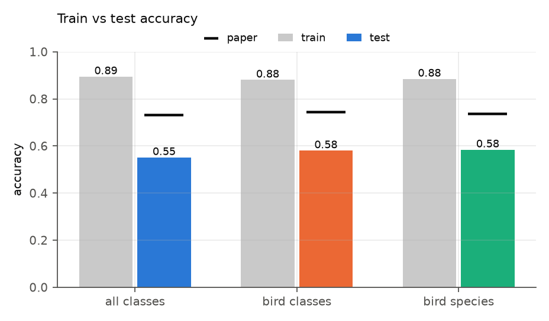

# Part 4 — The training loop, the optimiser, convergence, cost, and tuning

> Part of the [deep code review](../../CODE_REVIEW.md). Previous: [Part 3](03_model_theory_to_code.md). Next: [Part 5](05_inference_and_evaluation.md).

---

## 1. The training script as an algorithm

[call_id.py](../../call_id.py) is a *script*, executed top to bottom on import. Its structure (line numbers are from the file):

```
 24-40   imports (torch, soundfile, numpy, pandas, dnn_models, data_io)
 42-45   run_validation = False                         # flag: no test evaluation during training
 48-59   preload_list()       decode every training wav ONCE, keep numpy arrays
 63-120  create_batches_rnd() one minibatch: 128 random (row, window, gain) draws → GPU tensors
125-181  cfg → Python values
186-193  read train csv (preloaded) and test csv (only counted)
197-205  make output dir, seed numpy + torch
208-216  loss, wlen/wshift, Batch_dev
220-267  build CNN_net, DNN1_net, DNN2_net  (.cuda())
270-274  optional warm start from pt_file
278-280  three RMSprop optimisers
284      train_start = time.time()
286-326  EPOCH LOOP: N_batches × (batch → fwd → NLL → bwd → 3 steps)
329-418  every N_eval_epoch: (optional validation) + log + time.res + checkpoint
420-421  other epochs: print only
```

### 1.1 One optimisation step, exactly

[L296-320](../../call_id.py#L296-L320):

```python
inp, lab = create_batches_rnd(128, ...)                 # numpy → torch → .cuda()   (L300)
pout = DNN2_net(DNN1_net(CNN_net(inp)))                 # [128, C] log-probabilities (L301)
pred = torch.max(pout, dim=1)[1]                        #                           (L303)
loss = cost(pout, lab.long())                           # NLLLoss: −mean_i log p_i(y_i)  (L304)
err  = torch.mean((pred != lab.long()).float())         # training error             (L305)
optimizer_CNN.zero_grad(); optimizer_DNN1.zero_grad(); optimizer_DNN2.zero_grad()   (L309-311)
loss.backward()                                         #                            (L313)
optimizer_CNN.step(); optimizer_DNN1.step(); optimizer_DNN2.step()                 (L314-316)
loss_sum += loss.detach(); err_sum += err.detach()      # accumulated on GPU, no sync (L318-319)
```

Mathematically, with `θ = (θ_CNN, θ_DNN1, θ_DNN2)`:

```
ℓ(θ) = − (1/128) Σ_{i=1..128} log p_θ(y_i | x_i)
θ ← RMSprop(θ, ∇ℓ)          with all parameters in one logical optimiser
```

Properties worth noting:

* **Train-mode statistics.** `CNN_net.train()` etc. ([L289-291](../../call_id.py#L289-L291)) is set once per epoch; BatchNorm uses batch statistics with `momentum=0.05` for the running estimates; dropout is 0 everywhere in the enhanced cfg.
* **Training error** (`err`) is computed from the same forward pass in train mode, on jittered windows — it is *not* the metric reported later (whole-file accuracy), and not comparable with it ([Part 5](05_inference_and_evaluation.md)).
* **No gradient accumulation, clipping, mixed precision or scheduler.**
* **`loss_sum`/`err_sum`** accumulate `loss.detach()` tensors on the GPU, so the loop has *no per-step host synchronisation* — a good habit (the only syncs are the `.cuda()` copy and the periodic print).

### 1.2 Three optimisers = one optimiser

[L278-280](../../call_id.py#L278-L280): `optim.RMSprop(net.parameters(), lr=lr, alpha=0.95, eps=1e-8)` ×3 with identical hyper-parameters on disjoint parameter sets. RMSprop has **per-parameter state only**, so three instances are mathematically identical to one over the union; the split exists in upstream SincNet for historical reasons (separate learning rates are possible but unused).

PyTorch's RMSprop (not centred, no momentum):

```
v_t = α v_{t−1} + (1−α) g_t²
θ_t = θ_{t−1} − lr · g_t / (√v_t + ε)
```

with `α = 0.95`, `lr = 0.001`, `ε = 1e-8` (the SincNet paper states `ε = 10⁻⁷`; the code value is `10⁻⁸`, harmless). First update: `v_1 = 0.05 g²` ⇒ `|Δθ| = lr/√0.05 = 4.47·lr`. Steady state: `|Δθ| ≈ lr · |g|/rms(g)`, i.e. **≤ ≈ lr per step regardless of gradient scale**. This is the root of the frozen Sinc cut-offs ([Part 3 §2.6](03_model_theory_to_code.md)): `lr = 10⁻³` is a sensible step for unit-scale weights and an irrelevant 10⁻³ Hz step for frequencies measured in Hz.

---

## 2. What an "epoch" costs and how the budget compares

| | default (Part I) | enhanced (Part II, this repo) |
|---|---|---|
| draws / epoch | 102,400 (800 × 128) | **10,240** (80 × 128) |
| epochs | 200 | **400** |
| optimiser steps | 160,000 | **32,000** |
| windows seen | 20.5 M | **4.1 M** |
| approx. draws per train tag | 5,000 | ≈ 1,000 |
| max possible drift of a parameter (`lr·steps`) | 160 (units) | **32** (units) |

⟨measured⟩ wall clock of the three recorded runs ([data/training_summary.json](../data/training_summary.json)): **75.8 / 75.3 / 77.7 min** (11.59 / 11.50 / 11.89 s/epoch, linear fits of `time.res`); the paper reports 1.9–2.1 h on an RTX 2060 for the *enhanced* runs ([Table 1](../../Bioacoustic%20classification%20of%20avian%20calls%20from%20raw%20sound%20waveforms.pdf)).

### 2.1 Profile of one training step (⟨measured⟩, this machine: GTX 1650 4 GB, [11_profile.py](../scripts/11_profile.py))



| phase | ms / batch | share |
|---|---|---|
| batch assembly (Python/NumPy) | 0.97 | 4.3 % |
| host → device copy | 0.36 | 1.6 % |
| forward | 7.41 | 33.1 % |
| backward | 12.25 | 54.7 % |
| 3 × RMSprop step | 1.42 | 6.4 % |
| **total** | **22.4** | |

Predicted epoch time = `80 × 22.4 ms = 1.8 s` → **12 min for 400 epochs**; GPU peak memory 850 MB; evaluation throughput 18,364 frames/s ≈ 1.0 TFLOP/s effective (28.1 M MACs/frame).

**Discrepancy — the recorded runs took 6.5× longer than this profile predicts** (11.6 s/epoch vs 1.8 s). The hardware behind the committed `time.res` files is not recorded (the notes in [logs.md](../../logs.md) mention a Colab T4 session for a *different* run). A T4 is faster than a GTX 1650, so hardware alone does not explain it. Candidates I could not test: a CPU-bound NumPy loop on a slow shared Colab vCPU, process start/BN cuDNN algorithm selection per epoch, or the evaluation path being active in that run. **I therefore retract the claim in my first review draft that batch assembly dominates**: on this machine it is 4 %. The actual bottleneck here is backward + forward on the Sinc layer (65 % of MACs, [Part 3 §5](03_model_theory_to_code.md)).

A harmless cuDNN message appears on this GPU (`memory allocation failed with OOM … 4,775,215,104 bytes`): cuDNN tries a 4.7 GB workspace algorithm for the first `conv1d` and falls back. Peak usage stays at 0.85 GB.

---

## 3. Convergence behaviour (⟨measured⟩ from [output/*.log](../../output/), [03_training_curves.py](../scripts/03_training_curves.py))



| | all classes | bird classes | bird species |
|---|---|---|---|
| train loss, epoch 0 | 3.707 | 3.569 | 3.210 |
| train loss, mean of last 10 epochs | 0.323 | 0.365 | 0.346 |
| train accuracy (jittered windows), last 10 epochs | **0.895** | 0.881 | 0.885 |
| first epoch with ≥ 50 % train accuracy | 10 | 13 | 8 |
| held-out test accuracy (whole-file rule) | 0.5514 | 0.5803 | 0.5841 |
| train − test | 0.34 | 0.30 | 0.30 |

Observations:

1. **Fast early progress**: 50 % training accuracy within 8–13 epochs (≈ 800–1,300 steps), consistent with SincNet's claim of fast convergence and the paper's ">65 % within a few epochs".
2. **Not converged**: the 10-epoch smoothed loss is still falling at the last epoch (best smoothed window is the last one in all three runs); there is no plateau, no learning-rate decay, no early stopping.
3. **Train/test gap 0.30–0.34**, but the two numbers measure different things (jittered 16 ms windows vs a whole 5 s file; [Part 5](05_inference_and_evaluation.md)). Using the *tag-span mean-p rule* on the test list gives 0.68–0.71, i.e. a gap of ≈ 0.17–0.22 — still a large generalisation gap with **zero dropout, zero weight decay** and 2.5 M parameters trained for ≈ 1,000 draws per tag.
4. The last logged epochs (393–399) are never saved ([Part 5 §7](05_inference_and_evaluation.md)).



---

## 4. Seeds, determinism and what is reproducible

| Source of randomness | Seeded? | Where |
|---|---|---|
| train/test split | yes (`split_seed`, default 1234) | [generate_mod_file_lists.py:43](../../generate_mod_file_lists.py#L43) |
| list row order / label integers | yes (`sorted(glob)`) | [:50](../../generate_mod_file_lists.py#L50) |
| weight initialisation | yes (`torch.manual_seed`) | [call_id.py:204](../../call_id.py#L204) |
| batch/window/gain draws | yes (`np.random.seed`) | [:205](../../call_id.py#L205) |
| CUDA non-determinism (conv1d backward atomics) | **no** (`cudnn.deterministic` not set) | — |
| dropout | n/a (0.0) | cfg |

So two runs from the same cfg would produce the same data stream and the same init but may still diverge numerically on GPU. I did **not** re-run training (76 min per run) and therefore cannot quantify seed or hardware variance. In the paper's Figure 1 individual default-model runs of the same configuration differ by roughly 10 accuracy points; the cluster-bootstrap 95 % interval of the test accuracy of a single run here is **±4.5 pts** ([Part 5 §6](05_inference_and_evaluation.md)).

---

## 5. Checkpointing and logging design

* One file, overwritten: `model_raw.pkl` = `{CNN_model_par, DNN1_model_par, DNN2_model_par}` state-dicts ([L414-418](../../call_id.py#L414-L418)). No optimiser state, no epoch, no cfg hash, no RNG state ⇒ **no resume** (a restart would reset RMSprop's `v`).
* Written only when `epoch % N_eval_epoch == 0` ([L329](../../call_id.py#L329)): epochs 0, 8, …, 392. For 400 epochs **epochs 393–399 (7 epochs, 1.75 %) are trained and discarded**; the committed `time.res` ends at `epoch 392` ⟨measured⟩. [logs.md](../../logs.md) documents moving to `N_eval_epoch=57` to land on epoch 399; the cfgs still say 8.
* `res.res` has 50 lines (every 8 epochs) and `output/*.log` has all 400 lines (stdout capture). The two are consistent ⟨measured⟩.
* With `run_validation=False` the "evaluation epoch" block does no evaluation: it only logs and checkpoints, so `N_eval_epoch` is really a *checkpoint interval*. The comment at [L412-413](../../call_id.py#L412-L413) says so; the name does not.

---

## 6. Tuning: how the enhanced configuration was obtained, and what this repo can say about it

### 6.1 The search space (Supplementary Table S9)

The authors searched, one parameter or small group at a time, `cw_len ∈ {8 … 50 ms}` (29 values), `fact_amp ∈ {0, .1, .2, .3}`, `cnn_N_filt` (30 combinations from `[70,50,50]` to `[300,60,60]`), `cnn_len_filt` (17 combinations from 51 to 351), `cnn_max_pool_len ∈ {2,3,4,[4,5,6],5}`, norm/activation/dropout choices, `fc_lay ∈ {1024 … 4096}`, `class_act`. **`lr`, `batch_size`, `N_epochs`, `N_batches` are not in the table** although they changed between default and enhanced (`N_batches 800 → 80`, `N_epochs 200 → 400`).

### 6.2 Where the final values sit

| Parameter | Enhanced value | Position in the tested range |
|---|---|---|
| `cw_len` | 16 (birds) / 18 (all) | interior of 8–50 |
| `cnn_N_filt` | 220 | interior of 70–300 |
| `cnn_len_filt` | 151 | interior of 51–351 |
| `cnn_max_pool_len` | 5,5,5 | **largest uniform pool tested** (`[4,5,6]` reaches 6) |
| `fc_lay` | 1024 ×3 | **lower edge** of 1024–4096 |
| `fact_amp` | 0 | **lower edge** of 0–0.3 |
| `cnn_drop`, `fc_drop` | 0 | lower edge |
| `cnn_use_batchnorm` | True | tested with the eps-inflated BatchNorm ([Part 3 §4.2](03_model_theory_to_code.md)) |

Three of the six numeric choices are at (or next to) the **boundary of the searched range**, which usually signals that the optimum might lie outside it (more pooling, a narrower FC stack, still less jitter). No dropout/weight decay in the final models despite the 0.3-point generalisation gap above.

### 6.3 Selection criterion

The repo contains no validation split and [call_id.py:45](../../call_id.py#L45) sets `run_validation=False`; metrics are computed on the *test list only*. The paper says the best models were chosen "by grid searches … over a set of epochs, selected the best performing values", so the *test* accuracy was almost certainly the selection criterion (no other held-out set exists). That bias is not present in this reproduction (a single, untuned run) and is one plausible contributor to a residual gap ([Part 7](07_gap_analysis_and_open_questions.md)).

### 6.4 Optimisation techniques actually used in this repo (and measured effect)

| Technique | Where | Effect |
|---|---|---|
| decode WAVs once (`preload_list`) | [call_id.py:48-59](../../call_id.py#L48-L59) | removes 4.1 M `sf.read` calls per run; batch assembly is now 0.97 ms |
| GPU-side accumulation of loss/err | [L318-319](../../call_id.py#L318-L319) | avoids a host sync per step |
| `unfold`-based dense framing | [evaluate_metrics.py:128-129](../../evaluate_metrics.py#L128-L129) | one view instead of a Python copy loop (bit-identical to the original, per [logs.md](../../logs.md)) |
| per-file memoisation of scores | [:111-147](../../evaluate_metrics.py#L111-L147) | 3.2 test rows per file ⇒ ≈ 3.2× fewer forward passes |
| `Batch_dev = 1024` | [:63](../../evaluate_metrics.py#L63) | irrelevant for speed beyond 128 per [logs.md](../../logs.md) (GPU-compute-bound) |
| `N_eval_epoch` as checkpoint interval | cfg | evaluation was ≈ 71 % of run time in the original design ([logs.md](../../logs.md)); now zero |
| `time.res` | [L408-410](../../call_id.py#L408-L410) | enables the "training time" column of Table 1 |

**Not done** (opportunities, none required for fidelity): mixed precision (the Sinc layer is 65 % of MACs, easily half-precision), `torch.compile`, a vectorised batch assembly (`np.take` on a pre-concatenated array), channels-last / CUDA graphs. The GPU is not saturated: at 28 M MACs × 128 × 3 (fwd+bwd) ≈ 10.8 GMAC per step = 21.6 GFLOP in 22.4 ms ≈ **1 TFLOP/s**, about a third of a GTX 1650's FP32 peak.

---

## 7. Findings of Part 4

| # | Finding | Evidence | Severity |
|---|---|---|---|
| T1 | Sinc cut-offs are in Hz with `lr=1e-3`: they cannot move (≤ 32 Hz bound, 0.5 Hz measured) | [Part 3 §2.6](03_model_theory_to_code.md) | high (design) |
| T2 | Checkpoint at epoch 392; epochs 393–399 discarded; cfg/log disagreement | §5 | medium |
| T3 | No validation set; selection and reporting use the same list | §6.3 | medium (methodology) |
| T4 | Training not converged; no schedule/regularisation; large train–test gap | §3 | medium |
| T5 | Three of six searched numeric hyper-parameters at/near the boundary of the range | §6.2 | low–medium |
| T6 | Wall clock of recorded runs 6.5× slower than local profile; hardware not recorded | §2.1 | low (provenance) |
| T7 | No resume (no optimiser/RNG state) | §5 | low |
| T8 | No `cudnn.deterministic`, seed variance unmeasured | §4 | low |

→ continue with [Part 5: inference and evaluation](05_inference_and_evaluation.md).
