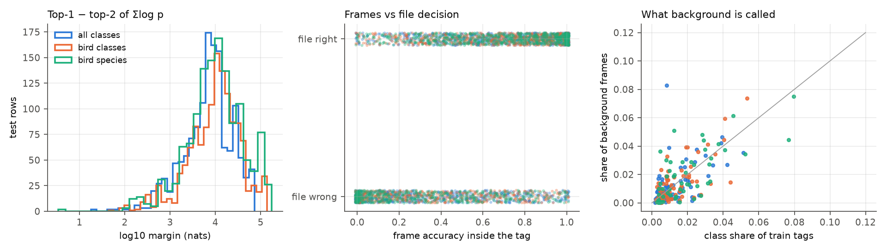
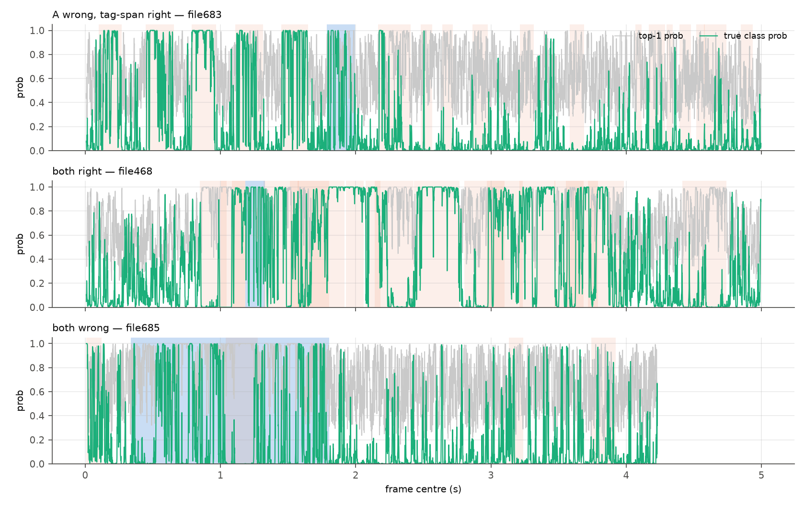
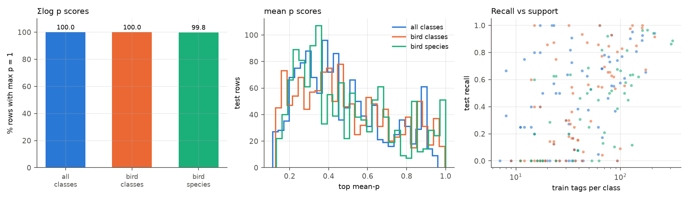
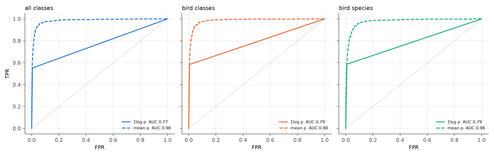
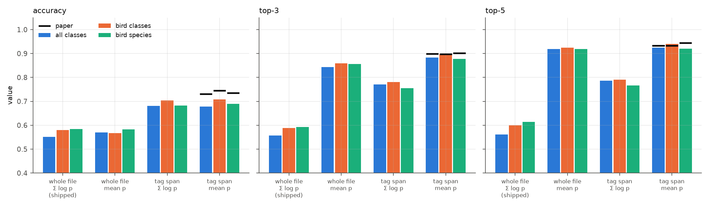
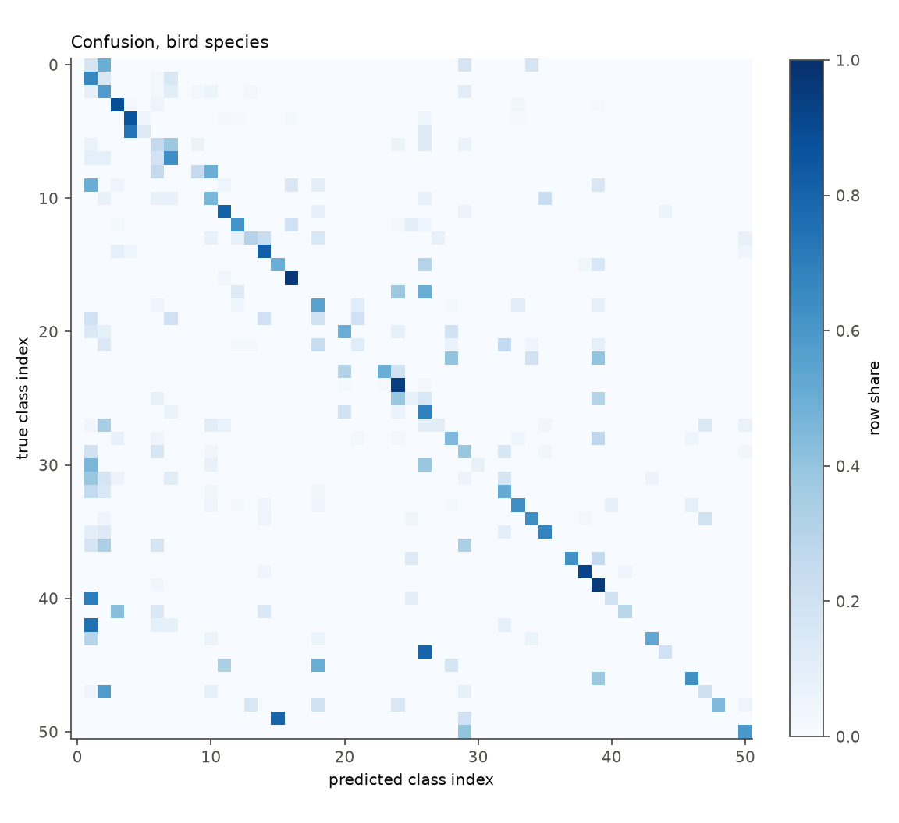
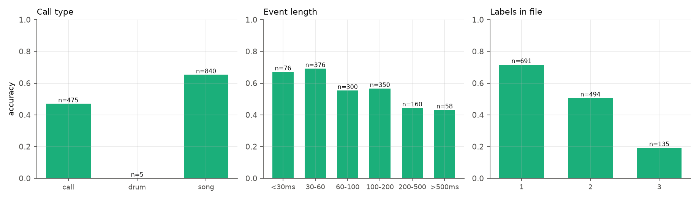

# Part 5 — Inference and evaluation: how a prediction is made, what the metrics mean, and why the numbers differ from the paper

> Part of the [deep code review](../../CODE_REVIEW.md). Previous: [Part 4](04_training_loop_and_optimisation.md). Next: [Part 6](06_engineering_review.md).
> Code: [evaluate_metrics.py](../../evaluate_metrics.py), [metrics_utils.py](../../metrics_utils.py), and the (disabled) validation block of [call_id.py:329-399](../../call_id.py#L329-L399).
> Paper: Methods "Metrics", Table 1, Supplementary Tables S7–S8, Figures S1–S3.

---

## 1. Dense inference: mechanics

[evaluate_metrics.py:114-153](../../evaluate_metrics.py#L114-L153):

```python
for i in range(snt_te):                                   # every TEST ROW
    fname = wav_lst_te.loc[i,'file']
    if fname not in file_scores:                          # once per unique FILE
        signal = sf.read(...)                             # whole recording, float64 → float32 GPU
        N_fr      = int((len(signal)-wlen)/wshift)
        n_frames  = max(0, -(-(len(signal)-wlen)//wshift))        # ceil((len-wlen)/wshift)
        frames    = signal.unfold(0, wlen, wshift)[:n_frames]      # [F, wlen] view
        pout      = zeros(N_fr+1, C)
        for beg in range(0, n_frames, 1024):                       # batches of 1024 frames
            pout[beg:beg+B] = DNN2(DNN1(CNN(frames[beg:beg+B])))   # log-softmax
        file_scores[fname]     = pout.sum(0)                       # Σ_k log p_k
        file_scores_exp[fname] = exp(pout[:n_frames]).mean(0)      # (1/F) Σ_k p_k
    sent_probs = softmax(file_scores[fname])
    y_pred[i]  = argmax(sent_probs);  y_score[i] = sent_probs;  y_score_exp[i] = file_scores_exp[fname]
```

* **Frame count.** For the typical 5.0039 s file (220,672 samples) with `wlen=705`, `wshift=44`: `F = ceil((220,672 − 705)/44) = 5,000` frames (⟨measured⟩ matches). A frame is 705 samples = 16 ms, hop 44 samples = 1 ms ⇒ consecutive frames share **15/16 = 93.75 %** of their samples.
* **Equivalence with the original loop.** The `while end_samp < len` loop in upstream/`call_id.py` yields frames with `start + wlen < len` strictly; `ceil((len − wlen)/wshift)` gives the same count (the extra row `N_fr+1`, left as zeros when `(len − wlen)` is a multiple of `wshift`, adds 0 to the sum). `logs.md` records this being verified bit-identical.
* **Eval mode and batching.** `CNN_net.eval()` etc. ([L100-102](../../evaluate_metrics.py#L100-L102)) — BatchNorm uses running statistics, so a frame's output does not depend on its batch; `Batch_dev = 1024` is therefore a pure speed parameter.
* **Cost** ⟨measured⟩: 417 unique test files × ≈ 4,395 frames = **1.83 M frames** for bird-species; 18.4 k frames/s on the GTX 1650 ⇒ ≈ 100 s per model.

**Latent inconsistency** (low severity): the file's **sampling rate** is returned as `fs_i` ([L120](../../evaluate_metrics.py#L120)) and never compared with `cfg fs`; a non-44.1 kHz file would be silently mis-windowed.

---

## 2. From frame posteriors to a decision

### 2.1 What the papers say

* SincNet: "A sentence-level classification was simply derived by averaging the frame predictions and voting for the class which maximises the average posterior."
* Sci Rep Methods: "The classification for each file derives from averaging the frame predictions and voting for the class that maximises the average posterior"; Metrics: "The ROC AUC calculation uses the mean of the posterior probabilities provided by SincNet for each *tagged call*."
* Supplement S7: the *original* ROC AUC used **the mean of the LogSoftmax outputs**; "ROC AUC Mean Exp" uses **the mean of `exp(LogSoftmax)`** per tag.

### 2.2 What the code does

`argmax softmax(Σ_k log p_k)` over **all frames of the whole file**. Three differences from the text:

1. **sum of log-probabilities**, not mean of probabilities;
2. **whole file**, not "each tagged call";
3. the final `softmax` is a *renormalisation of a sum of logs* — not a probability of anything.

### 2.3 What each rule means statistically

Let `p_k(c)` be the network posterior of class `c` for frame `k`, `F` frames.

| Rule | Formula | Interpretation | Behaviour |
|---|---|---|---|
| **Σ log p** (shipped) | `argmax_c Σ_k log p_k(c)` | **product rule** / naive-Bayes with independent frames and a uniform prior | one frame with `p≈0` for a class *vetoes* it; scales with `F` |
| **mean p** (paper text) | `argmax_c (1/F) Σ_k p_k(c)` | **sum rule** / arithmetic ensemble | robust to outlier frames (Kittler et al. 1998); bounded in [0,1] |
| restricted to tag span | frames with centre inside `[start, start+length]` | evidence only from where the label applies | uses `start/length` that the dataset provides |

The product rule is the Bayes-optimal combination **only if the frames are conditionally independent given the class**. Here consecutive frames overlap by 93.75 %; the effective number of independent frames is closer to `F/16 ≈ 312` than to `5,000`, so the summed log-evidence is over-counted by ≈ 16×. Two further violations: (i) the model has **no background class** (below), so most frames are forced to name a species; (ii) the posterior is `p(class | frame)` under the *training prior* (sampled over tag windows), and the product rule adds that prior `F` times.

### 2.4 Frame-level behaviour of the trained models (⟨measured⟩, [10_frame_level.py](../scripts/10_frame_level.py))

For every test file the models were run frame by frame; tags of the file (train and test rows, from the annotation CSVs) define "inside a tag" vs "background" (no tag at all).

| | all classes | bird classes | bird species |
|---|---|---|---|
| mean single-frame accuracy **inside the labelled tag** | **0.545** | 0.552 | **0.542** |
| median over test rows | 0.574 | 0.591 | 0.564 |
| mean max-probability inside tag | 0.761 | 0.797 | 0.815 |
| mean entropy inside tag (nats) | 0.693 | 0.576 | 0.517 |
| background frames analysed | 1.11 M | 1.11 M | 1.07 M |
| mean max-probability on **background** | **0.637** | 0.686 | **0.693** |
| mean entropy on background (nats) | 1.07 | 0.92 | 0.87 |
| share of background frames assigned to the single most frequent class | 8.3 % | 7.4 % | 7.5 % |
| correlation(in-tag frame accuracy, whole-file decision correct) | 0.48 | 0.51 | 0.54 |
| median top-1 − top-2 margin of `Σ log p` | **7,703 nats** | 11,399 | **10,208** |

Interpretation:

* **A single 16 ms frame inside the tag is already ≈ 54–55 % correct** — essentially the same as the whole-file accuracy (0.55–0.58). Aggregation over 5,000 frames adds nothing on average under the shipped rule, and the tag-span rule (which pools ≈ 30–1,200 frames) adds ≈ 12 points.
* **Background is called a species, confidently.** On frames with no tag the network's top probability averages 0.64–0.69 (vs 0.76–0.81 inside tags): the *confidence gap between signal and noise is only ≈ 0.12*. Background frames are 91 %+ of the file ([Part 2 §5.3](02_data_pipeline.md)), so the product rule is dominated by what the network says about noise.
* The background prediction distribution follows the training prior (right panel below): the network labels noise with frequent classes (*Sylvia*, *Carduelis*…).





*(Frame posteriors over time for three test rows of the bird-species model. Blue = the labelled tag, orange = other tags in the same file; green = probability of the true class, grey = top-1 probability. Top: the whole-file rule is wrong but the tag-span rule is right (`trainfile683`). Middle: both right (`trainfile468`): the true class has high probability in orange (other-tag) regions as well, because the same species sings elsewhere in the file. Bottom: both wrong (`trainfile685`, a 1.47 s tag, long-event class).)*

### 2.5 Saturation: why `softmax(Σ log p)` is one-hot

The margin between the best and second-best summed log-probability is **thousands of nats** (median 7.7 k–11.4 k, the 10th percentile 1.4 k–1.9 k; **> 100 nats for 99.3–99.7 % of rows**). Since `softmax` of a vector whose top entry exceeds the second by `m` nats gives `p_2 ≈ e^{−m}`, and `float32` underflows `e^{−m}` for `m > 103`, the stored `y_score` rows are **exactly one-hot**: ⟨measured⟩ `max prob == 1.0` for **100 % / 100 % / 99.85 %** of rows, with the median row having **86 / 76 / 50 classes with probability exactly 0.0**.



---

## 3. Metrics: definitions, implementation, and what the saturation does to each

[compute_metrics](../../metrics_utils.py#L29-L47), with `labels = range(C)`:

| Metric | scikit-learn call | Definition | Effect of one-hot scores |
|---|---|---|---|
| accuracy | `accuracy_score(y, ŷ)` | `(1/N) Σ 1[ŷ_i = y_i]` | unaffected |
| precision / recall / F1 | `average='weighted'` | per-class value averaged with weights `n_c / N` | unaffected; **weighted recall ≡ accuracy** (equal to 4 d.p. in every `metrics.res`) |
| FPR / FNR | [weighted_fpr_fnr](../../metrics_utils.py#L15-L26) | per-class `FP/(FP+TN)`, `FN/(FN+TP)`, support-weighted | unaffected; `FNR = 1 − recall` exactly (0.4486 = 1 − 0.5514) |
| ROC AUC | `roc_auc_score(y, y_score, multi_class='ovr', average='weighted')` | per-class one-vs-rest AUC, support-weighted | **degenerate**: for one-hot scores the ROC has 3 points and `AUC = (TPR + TNR)/2` |
| top-3 / top-5 | `top_k_accuracy_score(y, y_score, k)` | true class among the `k` highest scores | **degenerate**: ties among the 50 zeros are ranked arbitrarily; adds only ≈ 1 pt |
| "ROC AUC Mean Exp" | same on `y_score_exp` | AUC of the mean-probability matrix | meaningful |

⟨measured⟩ checks ([04_evaluation_analysis.py](../scripts/04_evaluation_analysis.py)):

* Re-running `compute_metrics` on the saved `predictions.npz` reproduces every line of `metrics.res`.
* `roc_auc` of the shipped scores: all classes `(0.5514 + 1 − 0.0085)/2 = 0.7714` vs reported **0.7718**; bird classes `(0.5803 + 1 − 0.0099)/2 = 0.7852` vs **0.7867**; bird species `(0.5841 + 1 − 0.0120)/2 = 0.7861` vs **0.7872** — within 0.0015.
* Top-3 − top-1: +0.0059 / +0.0076 / +0.0083; the arbitrary tie-breaking fills the 2 extra slots with classes of probability 0.
* The same predictions scored with the stored `y_score_exp`: top-3 **0.844 / 0.858 / 0.856**, top-5 **0.919 / 0.925 / 0.919**, AUC **0.984 / 0.985 / 0.976**.



### 3.1 Comparison with the paper (Table 1 + S7)


| | accuracy | ROC AUC | precision | recall | F1 | top-3 | top-5 | AUC mean-exp |
|---|---|---|---|---|---|---|---|---|
| All, ours | 0.5514 | 0.7718 | 0.5476 | 0.5514 | 0.5130 | 0.5573 | 0.5616 | 0.9840 |
| All, paper | 0.7301 | 0.7562 | 0.7489 | 0.7301 | 0.7231 | 0.8993 | 0.9329 | 0.7591 |
| Bird classes, ours | 0.5803 | 0.7867 | 0.5498 | 0.5803 | 0.5310 | 0.5879 | 0.5992 | 0.9854 |
| Bird classes, paper | 0.7447 | 0.7662 | 0.7625 | 0.7447 | 0.7408 | 0.8970 | 0.9327 | 0.7865 |
| Bird species, ours | 0.5841 | 0.7872 | 0.6010 | 0.5841 | 0.5623 | 0.5924 | 0.6144 | 0.9759 |
| Bird species, paper | 0.7356 | 0.7485 | 0.7481 | 0.7356 | 0.7408 | 0.9023 | 0.9447 | 0.7865 |

Notes: (i) the paper's own ROC AUC (0.75–0.77) is *close to ours* even though its accuracy is 15 points higher — consistent with the paper also using a near-degenerate score. (ii) Its top-3/5 (0.90/0.93) are *incompatible with saturated scores* and are close to our mean-p top-3/5 (0.84–0.86 / 0.92); they were most likely computed from mean posteriors. (iii) Our "AUC mean-exp" (0.98) is **26 points above** the paper's mean-exp (0.76–0.79) while its accuracy is lower — the quantity the paper calls Mean Exp is not the quantity computed here, or is computed on different groupings (per *tagged call*, flattened differently). (iv) The paper's F1 for bird classes and bird species are both 0.7408 and AUC mean-exp both 0.7865 in Table S7 — apparently duplicated cells.

---

## 4. The decision-rule diagnostic (read-only re-scoring of the saved checkpoints)

[08_scoring_diagnostics.py](../scripts/08_scoring_diagnostics.py) loads `model_raw.pkl`, the unchanged test lists, and scores the same frames four ways. Rule **A** reproduces `metrics.res` accuracy to every digit for the three class sets, which validates the harness.

| rule | what is pooled | formula |
|---|---|---|
| A (shipped) | all frames | `argmax Σ log p` |
| B | all frames | `argmax mean p` |
| C | frames whose centre lies in `[start, start+length]` | `argmax Σ log p` |
| D | same frames | `argmax mean p` |

⟨measured⟩ accuracy / top-3 / top-5 (with file-cluster bootstrap 95 % intervals for accuracy, 3,000 resamples, [20_bootstrap_rules.py](../scripts/20_bootstrap_rules.py)):

| set | A | B | C | D | paper | D top-3 / top-5 | paper top-3 / top-5 |
|---|---|---|---|---|---|---|---|
| All | **0.551** [0.508, 0.596] | 0.570 | 0.681 [0.646, 0.717] | **0.678** [0.642, 0.712] | 0.7301 | 0.883 / 0.924 | 0.899 / 0.933 |
| Bird classes | **0.580** [0.533, 0.624] | 0.567 | 0.703 [0.666, 0.737] | **0.708** [0.672, 0.742] | 0.7447 | 0.898 / 0.940 | 0.897 / 0.933 |
| Bird species | **0.584** [0.535, 0.634] | 0.583 | 0.683 [0.642, 0.721] | **0.689** [0.650, 0.727] | 0.7356 | 0.877 / 0.920 | 0.902 / 0.945 |



Paired comparison **D − A**: +12.6 pts [8.9, 16.6] (all), +12.8 [9.1, 16.6] (bird classes), +10.5 [7.1, 14.0] (bird species); discordant rows (A-only-correct vs D-only-correct): 106 vs 279, 90 vs 259, 93 vs 232. All differences are well outside the bootstrap noise.

What the diagnostic does and does not show:

* **It shows** that, for fixed weights, the evaluation rule moves accuracy by 10–13 points and top-k by ≈ 30 points, i.e. most of the apparent shortfall against Table 1 is *attributable to how the whole-file scores are formed*, not to the trained network.
* **It also shows** that restricting to the tag is only ever applicable when the tag boundaries are known at test time (true in this dataset, not in deployment).
* **It does not show** that this is what the authors did: with rule D the paper's values still lie at or just outside the 95 % interval (0.7301 vs [0.642, 0.712]; 0.7447 vs [0.672, 0.742]; 0.7356 vs [0.650, 0.727]), a remaining gap of 3.6–5.2 points. The "tag span" definition (centre-in-span) is my reading of the Methods.
* The diagnostic changed **no pipeline file**; the outputs are in [code_review/data/](../data/) (`rescored_*.npz`).

---

## 5. Where the errors are (per class, per group)

### 5.1 Per-class table, bird-species model ([data/per_class_bird_species.csv](../data/per_class_bird_species.csv); all 51 classes, sorted by training support)

| # | species | English | train | test | recall | precision | predicted | most common wrong answer (n) |
|---|---|---|---|---|---|---|---|---|
| 1 | *Sylvia melanocephala* | Mediterranean Warbler | 315 | 105 | 0.89 | 0.89 | 104 | Turdus merula (5) |
| 2 | *Sylvia cantillans* | Subalpine Warbler | 304 | 102 | 0.86 | 0.81 | 108 | Petronia petronia (4) |
| 3 | *Carduelis carduelis* | European Goldfinch | 207 | 69 | 0.94 | 0.76 | 86 | Serinus serinus (2) |
| 4 | *Sylvia undata* | Dartford Warbler | 181 | 60 | 0.97 | 0.80 | 73 | Galerida theklae (2) |
| 5 | *lullula arborea* | Woodlark | 162 | 54 | 0.96 | 0.58 | 90 | Turdus merula (2) |
| 6 | *Linaria cannabina* | Common Linnet | 148 | 50 | 0.62 | 0.82 | 38 | Sylvia undata (10) |
| 7 | *Sylvia atricapilla* | Eurasian Blackcap | 131 | 44 | 0.64 | 0.70 | 40 | Columba palumbus (4) |
| 8 | *Parus major* | Great Tit | 129 | 43 | 0.12 | 0.42 | 12 | Anthus trivialis (11) |
| 9 | *Cyanistes caeruleus* | Blue Tit | 127 | 43 | 0.56 | 0.45 | 53 | Parus major (5) |
| 10 | *Alauda arvensis* | Eurasian Skylark | 124 | 41 | 0.63 | 0.84 | 31 | Poecile palustris (8) |
| 11 | *Luscinia megarhynchos* | Common Nightingale | 118 | 40 | 0.45 | 0.55 | 33 | lullula arborea (11) |
| 12 | *Galerida theklae* | Thekla Lark | 115 | 38 | 0.82 | 0.78 | 40 | Cyanistes caeruleus (3) |
| 13 | *Periparus ater* | Coal Tit | 112 | 38 | 0.58 | 0.28 | 80 | Prunella modularis (4) |
| 14 | *Cettia cetti* | Cetti's Warbler | 109 | 36 | 0.50 | 0.67 | 27 | Luscinia megarhynchos (7) |
| 15 | *Erithacus rubecula* | European Robin | 100 | 33 | 0.67 | 0.23 | 97 | Periparus ater (5) |
| 16 | *Regulus ignicapillus* | Common Firecrest | 93 | 31 | 0.39 | 0.43 | 28 | Erithacus rubecula (6) |
| 17 | *Troglodytes troglodytes* | Winter Wren | 93 | 31 | 0.68 | 0.81 | 26 | Periparus ater (4) |
| 18 | *Turdus philomelos* | Song Thrush | 87 | 29 | 0.10 | 0.75 | 4 | Periparus ater (10) |
| 19 | *Anthus trivialis* | Tree Pipit | 82 | 27 | 0.52 | 0.38 | 37 | Erithacus rubecula (7) |
| 20 | *Emberiza cirlus* | Cirl Bunting | 78 | 26 | 0.50 | 0.77 | 17 | Serinus serinus (8) |
| 21 | *Galerida cristata* | Crested Lark | 75 | 25 | 0.92 | 0.92 | 25 | Passer domesticus (1) |
| 22 | *Poecile palustris* | Marsh Tit | 70 | 24 | 0.21 | 0.29 | 17 | Periparus ater (14) |
| 23 | *Petronia petronia* | Rock Sparrow | 68 | 23 | 0.13 | 0.43 | 7 | Sylvia cantillans (17) |
| 24 | *Passer domesticus* | House Sparrow | 66 | 22 | 0.82 | 0.64 | 28 | Sylvia melanocephala (2) |
| 25 | *Fringilla coelebs* | Common Chaffinch | 62 | 20 | 0.00 | 0.00 | 3 | Erithacus rubecula (10) |
| 26 | *Motacilla cinerea* | Grey Wagtail | 61 | 20 | 0.45 | 1.00 | 9 | Cyanistes caeruleus (4) |
| 27 | *Phylloscopus collybita* | Common Chifchaff | 53 | 18 | 0.00 | 0.00 | 0 | Erithacus rubecula (7) |
| 28 | *Loxia curvirostra* | Red Crossbill | 52 | 17 | 0.53 | 0.90 | 10 | Erithacus rubecula (5) |
| 29 | *Turdus merula* | Common Blackbird | 50 | 16 | 0.25 | 0.13 | 30 | Prunella modularis (6) |
| 30 | *Serinus serinus* | European Serin | 49 | 16 | 0.69 | 0.22 | 51 | Cettia cetti (3) |
| 31 | *Oriolus oriolus* | Eurasian Golden Oriole | 48 | 16 | 0.50 | 0.89 | 9 | Cettia cetti (5) |
| 32 | *Sitta europaea* | Eurasian Nuthatch | 41 | 13 | 0.46 | 0.27 | 22 | Troglodytes troglodytes (3) |
| 33 | *Certhia brachydactyla* | Short-toed Treecreeper | 41 | 13 | 0.31 | 0.44 | 9 | Passer domesticus (3) |
| 34 | *Lophophanes cristatus* | European Crested Tit | 39 | 13 | 0.08 | 1.00 | 1 | Erithacus rubecula (6) |
| 35 | *Pica pica* | Eurasian Magpie | 39 | 13 | 0.08 | 0.10 | 10 | Carduelis carduelis (5) |
| 36 | *Dendrocopos major* | Great Spotted Woodpecker | 35 | 12 | 0.00 | 0.00 | 0 | Erithacus rubecula (9) |
| 37 | *Prunella modularis* | Dunnock | 33 | 11 | 0.64 | 0.25 | 28 | Turdus merula (2) |
| 38 | *Columba palumbus* | Common Wood Pigeon | 32 | 10 | 0.20 | 0.33 | 6 | Erithacus rubecula (7) |
| 39 | *Aegithalos caudatus* | Long-tailed Tit | 24 | 8 | 0.00 | 0.00 | 0 | Serinus serinus (4) |
| 40 | *Streptopelia decaocto* | Eurasian Collared Dove | 24 | 8 | 0.62 | 1.00 | 5 | lullula arborea (2) |
| 41 | *Streptopelia turtur* | European Turtle Dove | 23 | 8 | 0.62 | 0.46 | 11 | lullula arborea (3) |
| 42 | *Cisticola juncidis* | Zitting Cisticola | 21 | 7 | 0.29 | 0.67 | 3 | Sylvia melanocephala (3) |
| 43 | *Buteo buteo* | Common Buzzard | 18 | 6 | 0.00 | 0.00 | 0 | Periparus ater (3) |
| 44 | *Pyrrhula pyrrhula* | Eurasian Bullfinch | 18 | 6 | 0.00 | 0.00 | 0 | Periparus ater (2) |
| 45 | *Muscicapa striata* | Spotted Flycatcher | 17 | 6 | 0.00 | 0.00 | 0 | Cyanistes caeruleus (3) |
| 46 | *Hirundo rustica* | Barn Swallow | 16 | 5 | 0.00 | 0.00 | 0 | Luscinia megarhynchos (2) |
| 47 | *Chloris chloris* | European Greenfinch | 15 | 5 | 0.60 | 0.33 | 9 | Regulus ignicapillus (2) |
| 48 | *Jynx torquilla* | Eurasian Wryneck | 15 | 5 | 0.20 | 0.33 | 3 | Serinus serinus (4) |
| 49 | *Corvus corone* | Carrion Crow | 14 | 5 | 0.00 | 0.00 | 0 | Erithacus rubecula (1) |
| 50 | *Sturnus vulgaris* | Common Starling | 14 | 5 | 0.00 | 0.00 | 0 | Emberiza cirlus (4) |
| 51 | *Garrulus glandarius* | Eurasian Jay | 11 | 4 | 0.00 | 0.00 | 0 | Sitta europaea (2) |

Reading the table: recall correlates with training support (Pearson 0.64; Spearman 0.65, p < 10⁻⁶ for species; 0.43 for all-classes, 0.61 for bird-classes); **11 species have zero recall** (all with ≤ 62 training tags) and 10 are never predicted. The top confusions are mostly ecologically sensible: *Parus major* ↔ *Cyanistes caeruleus* (two tits), *Petronia petronia* → *Sylvia cantillans*, *Poecile palustris* → *Periparus ater*; but also dominance effects (frequent *Sylvia* classes absorb many errors).
Equivalent CSVs for the other two sets: [per_class_all_classes.csv](../data/per_class_all_classes.csv), [per_class_bird_classes.csv](../data/per_class_bird_classes.csv).

### 5.2 Confusion matrices



Row-normalised confusion for the 51 species. The diagonal is clear for the common classes; off-diagonal mass concentrates in a few **predicted columns** (frequent classes) — a prior effect. The 77- and 87-class matrices: [bird classes](../figures/evaluation/confusion_bird_classes.png), [all classes](../figures/evaluation/confusion_all_classes.png). Raw counts: [data/confusion_*.npy](../data/).

### 5.3 Accuracy by group (⟨measured⟩, [14_class_tables.py](../scripts/14_class_tables.py))



| group | all classes | bird classes | bird species |
|---|---|---|---|
| song / call / drum | 0.630 / 0.416 / 0.00 (n=5) | 0.680 / 0.411 / 0.00 | 0.652 / 0.469 / 0.00 |
| 1 / 2 / ≥3 distinct labels in the file | 0.642 / 0.495 / 0.331 | 0.718 / 0.485 / 0.254 | 0.716 / 0.506 / 0.193 |
| event < 30 ms … > 500 ms | 0.62 → 0.41 | 0.61 → 0.35 | 0.67 → 0.43 |
| bird / insect / amphibian | 0.557 / 0.381 / 0.500 (n=8) | — | — |
| macro-recall | 0.395 | 0.396 | 0.411 |
| classes with zero recall / never predicted | 25 / 18 | 23 / 20 | 11 / 10 |

Takeaways: **calls are harder than songs** (calls are short and often share a file with songs of the same species), **accuracy falls with the number of competing labels** in the file (0.72 → 0.19 for species) — the signature of the whole-file rule — and with **event length** (long events are mostly insect songs and sustained songs in busy recordings). Macro-recall (0.40–0.41) is ≈ 17 points below accuracy (0.55–0.58): the model is much better on frequent classes.

---

## 6. Statistical honesty

* **One run, one split per set.** The test set has 1,320 rows but only 417 independent files; row-level binomial intervals would be too narrow. With a **file-cluster bootstrap** the 95 % interval of the accuracy is **±4.5 pts** (e.g. bird species 0.584 [0.537, 0.632]).
* The paper's reported single numbers have no interval; Figure 1 shows the *default* model's runs spanning ≈ 10 points. The 15-point shortfall of the shipped rule is far outside that spread; the residual 4–5-point gap under rule D is within the plausible *seed × split* variance and inside a best-of-N selection effect ([Part 4 §6.3](04_training_loop_and_optimisation.md)).
* Differences between class sets (0.551 vs 0.580 vs 0.584) are **not significant** (the 95 % intervals overlap almost completely): the ranking "bird species ≥ bird classes ≥ all classes" in Table 1 cannot be confirmed from one run each.
* The three test sets are different random subsets ([Part 1 §3.3](01_repository_and_scripts.md)), so cross-set differences also mix class-set difficulty with test-sample difference.

---

## 7. Epoch 392 vs 399 and what was *not* checked

* The evaluated checkpoint is epoch 392 ([Part 4 §5](04_training_loop_and_optimisation.md)); the loss was still decreasing, and BatchNorm statistics change at every step, so epoch 399 would differ slightly. I did not and cannot evaluate epoch 399 (the weights were never saved).
* No ablation of dropout/weight decay, no evaluation on the unlabeled challenge test set (no labels exist), no per-seed variance, no calibration analysis beyond saturation, no evaluation of the waveform+CNN baseline (out of scope, [TODO.md](../../TODO.md)).

---

## 8. Findings of Part 5

| # | Finding | Evidence | Severity |
|---|---|---|---|
| E1 | Whole-file Σ log p decision; tags are 2 % of a file; ceiling 82 %; +10.5–12.8 pts under tag-span scoring | §2, §4, [Part 2 §5](02_data_pipeline.md) | **high** |
| E2 | Scores one-hot (100 % / 100 % / 99.85 %): top-3/5 ≈ top-1; ROC AUC = `(acc + 1 − FPR)/2` | §2.5, §3 | **high** |
| E3 | Product rule over-counts evidence from 93.75 %-overlapping frames; background forced into species | §2.3–2.4 | medium |
| E4 | Paper's Mean-Exp AUC (0.76–0.79) vs ours (0.98): different quantity | §3.1 | medium |
| E5 | 11–25 classes have zero recall; recall ∝ support; macro-recall 0.40 | §5 | medium |
| E6 | Single-run intervals ±4.5 pts; class-set ranking not significant | §6 | medium |
| E7 | `fs_i` unchecked; `N_fr+1` zero row; epoch-392 checkpoint | §1, §7 | low |

→ continue with [Part 6: engineering review](06_engineering_review.md).
